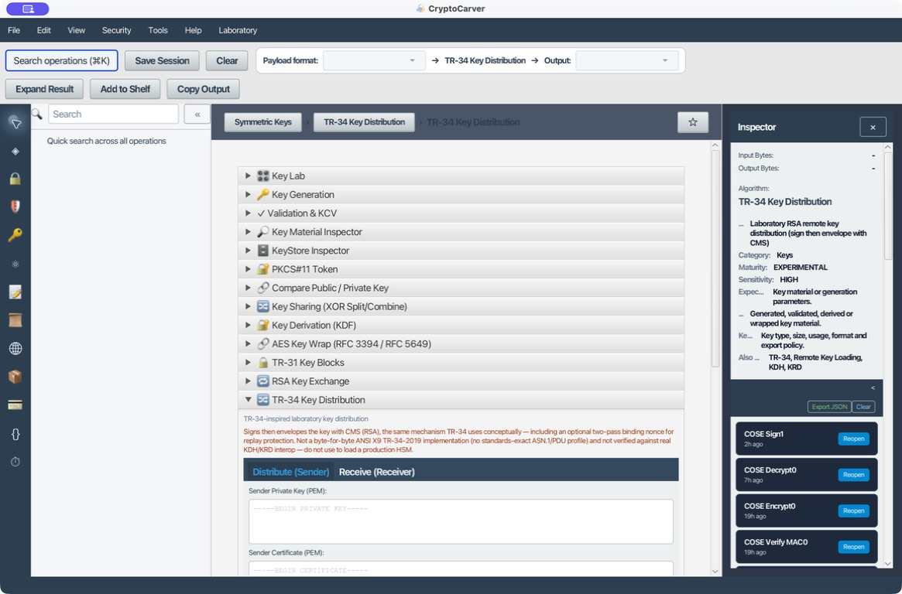

# Tutorial: Localizar y encadenar operaciones

La búsqueda no es solo un índice: permite descubrir una operación por algoritmo, alias, formato o propósito y construir una ruta entre módulos.

## Qué indexa

CryptoCarver busca en título, categoría, descripción y alias. Por eso **TR31**, **TR-31**, **PKCS7**, **CMS**, **SHA-256**, **DUKPT** o **PEM** pueden llevarte a la herramienta correcta aunque no conozcas la sección.

## Caso 1: Del texto al hash y a Base64

### Quiero obtener el identificador que espera un servicio externo

1. Pulsa la lupa o **Cmd+K**.
2. Busca **SHA-256** y abre **Hashing**.
3. Calcula el hash de **CryptoCarver**.
4. Busca **Manual Conversion**.
5. Convierte el resultado hexadecimal a Base64 si el sistema receptor lo necesita.

| Etapa | Entrada | Salida |
|---|---|---|
| SHA-256 | CryptoCarver en UTF-8 | be3fcd24f9b18b05701a7a57d8a7f365f367775d032cd7ee734c943658873d79 |
| Base64 directa del texto | CryptoCarver | Q3J5cHRvQ2FydmVy |

No confundas Base64 del texto con Base64 del hash: representan bytes distintos.

En la pantalla de resultado confirma primero el formato seleccionado. Si el
receptor pide el hash en Base64, calcula SHA-256 sobre los bytes UTF-8 y
convierte *ese digest* hexadecimal; no conviertas el texto original. Conserva
en la incidencia el texto, su codificación y el digest para que otro operador
pueda repetirlo sin adivinar qué se transformó.

## Caso 2: Localizar una ruta de claves

### Quiero crear una clave, cifrar un dato y dejar una receta auditable

Busca en este orden:

1. **Key Generation** para crear AES-256.
2. **Validation & KCV** para inspeccionar la clave.
3. **Symmetric Ciphers** para cifrar.
4. **History** para exportar la receta.

La búsqueda permite saltar de una categoría a otra sin perder la salida si antes la añades a **Clipboard Shelf**.

En cada salto verifica las migas de pan y el inspector: la búsqueda puede
encontrar herramientas con nombres parecidos, como **AES Key Wrap** (protege
una clave) y **Symmetric Ciphers** (protege datos). La salida que debe pasar de
un paso a otro no siempre es texto; identifica si CryptoCarver la presenta como
hexadecimal, Base64, PEM o binario antes de pegarla.

### Caso 3: Encontrar una operación por un estándar que no recuerdas

1. Busca `RFC 3394` para abrir **AES Key Wrap**.
2. Busca `X9.143` o `TR31` para abrir **TR-31 Key Blocks**.
3. Busca `XAdES` para llegar a la firma XML avanzada.
4. Abre el inspector de cada resultado y confirma propósito, madurez y
   sensibilidad antes de ejecutarlo.

Esta ruta es útil cuando recibes una especificación de integración en lugar de
un nombre de producto. El alias encuentra la herramienta; la ficha de la
operación decide si corresponde a tu caso de uso.

## Cómo leer un resultado

- Confirma sección y operación en las migas de pan.
- Revisa **Maturity**: STABLE, EXPERIMENTAL o PLANNED.
- Revisa **Sensitivity** antes de pegar datos.
- Comprueba **Expected input** y **Produces**.
- Lee los aliases para saber cómo encontrar la misma herramienta después.

La etiqueta **EXPERIMENTAL** no significa que el botón no pueda ejecutarse: sí
significa que debes contrastar el resultado con un vector o una implementación
independiente antes de usarlo en un intercambio real. **PLANNED** indica que la
operación se ha catalogado pero aún no ofrece una ejecución utilizable.

## Búsquedas útiles

| Consulta | Herramientas esperadas |
|---|---|
| AES | Symmetric Ciphers, AES Key Wrap, DUKPT AES |
| PEM | Key Material Inspector, Workbench, certificados |
| JWT | JOSE / JWT, JWS, JWE, JWK |
| SOAP | WS-Security, UsernameToken, XML Encryption |
| PDF | PAdES |
| CBOR | COSE |

## Cuando no aparece nada

### Prueba negativa: una consulta sin coincidencias

1. Pulsa **Cmd+K** y escribe `zzz-no-existe`. La lista de resultados debe quedar vacía o mostrar un estado "sin coincidencias"; nunca debe aparecer una herramienta no relacionada solo por rellenar la lista.
2. Escribe ahora `tr-31` con guion y compáralo con `tr31` sin guion: ambos deben resolver a **TR-31 Key Blocks**. Si uno de los dos formatos deja de encontrar la operación, es un defecto de indexado a reportar, no una limitación que debas memorizar.
3. Limpia con **Esc** entre cada prueba; una consulta previa no debe "contaminar" la siguiente.

Prueba el nombre del estándar, el algoritmo y el formato por separado. Si una operación aparece **PLANNED**, no puede ejecutarse; si aparece **EXP**, trata los resultados como laboratorio.

## Evidencia que conviene guardar

| Elemento | Ejemplo |
|---|---|
| Consulta | `SHA-256` |
| Operación elegida | `Generic → Hashing` |
| Formato de entrada | UTF-8 |
| Entrada no sensible | `CryptoCarver` |
| Resultado | Digest hexadecimal de 32 bytes |
| Conclusión | Coincide con la prueba de referencia |

Así la búsqueda deja de ser navegación informal y se convierte en el primer
paso de una receta reproducible.
