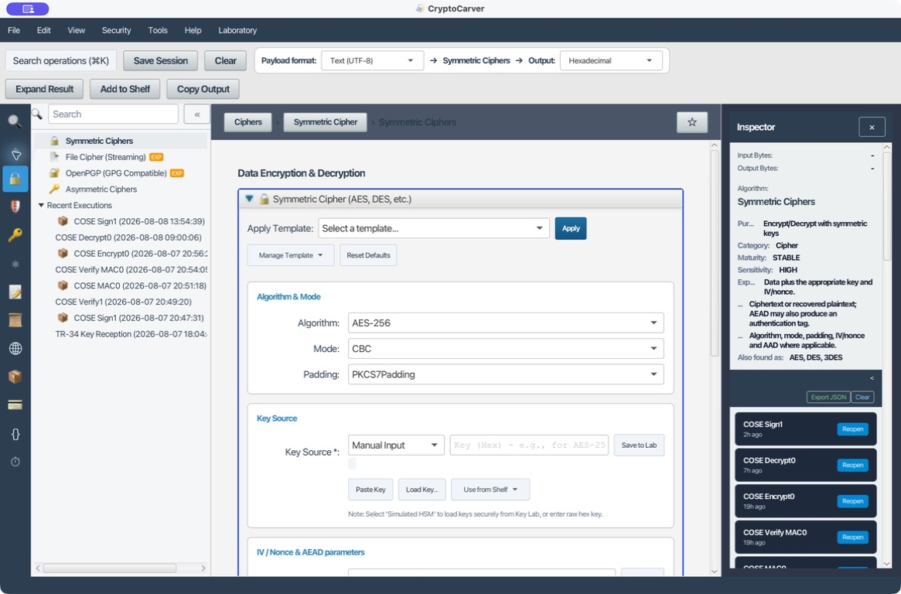
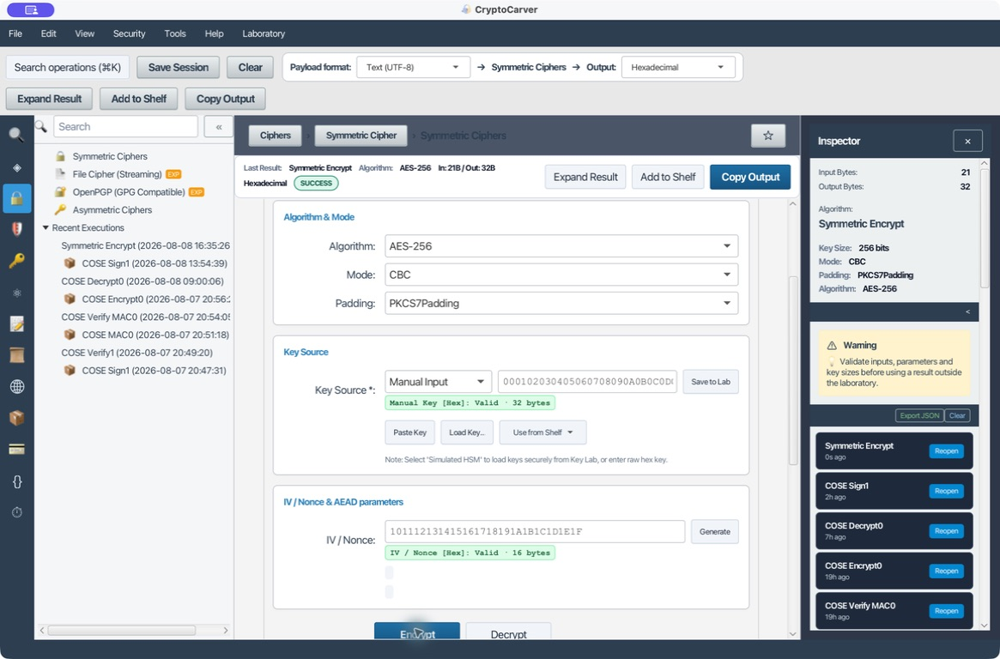
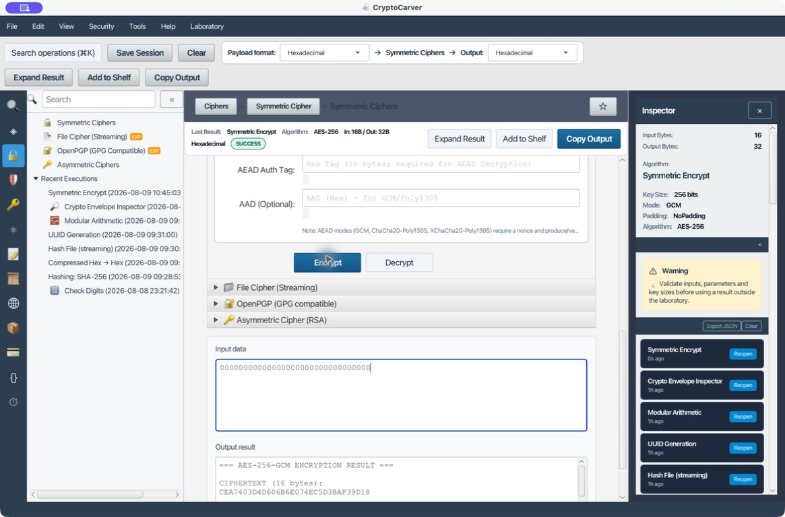
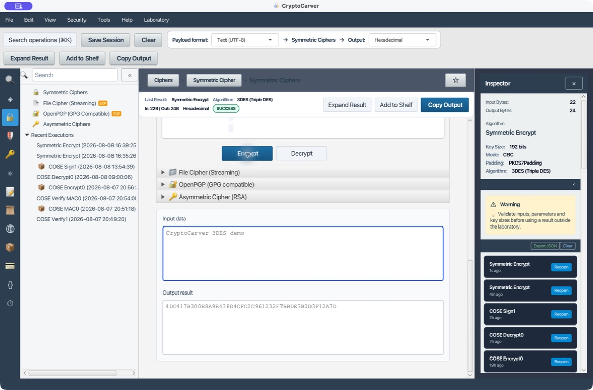
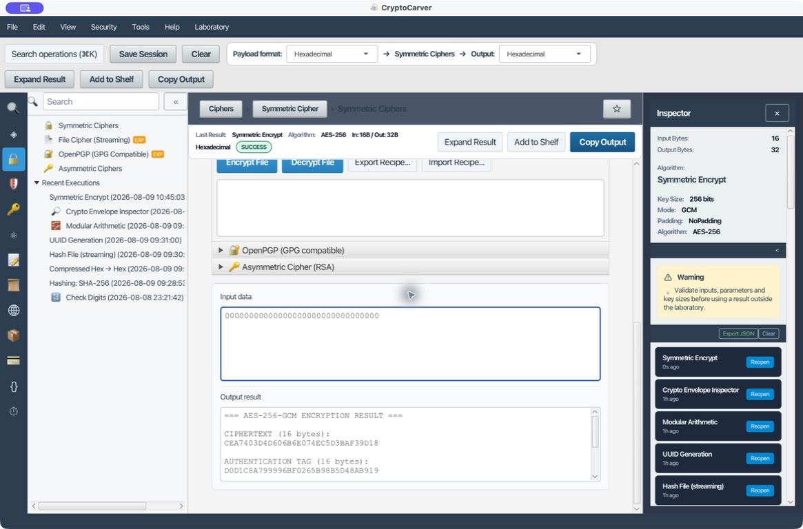
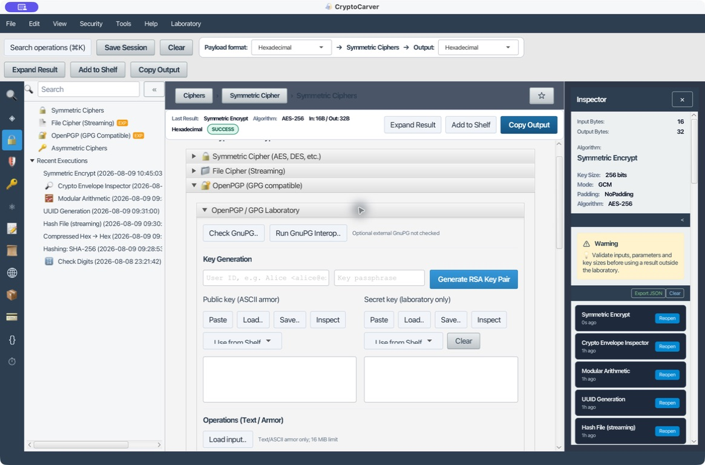
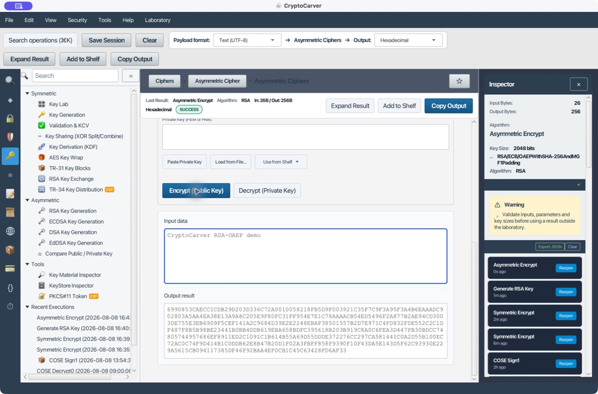

# Tutorial: Cifrado Simétrico y Asimétrico

Este tutorial explica cómo pasar de una necesidad real a una receta que se pueda repetir y auditar. Los valores de claves, IV, nonce y mensajes son exclusivamente de laboratorio: no copies claves de prueba a un entorno real.

## Qué quiero hacer

| Objetivo | Operación de CryptoCarver | Receta inicial |
|---|---|---|
| Proteger un mensaje nuevo y detectar alteraciones | **Cipher → Symmetric Ciphers** | AES-256-GCM, nonce nuevo y tag de 16 bytes |
| Integrar un protocolo que ya exige CBC | **Cipher → Symmetric Ciphers** | AES-256-CBC y, fuera de este ejemplo, un MAC independiente |
| Mantener compatibilidad con una plataforma antigua | **Cipher → Symmetric Ciphers** | 3DES-CBC solo si no se puede migrar |
| Cifrar un archivo grande | **Cipher → File Cipher (Streaming)** | AES-256-GCM; conserva la receta junto al fichero |
| Intercambiar datos con GnuPG | **Cipher → OpenPGP (GPG Compatible)** | Armored OpenPGP y claves de laboratorio |
| Transportar un secreto pequeño a un receptor | **Cipher → Asymmetric Ciphers** | RSA-OAEP con SHA-256 |

## Antes de empezar: clave, formato y artefactos que conservar

La barra superior define el formato del **payload** de entrada y salida. La clave, IV, nonce, AAD y tag se introducen siempre en hexadecimal en sus propios campos. Este detalle evita uno de los fallos más comunes: interpretar texto UTF-8 como si fuera hexadecimal, o al revés.

Para obtener una clave tienes tres caminos:

1. **Reproducible:** pega una clave hexadecimal conocida, como en los casos de esta guía.
2. **Generada:** abre [Claves y Material Criptográfico](05-claves.md), genera una AES-256 y registra el KCV para identificarla.
3. **Custodiada:** guarda una clave de laboratorio en Key Lab y selecciona **Simulated HSM** como *Key Source*. La receta debe guardar el identificador de la clave, no su valor.

Una operación de cifrado no queda documentada con el ciphertext solamente. Conserva algoritmo, modo, padding, formato, referencia de clave, IV/nonce, AAD, tag y ciphertext. Esos elementos son el contrato de descifrado.

## Caso 1: Quiero comparar una integración AES-256-CBC

CBC sirve para interoperar con sistemas existentes, pero solo proporciona confidencialidad. No detecta cambios maliciosos; para un diseño nuevo utiliza el caso GCM siguiente.

### Datos de entrada reproducibles

| Parámetro | Valor |
|---|---|
| Payload format | Text (UTF-8) |
| Output | Hexadecimal |
| Algorithm | AES-256 |
| Mode | CBC |
| Padding | PKCS7Padding |
| Key | `000102030405060708090A0B0C0D0E0F101112131415161718191A1B1C1D1E1F` |
| IV | `101112131415161718191A1B1C1D1E1F` |
| Input | `CryptoCarver AES demo` |
| Ciphertext esperado | `1561F11F27EAD89344682F9D94695DDF72BE301A986DB5B1F79F3B661D41E827` |

### Cómo lo hago

1. Abre **Cipher → Symmetric Ciphers** y selecciona **AES-256 / CBC / PKCS7Padding**.
2. Pega la clave de 32 bytes y el IV de 16 bytes en hexadecimal.
3. Selecciona **Text (UTF-8)** como entrada y **Hexadecimal** como salida.
4. Escribe el mensaje y pulsa **Encrypt**.
5. Comprueba que el resultado ocupa 32 bytes: los 21 bytes del texto se completan hasta dos bloques AES de 16 bytes.

### Cómo verifico el retorno

Cambia la entrada a **Hexadecimal**, la salida a **Text (UTF-8)** y pega el ciphertext esperado. Con los mismos modo, padding, clave e IV, **Decrypt** recupera `CryptoCarver AES demo`.

Si se modifica un byte de clave, IV o ciphertext, la salida será errónea o aparecerá un error de padding. Ese error no equivale a autenticación: por ese motivo no debe usarse CBC sin un mecanismo de integridad adicional acordado por el protocolo.

## Caso 2: Quiero cifrar y autenticar con AES-256-GCM

GCM es un modo AEAD: entrega confidencialidad y autenticidad. CryptoCarver muestra el ciphertext y el tag por separado para que sea explícito qué hay que transportar al receptor.

### Vector de comprobación reproducible

Este vector usa clave, nonce y texto plano nulos y coincide con un vector de AES-GCM de 256 bits publicado por NIST. Es útil para comprobar que formatos, tamaño del nonce y separación de la etiqueta son correctos.

| Parámetro | Valor |
|---|---|
| Payload format / Output | Hexadecimal / Hexadecimal |
| Algorithm / Mode | AES-256 / GCM |
| Padding | NoPadding |
| Key (32 bytes) | `0000000000000000000000000000000000000000000000000000000000000000` |
| Nonce (12 bytes) | `000000000000000000000000` |
| AAD | vacío |
| Plaintext (16 bytes) | `00000000000000000000000000000000` |
| Ciphertext esperado | `CEA7403D4D606B6E074EC5D3BAF39D18` |
| Tag esperado (16 bytes) | `D0D1C8A799996BF0265B98B5D48AB919` |

### Cómo lo hago en la aplicación

1. Elige **AES-256** y **GCM**. El padding pasa a **NoPadding** y aparecen los campos **Nonce**, **AEAD Auth Tag** y **AAD**.
2. Selecciona **Hexadecimal** en la barra de formatos; introduce la clave, el nonce y el plaintext de la tabla. Deja AAD vacío.
3. Pulsa **Encrypt**. En el resultado se muestran tres valores: ciphertext, tag y la concatenación ciphertext + tag.
4. Verifica que CryptoCarver entrega exactamente los dos valores de la tabla. El pantallazo anterior registra esa ejecución y la separación de 16 bytes de ciphertext y 16 bytes de tag.

### Descifrado y prueba de integridad

Para descifrar, deja clave y nonce sin cambios, pega `CEA7403D4D606B6E074EC5D3BAF39D18` como entrada y escribe `D0D1C8A799996BF0265B98B5D48AB919` en **AEAD Auth Tag**. Pulsa **Decrypt**: el resultado debe ser los 16 bytes a cero del plaintext.

Haz además una prueba negativa controlada: cambia el último carácter del tag, por ejemplo de `9` a `8`, y ejecuta **Decrypt**. Debe fallar la verificación; no hay plaintext fiable que consumir. Repite la prueba cambiando AAD si la utilizas: AAD no se cifra, pero sí queda autenticado.

> En producción no reutilices jamás un nonce GCM con la misma clave. Para datos reales pulsa **Generate** en cada cifrado, guarda el nonce junto al ciphertext y rota la clave antes de agotar la política de uso de tu organización.

## Caso 3: Quiero mantener 3DES-CBC por compatibilidad

3DES tiene bloques de 64 bits y menor margen criptográfico que AES. Solo se justifica cuando una contraparte heredada lo exige y existe un plan de migración.

| Parámetro | Valor |
|---|---|
| Payload format / Output | Text (UTF-8) / Hexadecimal |
| Algorithm / Mode / Padding | 3DES / CBC / PKCS7Padding |
| Key de 24 bytes | `0123456789ABCDEFFEDCBA98765432100011223344556677` |
| IV de 8 bytes | `1234567890ABCDEF` |
| Input | `CryptoCarver 3DES demo` |
| Ciphertext esperado | `4DC417B300E8A9E438D4CFC2C961232F7BBDE3B0D3F12A7D` |

Selecciona el algoritmo, introduce la clave de 24 bytes y el IV de 8 bytes, cifra el texto y compara el resultado. Para volver, usa entrada hexadecimal y salida UTF-8. Si el texto no reaparece exactamente, revisa primero la longitud de la clave: dos claves y tres claves no son el mismo contrato de 3DES.

No reutilices esta receta como base de un sistema nuevo. Prioriza migrar a AES-GCM y limita el volumen de datos bajo una misma clave 3DES.

## Caso 4: Quiero cifrar un archivo sin cargarlo entero en memoria

**Cipher → File Cipher (Streaming)** procesa el origen como flujo. Es la opción apropiada para documentos de tamaño considerable; no uses el área de texto como sustituto de un proceso de ficheros.

### Receta operativa

| Campo | Valor de laboratorio |
|---|---|
| Algorithm | AES-256-GCM |
| Source | Un fichero de prueba, por ejemplo `archivo-laboratorio.txt` de [Operaciones Genéricas](02-operaciones-genericas.md) |
| Destination | Un nombre nuevo, por ejemplo `archivo-laboratorio.enc` |
| Key | La clave AES-256 de Key Lab o una clave hexadecimal de 32 bytes |
| Nonce | 12 bytes recién generados |
| AAD | `46494C452D4C41422D3031` (`FILE-LAB-01` en hexadecimal), si tu protocolo la necesita |

1. Despliega **File Cipher (Streaming)** y elige **AES-256-GCM**.
2. Selecciona origen y un destino distinto. Nunca sobrescribas el original durante una primera validación.
3. Introduce la clave, genera un nonce nuevo e indica AAD solo si también se conservará para descifrar.
4. Cifra. Registra en la receta el nonce, el tag producido, AAD y el algoritmo.
5. Cambia a descifrado, usa un destino nuevo y verifica el hash del fichero recuperado contra el original con **Generic → Hash File (Streaming)**.

El tag no es opcional durante el descifrado GCM. Si falta o no coincide, la aplicación debe abortar la recuperación del fichero.

## Caso 5: Quiero interoperar con OpenPGP

**Cipher → OpenPGP (GPG Compatible)** trabaja con datos OpenPGP en formato ASCII-armored. Úsalo cuando el contrato con otra parte sea PGP; no es necesario convertir a RSA-OAEP manualmente.

### Flujo de laboratorio

1. Genera o importa claves OpenPGP de prueba en un entorno aislado.
2. Despliega **OpenPGP (GPG Compatible)**, selecciona cifrado y proporciona el material del destinatario.
3. Introduce el texto `Mensaje OpenPGP de laboratorio` y pide salida armada (`-----BEGIN PGP MESSAGE-----`).
4. Guarda el bloque completo, incluidos encabezados, saltos de línea y el bloque final. Es el artefacto que se entrega al receptor.
5. En el recorrido inverso usa la clave privada correspondiente y compara el texto recuperado con el original.

La identidad del destinatario, la huella de la clave y la fecha de caducidad deben comprobarse fuera del contenido cifrado. No des por válida una clave porque su nombre o correo parezcan conocidos.

## Caso 6: Quiero transportar una clave o un secreto pequeño con RSA-OAEP

RSA-OAEP sirve para encapsular secretos pequeños, no para cifrar ficheros completos. El patrón habitual es híbrido: AES-GCM protege los datos y RSA-OAEP protege únicamente la clave AES y, si procede, el nonce.

### Datos y pasos

1. Genera un par RSA-2048 de laboratorio desde [Claves y Material Criptográfico](05-claves.md) y carga la pública en **Asymmetric Ciphers**.
2. Selecciona **RSA/ECB/OAEPWithSHA-256AndMGF1Padding**.
3. Usa entrada UTF-8 con `CryptoCarver RSA-OAEP demo` y cifra. Con RSA-2048 el resultado ocupa 256 bytes, o 512 caracteres hexadecimales.
4. Cambia la entrada a hexadecimal y la salida a texto; carga la privada y pulsa **Decrypt**.
5. Comprueba que reaparece el mensaje original.

El ciphertext OAEP cambia cada vez aunque clave y texto sean iguales: OAEP incorpora aleatoriedad deliberadamente. La comprobación correcta es el descifrado, no comparar ciphertexts. Si aparece **RSA data too long**, reduce el payload a una clave de sesión o adopta el esquema híbrido.

## Diagnóstico rápido

| Síntoma | Qué significa | Qué revisar |
|---|---|---|
| `Invalid key size` | La clave no tiene la longitud del algoritmo | AES-256 = 32 bytes; 3DES de tres claves = 24 bytes |
| `IV required` | El modo necesita IV/nonce | AES-CBC = 16 bytes; 3DES-CBC = 8; GCM recomienda 12 |
| `Bad padding` | Parámetros CBC o ciphertext no coinciden | Formato, clave, IV, modo y padding |
| `AEAD tag mismatch` | Ciphertext, AAD, nonce o tag fue alterado | Detén el flujo; no uses plaintext parcial |
| `RSA data too long` | El payload supera OAEP | Cifra los datos con AES y encapsula la clave con RSA |
| El archivo descifrado difiere | La receta de fichero no se reprodujo | Nonce, tag, AAD, algoritmo y clave de descifrado |

## Cierre: checklist antes de entregar una receta

- ¿El modo es AES-GCM para un diseño nuevo?
- ¿El nonce se creó una sola vez para esa clave y se conserva con el ciphertext?
- ¿El tag y AAD viajan junto a la salida cuando se usa AEAD?
- ¿La salida se verificó con un descifrado y, para ficheros, con un hash del original?
- ¿La clave real se identifica por una referencia/KCV en vez de incluirse en registros o capturas?

Con esos datos, otra persona puede repetir la operación sin adivinar formatos ni parámetros, y también puede detectar cuándo una salida no es segura para usar.
