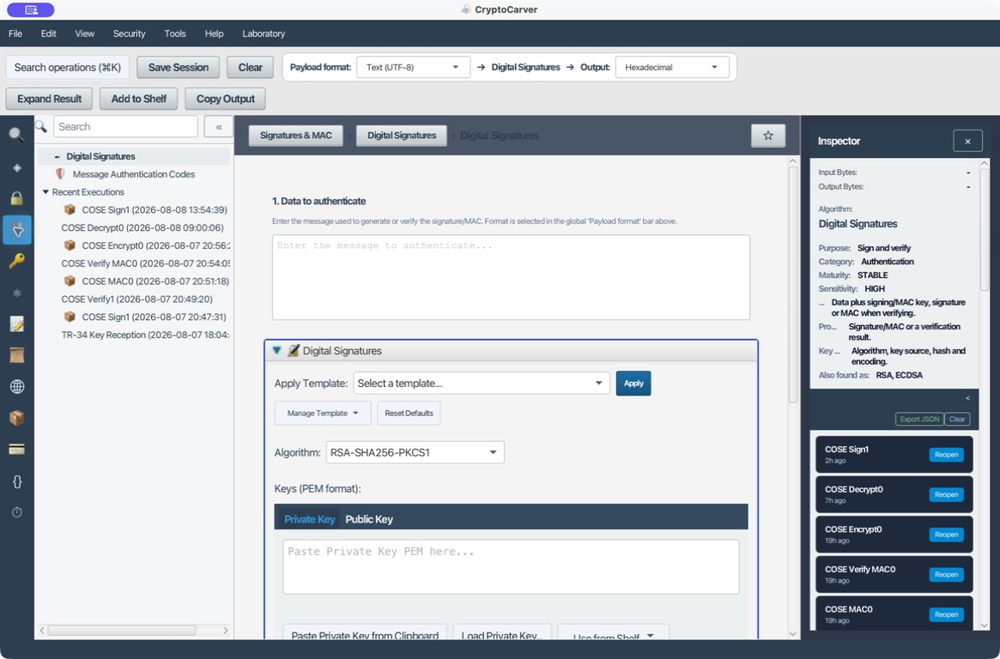
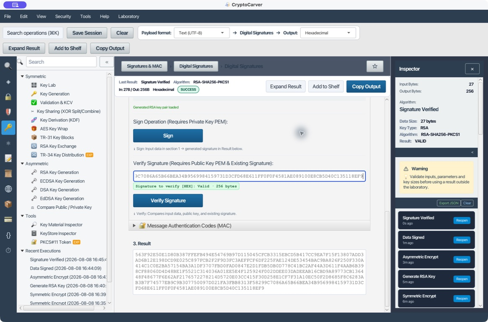
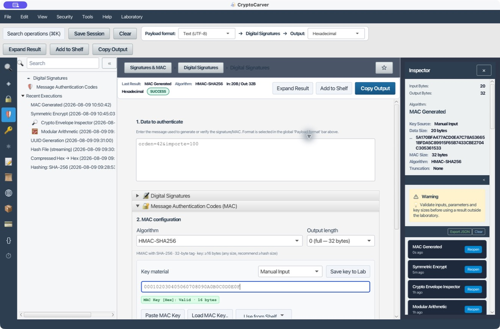
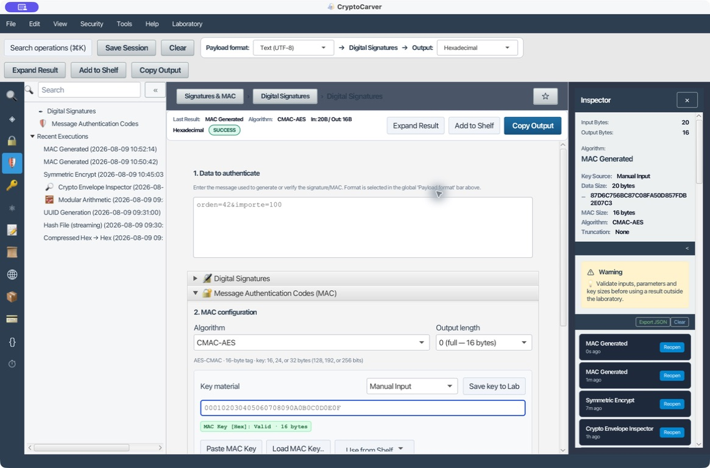

# Tutorial: Firmas Digitales y MAC

Esta sección demuestra integridad y autenticidad. Una firma usa clave privada y se verifica con clave pública; un MAC usa el mismo secreto en ambos extremos.

## Qué quiero demostrar

| Propiedad | Firma digital | MAC |
|---|---|---|
| Claves | Par pública/privada | Secreto compartido |
| Quién puede verificar | Cualquiera con la pública | Solo quien conoce el secreto |
| No repudio técnico | Puede respaldarlo con identidad y política | No, ambos participantes pueden generar el MAC |
| Caso típico | Documentos, artefactos, tokens | Mensajes entre sistemas de confianza compartida |

Una firma permite que un tercero con la clave pública compruebe el mensaje. Un MAC prueba integridad ante quien conoce el secreto compartido, pero no demuestra cuál de los dos poseedores lo generó. Antes de ejecutar cualquiera de los casos, fija los bytes del payload: formato, charset, saltos de línea y orden de campos forman parte del dato autenticado.

## Caso 1: Quiero firmar un documento y verificarlo

### 1. Generar y transferir las claves

1. Ve a **Keys → RSA Key Generation**.
2. Selecciona 2048 bits y pulsa **Generate RSA Key Pair**.
3. Revisa fingerprint, tamaños y origen.
4. Pulsa **Use in Digital Signatures**. CryptoCarver carga la privada y la pública en sus pestañas correspondientes.

### 2. Firmar

| Parámetro | Valor de laboratorio |
|---|---|
| Payload format | Text (UTF-8) |
| Output | Hexadecimal |
| Algorithm | RSA-SHA256-PKCS1 |
| Input | Documento de laboratorio v1 |
| Clave | Privada RSA-2048 generada en el paso anterior |
| Salida | Firma de 256 bytes, 512 caracteres hexadecimales |

Pulsa **Sign**. La firma concreta depende del par RSA generado; su longitud debe ser 256 bytes para RSA-2048. La aplicación confirma algoritmo y tamaño.

### 3. Verificar

1. Conserva exactamente el mismo mensaje y formato.
2. Cambia a la pestaña **Public Key** y confirma que contiene la pública del par.
3. Pega la firma en **Existing Signature**.
4. Pulsa **Verify Signature**.
5. El resultado esperado es **Signature is VALID**.

### 4. Prueba negativa obligatoria

Cambia el mensaje a **Documento de laboratorio v2** sin regenerar la firma. La verificación debe fallar. Repite cambiando un nibble de la firma: también debe fallar. Si una integración acepta esos casos, está verificando el dato equivocado o no está verificando.

## RSA-PSS frente a PKCS#1 v1.5

Para un protocolo nuevo, RSA-PSS suele ser preferible. Debes acordar hash, MGF1 y longitud de salt; no basta con indicar “RSA”. PKCS#1 v1.5 sigue siendo común por interoperabilidad y produce una firma determinista para la misma clave y mensaje.

## Caso 2: Quiero firmar con ECDSA P-256

1. Genera una clave P-256 en **Keys → ECDSA Key Generation**.
2. Usa **Use in Digital Signatures**.
3. Selecciona ECDSA con SHA-256.
4. Firma el mismo mensaje y verifica con la pública.

La firma ECDSA suele codificarse como una secuencia DER con los enteros `r` y `s`; su longitud puede variar. No compares su tamaño con el de RSA ni asumas que dos firmas del mismo mensaje serán idénticas. Para interoperar, acuerda curva, hash y codificación de firma (DER frente a `r || s`): son parte del protocolo.

## Caso 3: Quiero autenticar una petición con HMAC-SHA-256

Abre **Message Authentication Codes (MAC)**.

| Parámetro | Ejemplo |
|---|---|
| Algoritmo | HMAC-SHA-256 |
| Clave compartida | 000102030405060708090A0B0C0D0E0F |
| Payload format | Text (UTF-8) |
| Mensaje | orden=42&importe=100 |
| Salida esperada | `5A170BFA477ACD0EA7C78A536651BFDA5C89915F65B7433CBE2704C305361533` |

1. Selecciona **HMAC-SHA256** con salida completa de 32 bytes, deja **Text (UTF-8)** como formato y pega los valores de la tabla.
2. Pulsa **Generate MAC**. El pantallazo evidencia los 20 bytes de entrada, los 32 bytes de salida y el valor esperado.
3. Pega el resultado en **Paste the expected MAC** y ejecuta **Verify** para comprobar el ciclo completo.
4. Cambia `importe=100` por `importe=101` sin recalcular: la verificación debe fallar.

Emisor y receptor deben serializar el mensaje exactamente igual. Un espacio, cambio de orden, normalización Unicode o salto de línea modifica el MAC: son bytes diferentes, no un fallo del algoritmo.

## Caso 4: Quiero calcular AES-CMAC con una clave AES

CMAC es útil cuando el ecosistema ya gestiona claves AES y el protocolo indica CMAC. Este caso reutiliza el mensaje del HMAC únicamente para que la comparación sea reproducible.

| Parámetro | Valor de laboratorio |
|---|---|
| Algorithm | CMAC-AES |
| Key | `000102030405060708090A0B0C0D0E0F` (AES-128) |
| Payload format | Text (UTF-8) |
| Mensaje | `orden=42&importe=100` |
| CMAC esperado | `87D6C756BC87C08FA50D857FDB2E07C3` |

Selecciona **CMAC-AES**, introduce la clave y pulsa **Generate MAC**. CryptoCarver muestra una etiqueta de 16 bytes; el pantallazo registra la ejecución y su resultado. Pégala en el campo de MAC esperado y usa **Verify**. No reutilices una clave de cifrado como clave MAC salvo que el protocolo lo defina y derive subclaves separadas.

## Qué se firma realmente

Antes de firmar define una representación canónica. Para JSON, fija orden/canonicalización o firma los bytes finales. Para archivos, firma el contenido binario exacto. Para XML usa la sección [Seguridad XML](07-seguridad-xml.md), que gestiona referencias y canonicalización.

## Diagnóstico

| Resultado | Comprobación |
|---|---|
| Invalid key | El tipo de clave coincide con el algoritmo seleccionado |
| Signature invalid | Mensaje, formato, firma y clave pública pertenecen a la misma ejecución |
| Firma con longitud inesperada | Revisa tamaño RSA o formato DER/raw de ECDSA |
| MAC distinto entre sistemas | Compara bytes, charset, separadores y codificación de clave |

## Checklist antes de integrar

- Especifica el algoritmo completo, no solo “RSA” o “HMAC”.
- Verifica firma o MAC antes de procesar los datos.
- Conserva mensaje, firma/MAC, formato y referencia de clave como una sola receta.
- Prueba una modificación del mensaje, de la firma y del MAC: todas deben fallar.

Nunca publiques la clave privada ni la clave MAC. La firma y la clave pública sí pueden distribuirse.
