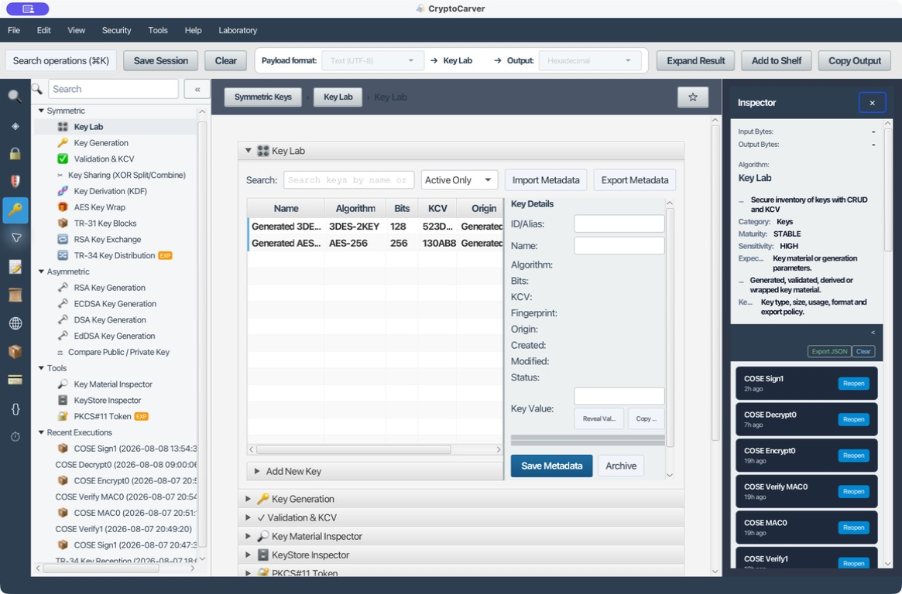
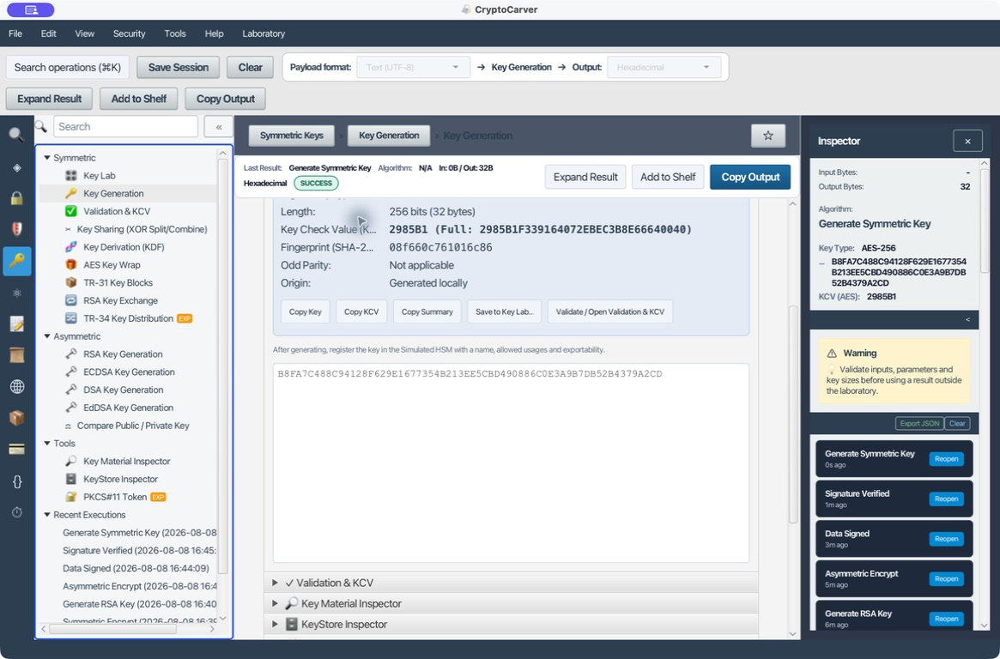
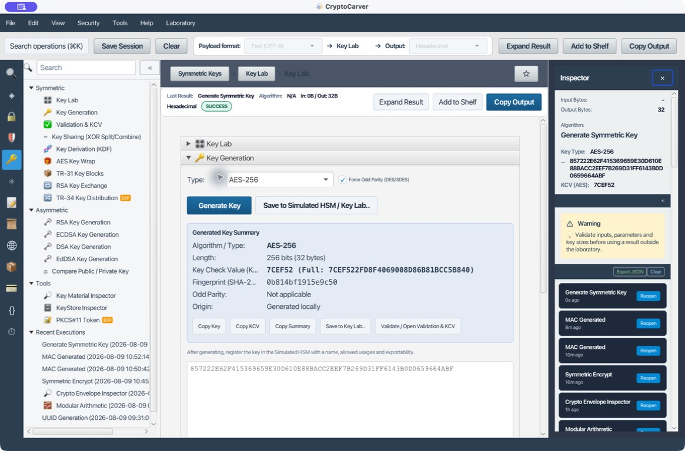
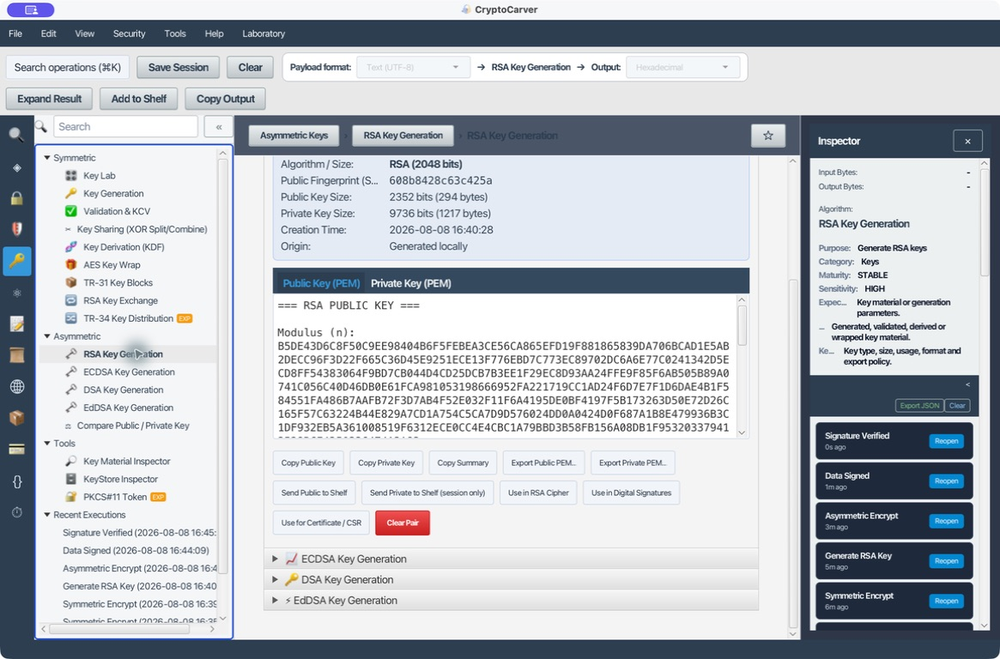
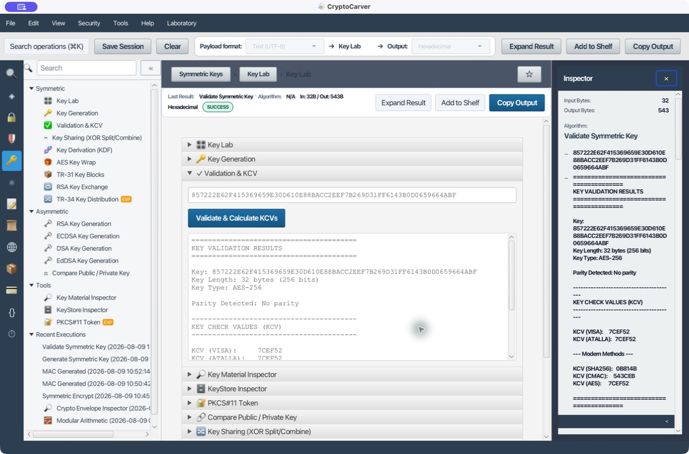
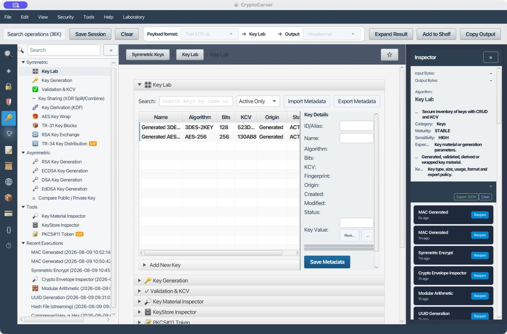

# Tutorial: Generación, Validación y Uso de Claves

Esta guía conecta el ciclo de vida de una clave con las operaciones que la consumen. Una clave útil no es solo una cadena hexadecimal: tiene algoritmo, tamaño, uso, origen, estado y política de exportación.

## Ruta recomendada

1. Generar o importar.
2. Validar longitud, estructura, paridad y KCV cuando aplique.
3. Registrar metadatos y usos en Key Lab.
4. Consumirla desde Cipher, Authentication, JOSE o Payments.
5. Rotar, archivar y eliminar según política.

La clave no viaja sola: algoritmo, longitud, propósito, estado y huella/KCV forman una receta de custodia. El valor de la clave solo se muestra en los ejemplos de laboratorio; en un entorno real se registra una referencia de Key Lab o HSM y el KCV, no el secreto.

## Caso 1: Generar AES-256 y usarla para cifrar

1. Abre **Keys → Key Generation**.
2. Selecciona **AES-256** y pulsa **Generate Key**.
3. La salida debe contener 64 caracteres hexadecimales, equivalentes a 32 bytes.
4. Pulsa **Save to Simulated HSM / Key Lab** si quieres asignar nombre, usos y exportabilidad.
5. En [Cipher](03-cifrado.md), selecciona **Simulated HSM** o pega la clave manualmente.
6. Genera un IV o nonce nuevo para cada cifrado.

La ejecución mostrada genera la clave `857222E62F415369659E30D610E88BACC2EEF7B269D31FF6143B0D0659664ABF`, de 32 bytes, con KCV AES `7CEF52`. Es un valor de laboratorio que permite enlazar el caso siguiente de validación; no reutilices esta clave fuera de los tutoriales.

Una clave aleatoria cambia en cada ejecución; la validación consiste en comprobar longitud, KCV y funcionamiento en un round-trip, no en esperar un valor concreto.

## Caso 2: Generar 3DES para una integración heredada

| Tipo | Longitud de entrada | Comentario |
|---|---|---|
| 3DES-2KEY | 16 bytes, normalmente K1-K2-K1 | Seguridad efectiva menor; compatibilidad |
| 3DES-3KEY | 24 bytes, K1-K2-K3 | Evitar en diseños nuevos |

Activa **Force Odd Parity** si el sistema DES/3DES lo exige. Después abre **Validation & KCV**, valida la paridad y calcula el KCV con el método acordado. Dos organizaciones pueden obtener KCV distintos si usan longitudes o truncamientos diferentes.

Para una prueba controlada, genera **3DES-2KEY**, deja activada la paridad impar y comprueba que la salida tenga 16 bytes (32 caracteres hexadecimales). Documenta también si el sistema espera K1-K2-K1 o exige un formato específico de transporte: “3DES” por sí solo no define la interoperabilidad.

## Caso 3: Par RSA-2048 multiuso

1. Abre **RSA Key Generation** y selecciona 2048 bits.
2. Pulsa **Generate RSA Key Pair**.
3. Revisa el resumen: algoritmo, tamaño, fingerprint SHA-256, tamaños codificados, fecha y origen.
4. Usa **Use in RSA Cipher** para el ejemplo OAEP de [Cifrado](03-cifrado.md).
5. Usa **Use in Digital Signatures** para el ejemplo de [Firmas](04-autenticacion.md).
6. Usa **Use for Certificate / CSR** para crear una identidad X.509.

La pública se distribuye; la privada se conserva protegida. El fingerprint identifica la pública, pero no sustituye la validación del certificado o del canal por el que se recibió.

## Caso 4: ECDSA P-256

Genera P-256 cuando necesites firmas más compactas que RSA. Exporta la pública en el formato exigido por el consumidor, por ejemplo PEM SubjectPublicKeyInfo o JWK. No intercambies sin conversión una clave EC con una clave X25519: tienen propósitos y formatos distintos.

Conserva como mínimo la curva (`secp256r1`/P-256), formato de pública, hash de firma y huella de la pública. Una clave P-256 es para firmas ECDSA; X25519 se usa para acuerdo de claves y no es intercambiable aunque ambas sean “claves de curva elíptica”.

## Validación & KCV

Usa este módulo antes de confiar en una clave recibida.

| Comprobación | Qué detecta |
|---|---|
| Longitud | Algoritmo o variante incorrecta |
| Hex válido | Separadores, caracteres o nibble incompleto |
| Paridad DES | Componentes que no cumplen la convención |
| KCV | Error de transporte o carga |
| Material débil | Claves DES conocidas o degeneradas |

El KCV se comparte, la clave no. Compara el KCV por un canal distinto al usado para transportar la clave.

### Caso 5: Quiero comprobar que una clave recibida es la correcta

1. Abre **Validation & KCV** y pega una clave de laboratorio. Para reproducir el pantallazo usa `857222E62F415369659E30D610E88BACC2EEF7B269D31FF6143B0D0659664ABF`.
2. Pulsa **Validate & Calculate KCVs**. La aplicación identifica AES-256, 32 bytes y paridad no aplicable.
3. Compara el informe: VISA/Atalla/AES `7CEF52`, SHA-256 `0B814B` y CMAC `543CEB`.
4. Si el KCV acordado no coincide, detén el proceso: puede ser otra clave, una conversión equivocada o una variante/algoritmo de KCV distinto.

## División XOR por componentes

Para una clave K y componentes C1…Cn, CryptoCarver combina por XOR: **K = C1 XOR C2 … XOR Cn**.

1. Selecciona longitud y número de componentes.
2. Genera componentes aleatorios.
3. Distribuye cada componente a custodios diferentes.
4. Recombina únicamente en el entorno autorizado.
5. Valida el KCV de la clave reconstruida.

Conocer todos menos uno de los componentes no revela K si el componente restante es uniforme y secreto.

### Caso 6: Quiero repartir la custodia de una clave

No envíes todos los componentes a la misma persona ni uses el correo como canal de recombinación. Define por escrito número de custodios, longitud, algoritmo de XOR, método de autenticación de cada entrega y quién puede autorizar la recombinación. Tras recombinar, calcula el KCV y compáralo con el valor conocido antes de usar la clave.

## Derivación: HKDF y PBKDF2

No son intercambiables:

- **HKDF** extrae y expande material con alta entropía, por ejemplo un secreto de protocolo.
- **PBKDF2** endurece contraseñas de baja entropía mediante salt e iteraciones.

Registra algoritmo, hash, salt, info/contexto, iteraciones y longitud de salida. Sin esos parámetros no podrás reproducir la clave.

### Caso 7: Quiero derivar una clave de sesión con HKDF

En **Key Derivation (KDF)** selecciona **HKDF-SHA256**, especifica si el IKM, salt e info están en hex o UTF-8 y fija la longitud de salida. Para un vector de prueba de HKDF-SHA256 usa IKM `0B` repetido 22 veces, salt `000102030405060708090A0B0C`, info `F0F1F2F3F4F5F6F7F8F9` y salida de 42 bytes; la salida esperada comienza por `3CB25F25FAACD57A90434F64D036F2A2`.

En cambio, usa PBKDF2 únicamente para contraseñas: conserva hash, salt aleatorio, número de iteraciones y longitud. No sustituyas HKDF por PBKDF2 cuando el material de entrada ya es un secreto de alta entropía.

## Comparación de par de claves

### Caso 8: Quiero comprobar que una pública y una privada realmente forman un par

**Compare Public / Private Key** no compara texto PEM: firma un reto temporal con la privada y verifica esa firma con la pública. Es la forma correcta de confirmar un par recibido por canales distintos (por ejemplo, una pública que llega por correo y una privada ya presente en el HSM o el disco), en lugar de fiarte de que "se ven parecidas" o de que los nombres de archivo coinciden.

Para el ejercicio hay dos pares de laboratorio en [datos/](datos/): [clave-publica-laboratorio-comparacion.pem](datos/clave-publica-laboratorio-comparacion.pem) con su [clave-privada-laboratorio-comparacion.pem](datos/clave-privada-laboratorio-comparacion.pem) (sí forman pareja) y una segunda privada, [clave-privada-laboratorio-comparacion-otra.pem](datos/clave-privada-laboratorio-comparacion-otra.pem), que no corresponde a la pública anterior.

1. Abre **Keys > Compare Public / Private Key**.
2. Pega el contenido de `clave-publica-laboratorio-comparacion.pem` en el campo de la pública (también acepta un certificado X.509 PEM) y el de `clave-privada-laboratorio-comparacion.pem` en el de la privada.
3. Pulsa **Compare Pair**. El informe debe mostrar `✓ MATCH: the private key successfully signed a challenge verified by the public key.` junto con el algoritmo de ambas claves y el SHA-256 de la pública.

### Prueba negativa

Sustituye la privada por `clave-privada-laboratorio-comparacion-otra.pem` sin cambiar la pública y pulsa **Compare Pair** de nuevo: el informe debe cambiar a `✗ NO MATCH: signature verification failed or the algorithms are incompatible.`. Si en vez de ese mensaje ves un error de parseo, revisa que hayas pegado un PEM completo con sus delimitadores `BEGIN`/`END`; el módulo no compara huellas de archivo ni nombres, solo material criptográfico.

## Envoltura y transporte

Para un recorrido profundo, con vectores oficiales, algoritmo interno y pruebas de integridad, consulta [AES Key Wrap con RFC 3394 y RFC 5649](14-aes-wrap-avanzado.md).

Para transportar una clave junto con sus restricciones de uso, consulta [TR-31 y bloques de clave interoperables](15-tr31-avanzado.md), con laboratorios de versiones B y D, cabeceras, bloques opcionales y rechazo de alteraciones.

- **AES Key Wrap:** protege una clave bajo una KEK simétrica.
- **TR-31:** añade metadatos de uso y versión al bloque de clave.
- **RSA Key Exchange:** protege una clave simétrica con RSA-OAEP, JWE o CMS.
- **TR-34:** laboratorio experimental; no implica interoperabilidad certificada con HSM reales.

## Key Lab

Usa nombres que expresen entorno y función, por ejemplo **lab-aes-gcm-api-v1**. Define usos mínimos: encrypt, decrypt, wrap, unwrap, sign o verify. Una clave marcada no exportable debe consumirse por referencia.

Registra también propietario, estado (activa, archivada o revocada), fecha de rotación y KCV. El listado del pantallazo permite localizar claves por algoritmo y comprobar que la operación consume un objeto inventariado, no un secreto copiado sin contexto.

## Checklist antes de usar una clave

- Algoritmo y tamaño correctos.
- Origen conocido y fingerprint/KCV verificado.
- Uso autorizado para la operación.
- No expirada, revocada ni archivada.
- Formato compatible con el módulo de destino.
- Valor secreto fuera de capturas, historial y exportaciones.
