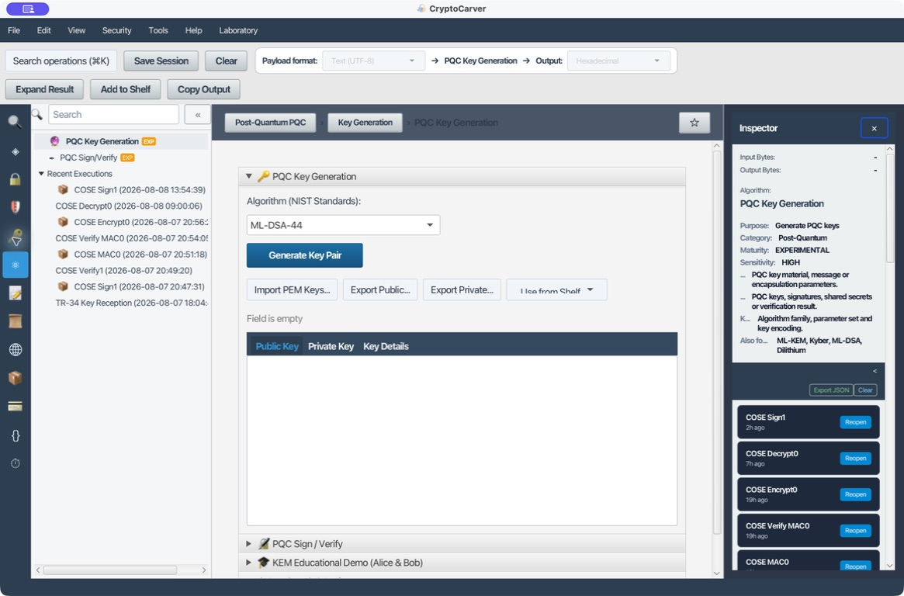
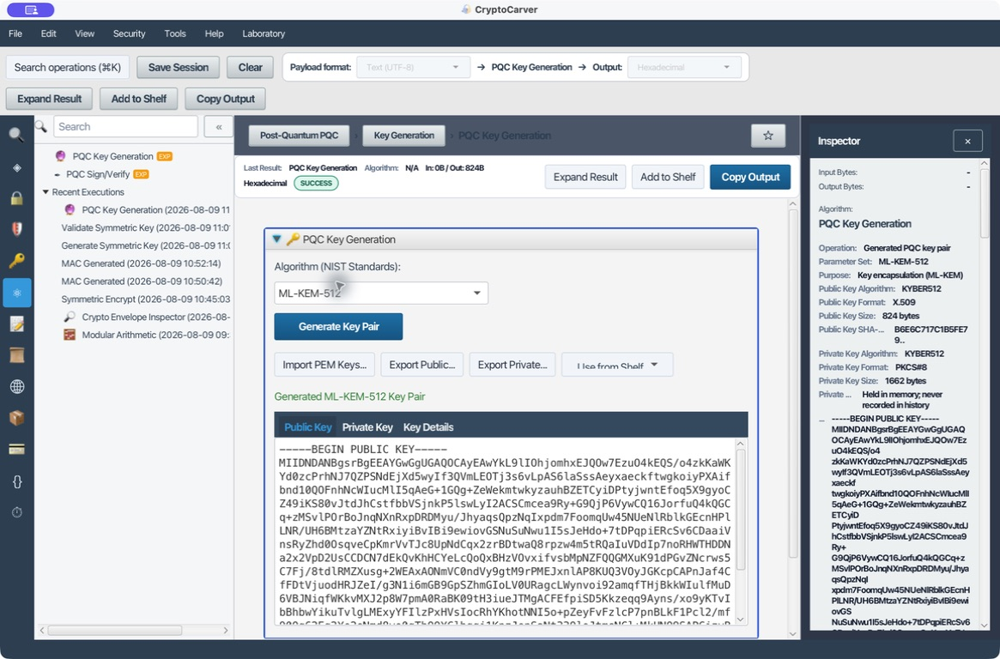
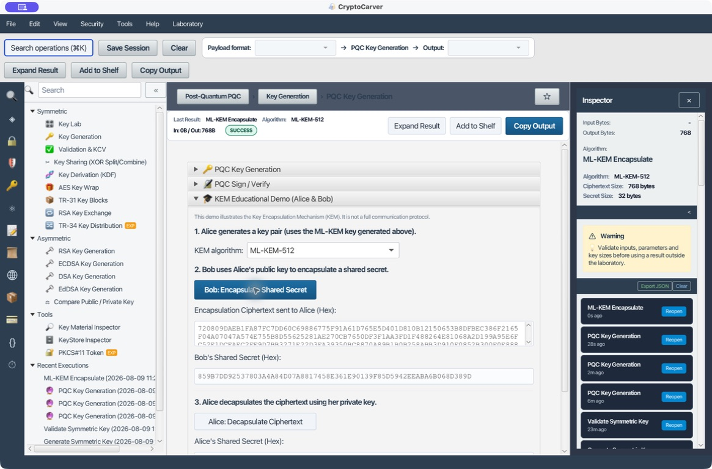
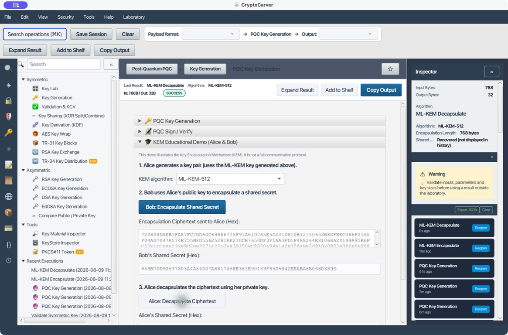

# Tutorial: Criptografía Post-Cuántica

La sección PQC permite practicar las dos funciones que hay que separar desde el diseño: **ML-KEM** para acordar un secreto nuevo y **ML-DSA/SLH-DSA** para firmar. Es un laboratorio experimental para validar tamaños, formatos y flujos antes de integrar un protocolo.

## Qué quiero conseguir

| Necesidad | Familia | Resultado |
|---|---|---|
| Acordar una clave con un destinatario | ML-KEM | Encapsulación pública y secreto compartido |
| Garantizar autoría e integridad | ML-DSA o SLH-DSA | Firma verificable |
| Cifrar datos reales | ML-KEM + HKDF + AES-GCM | Clave AES derivada y cifrado autenticado |

Un KEM **no cifra el documento directamente**: entrega un secreto que debe alimentar una KDF y un AEAD. Tampoco hay que reutilizar un secreto de demostración como clave de aplicación.

## Caso 1: Quiero crear y auditar un par ML-KEM-512

En **PQC Key Generation**, selecciona ML-KEM-512 y pulsa **Generate Key Pair**. La aplicación muestra la pública en PEM, conserva la privada en memoria y muestra en el inspector los datos que debes registrar.

En esta ejecución la pública X.509 mide **824 bytes** y la privada PKCS#8 **1.662 bytes**; la huella pública empieza por C1984BB593D845E2…. Los bytes cambian por la aleatoriedad segura: se reproduce el parámetro, formato y validación de tamaño, no el PEM concreto.

Antes de exportar, verifica que la finalidad sea **Key encapsulation (ML-KEM)**, que el selector KEM use el mismo parámetro y que la privada sólo se guarde en almacenamiento protegido. Para más margen, repite el ensayo con ML-KEM-768 o ML-KEM-1024, anotando los tamaños resultantes.

## Caso 2: Quiero que Bob entregue a Alice una clave simétrica nueva

En **KEM Educational Demo (Alice & Bob)**:

1. Alice genera ML-KEM-512 y distribuye sólo el PEM público.
2. Bob selecciona el mismo parámetro y pulsa **Bob: Encapsulate Shared Secret**.
3. Bob transmite la encapsulación hexadecimal, nunca el secreto.
4. Alice pega la encapsulación y pulsa **Alice: Decapsulate Ciphertext**.
5. Ambos validan que derivan el mismo material de clave.

La ejecución produjo una encapsulación de **768 bytes** y el secreto de Bob:

    859B7DD92537803A4A84D07A8817458E361E90139F85D5942EEABA6B068D389D

Alice recuperó el mismo valor y la pantalla confirmó **MATCH! Alice and Bob share the same secret.** El ciphertext es público; el secreto no. Transporta la encapsulación con un identificador inequívoco del parámetro ML-KEM y del perfil del mensaje.

### Prueba negativa imprescindible

Copia la encapsulación y altera un nibble, por ejemplo el primer 72 por 73. En una integración, un resultado derivado de ciphertext no autenticado no es suficiente para continuar: usa el secreto para proteger el primer mensaje con AEAD y rechaza su etiqueta si no valida.

## Caso 3: Quiero cifrar datos después de ML-KEM

El patrón correcto es:

    Secreto ML-KEM + sal aleatoria + contexto de protocolo
                     │ HKDF-SHA-256
                     ▼
    Clave AES-256 y nonce GCM único
                     │ AES-GCM con AAD
                     ▼
    Ciphertext + etiqueta + encapsulación ML-KEM

En **Key Derivation (KDF)** selecciona HKDF-SHA256, usa el secreto como input key material, una sal pública aleatoria y un contexto como CryptoCarver|archivo|v1|Alice|Bob; pide 32 bytes. Después sigue el caso AES-GCM de [Cifrado](03-cifrado.md), incluyendo como AAD los metadatos que no puedan cambiarse (algoritmo, versión y hash de la encapsulación).

No reutilices el nonce GCM con la misma clave derivada. Para varios mensajes, define un contador o deriva una subclave/nonce por mensaje.

## Caso 4: Quiero firmar una orden con ML-DSA

1. Genera ML-DSA-44 en **PQC Key Generation**.
2. En **PQC Sign / Verify** elige el mismo parámetro.
3. Firma en UTF-8: orden=42&importe=100.00&moneda=EUR.
4. Conserva firma hexadecimal, clave pública, algoritmo y bytes exactos de entrada.
5. Verifica la firma y modifica después 100.00 por 100.01: debe resultar inválida.

No firmes una representación “parecida” del negocio. Fija canonicidad, UTF-8, orden de campos y versión antes de implantar la firma.

## Caso 5: ¿ML-DSA o SLH-DSA?

| Criterio | ML-DSA | SLH-DSA |
|---|---|---|
| Uso en el laboratorio | Firma PQC general | Firma basada en hash |
| Parámetros | 44, 65, 87 | SHA2-128s/f, 192s/f, 256s/f |
| Qué medir | Tamaño de clave, firma y verificación | Tamaño de firma y coste operativo |

Elige según el perfil de interoperabilidad, no por una única medición. El verificador necesita la clave pública, el conjunto de parámetros y los bytes originales.

## Benchmark y migración

Ejecuta el benchmark varias veces y separa generación, encapsulación/firma, desencapsulación/verificación y tamaño serializado. Registra versión de CryptoCarver/proveedor, plataforma, parámetro, iteraciones y tamaños; descarta la primera ronda si mide calentamiento de JVM.

Para migrar: inventaría claves y contenedores, añade identificadores explícitos de algoritmo y formato, prueba tamaños PQC en APIs y bases de datos, y define una fase híbrida clásica + PQC cuando haga falta interoperabilidad. Una firma PQC válida no convierte por sí sola una clave en confiable.

## Errores que deben bloquear una integración

- Usar un par ML-KEM para firmar o un par ML-DSA para encapsular.
- Aceptar un parámetro distinto al declarado por el paquete.
- Exponer privadas o secretos en logs, histórico o tickets.
- Reutilizar secreto KEM, clave AES derivada o nonce GCM fuera de su alcance.
- Aceptar ciphertext modificado sin una comprobación AEAD posterior.

Que el algoritmo esté implementado no certifica el protocolo, formato ni perfil de producción. Conserva los casos de prueba, versiones y parámetros exactos.

