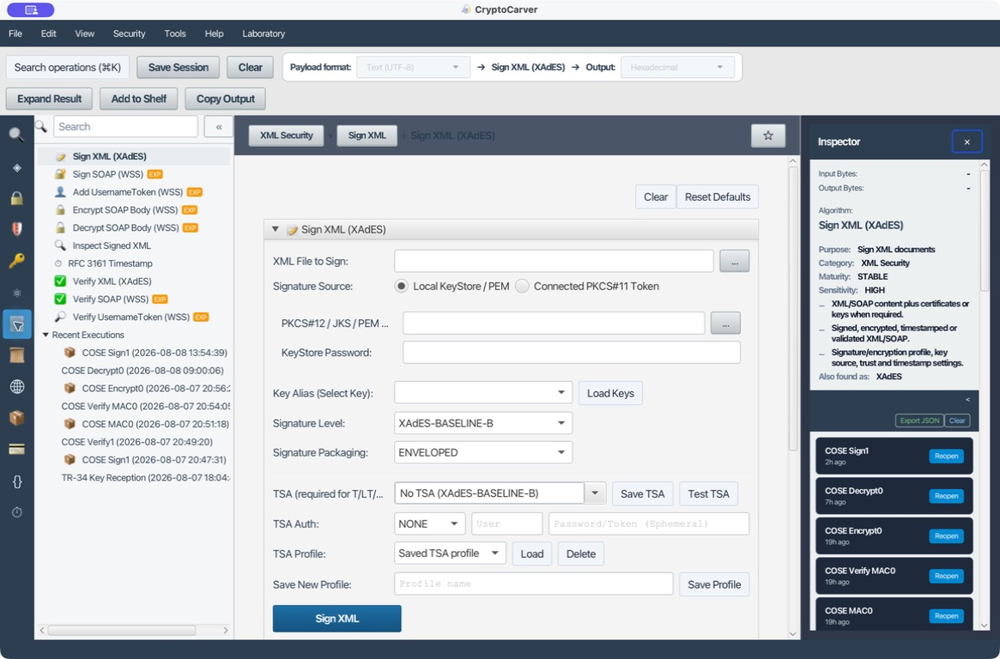
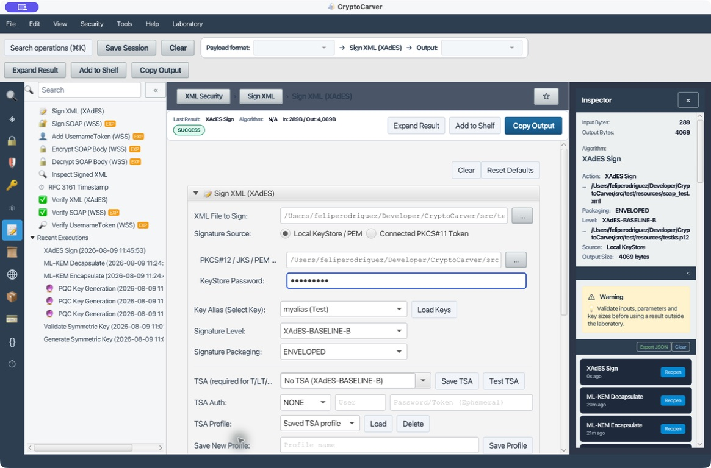
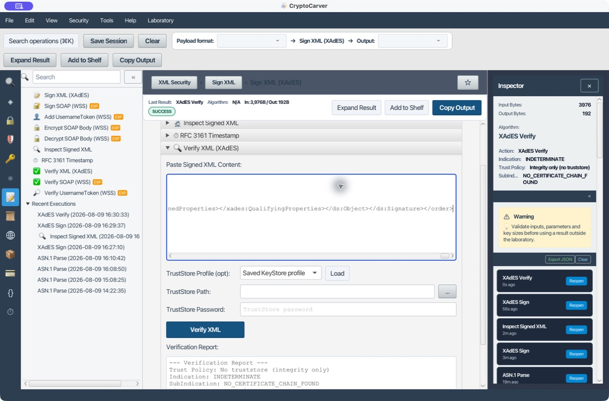
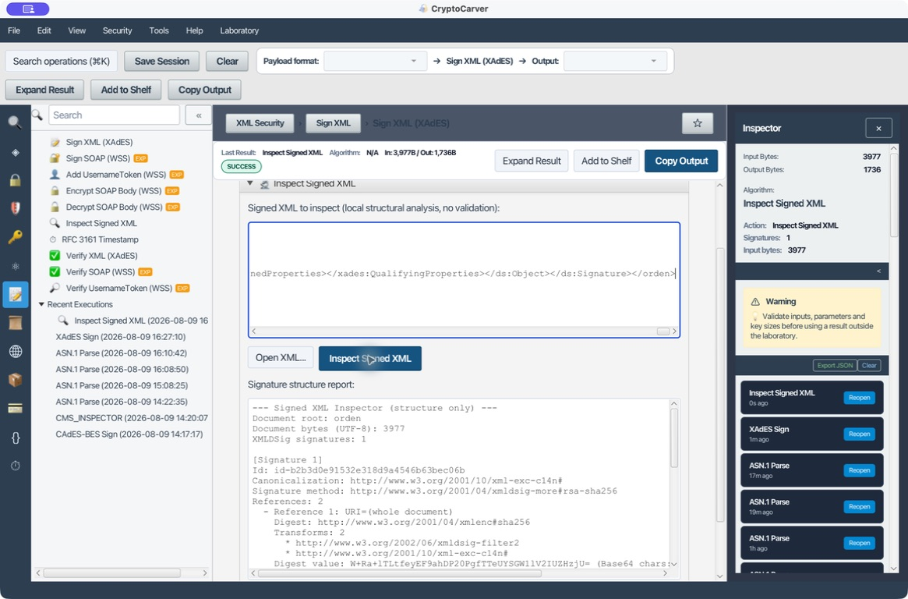
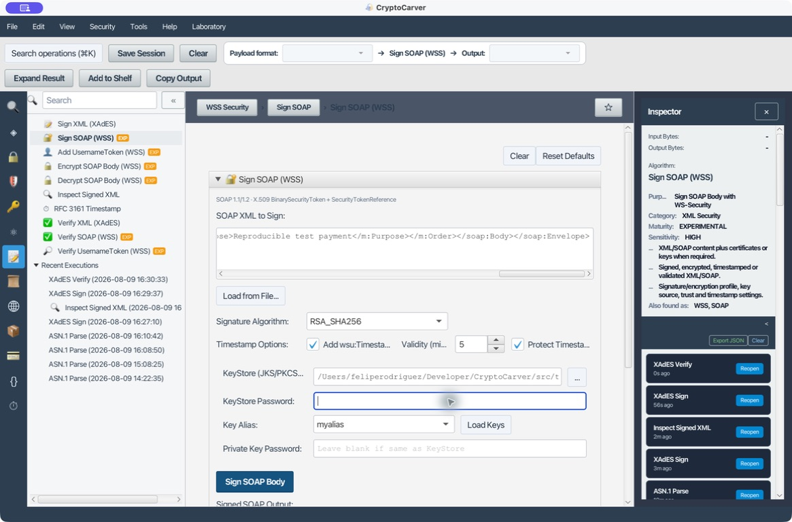
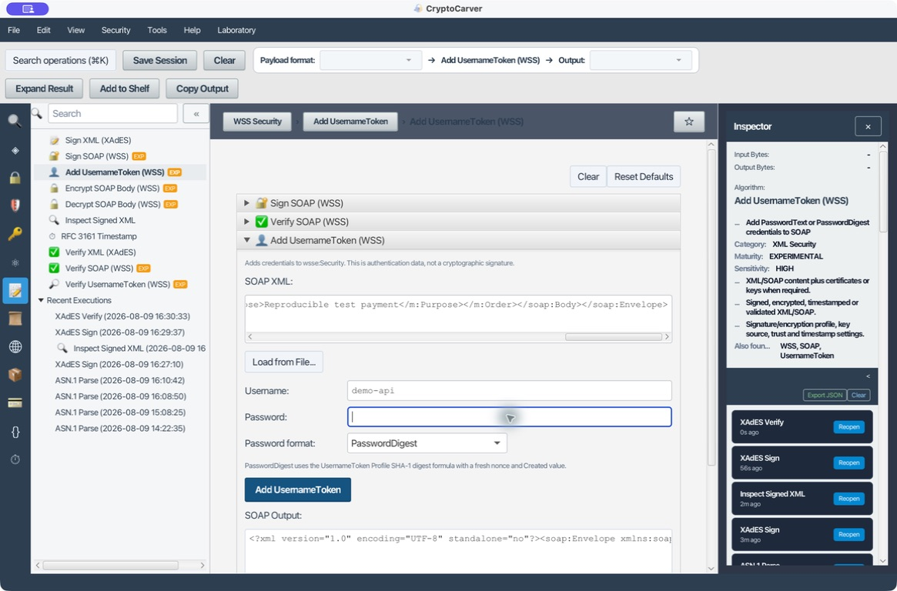
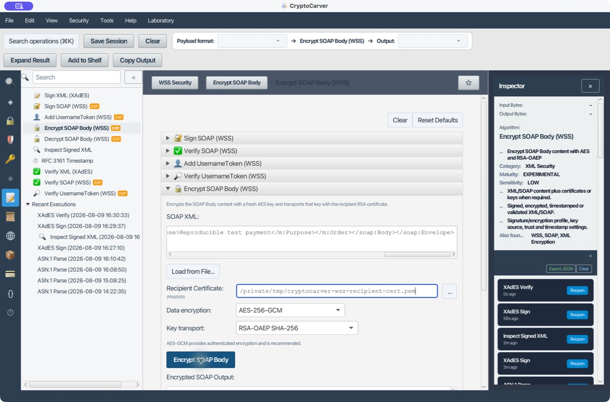
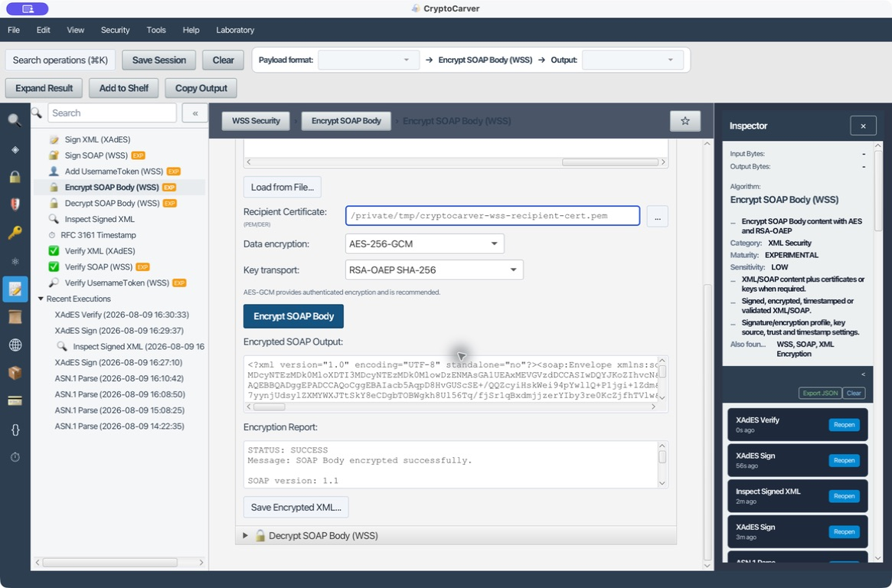

# Tutorial: Seguridad XML, XAdES y WS-Security

XML Security firma referencias y bytes canonicalizados, no el aspecto que muestra una pantalla. Los namespaces, IDs, transforms y la política de validación son parte del resultado criptográfico. CryptoCarver reúne firma XAdES, inspección y validación, RFC 3161 y herramientas WS-Security.

## Mapa de decisiones

| Quiero | Herramienta | Resultado |
|---|---|---|
| Firmar un XML de negocio | Sign XML (XAdES) | Firma XMLDSig con propiedades XAdES |
| Ver qué se firmó | Inspect Signed XML | Referencias, transforms, certificados y propiedades |
| Decidir si es válida y confiable | Verify XML (XAdES) | Resultado criptográfico y, con truststore, confianza |
| Proteger un SOAP | Sign/Encrypt SOAP (WSS) | Cabecera wsse y Body firmado o cifrado |
| Evitar replay de credenciales SOAP | UsernameToken | Nonce, Created y PasswordDigest |

## Caso 1: Quiero firmar una orden XML con XAdES Baseline-B

Usa el XML reproducible de laboratorio:

    /Users/feliperodriguez/Developer/CryptoCarver/src/test/resources/soap_test.xml

Y el almacén PKCS#12 de pruebas:

    /Users/feliperodriguez/Developer/CryptoCarver/src/test/resources/testks.p12

En **Sign XML (XAdES)** introduce ambos caminos, contraseña storepass, carga las claves y selecciona el alias myalias (Test). Elige **XAdES-BASELINE-B**, empaquetado **ENVELOPED** y deja TSA en No TSA.

La ejecución firmó 289 bytes y produjo 4.069 bytes. La salida contiene Signature, SignedInfo y SignatureValue, canonicalización exclusiva, firma RSA-SHA256, digest SHA-256, una referencia al documento que excluye Signature y una segunda referencia a SignedProperties. Además incorpora SigningTime y SigningCertificateV2.

No reutilices este almacén ni esta contraseña fuera del laboratorio.

### Qué comprobar antes de aceptar el resultado

1. El nivel mostrado es XAdES-BASELINE-B y el empaquetado corresponde al contrato.
2. Cada Reference resuelve al elemento que el proceso de negocio va a consumir.
3. DigestMethod, SignatureMethod y CanonicalizationMethod están permitidos por la política.
4. El certificado corresponde al firmante esperado y tiene el uso permitido.

## Caso 2: Quiero elegir entre ENVELOPED, ENVELOPING y DETACHED

| Empaquetado | Dónde queda la firma | Cuándo usarlo | Riesgo operativo |
|---|---|---|---|
| ENVELOPED | Dentro del XML firmado | Documento XML autocontenido | Debe excluirse la propia Signature de la referencia |
| ENVELOPING | El contenido queda dentro de la firma | Paquete centrado en la firma | El receptor debe extraer el objeto correcto |
| DETACHED | Firma y contenido son objetos separados | Facturas, lotes o contenido inmutable | Se debe transportar y resolver la referencia de forma segura |

Selecciona el empaquetado antes de firmar; no lo cambies al verificar. Para DETACHED, prueba que el archivo resuelto sea exactamente el esperado, con una URI sin resolución ambigua ni acceso a ubicaciones no autorizadas.

La captura del caso 1 muestra el resultado de una firma enveloped. Para enveloping y detached cambia el empaquetado antes de firmar, conserva ambos artefactos cuando sea detached y verifica que el receptor resuelve la URI conforme al contrato.

## Caso 3: Quiero pasar de Baseline-B a T, LT o LTA

| Nivel | Añade | Lo que no prueba por sí solo |
|---|---|---|
| Baseline-B | Identidad del firmante y propiedades firmadas | Momento de existencia ni validez futura |
| Baseline-T | Sello RFC 3161 sobre la firma | Confianza en el certificado TSA |
| Baseline-LT | Evidencia de validación para longevidad | Que la evidencia siga siendo suficiente indefinidamente |
| Baseline-LTA | Sellos de archivo que protegen la evidencia | Una política de archivo o confianza completa |

CryptoCarver exige TSA para T, LT y LTA. Configura una URL HTTP(S), usa **Test TSA** antes de firmar y registra URL, autenticación, política del token, algoritmo de imprint y hora. La autenticación del TSA sólo se usa en la solicitud; no debe aparecer en el informe ni en el histórico.

Un sello de tiempo afirma que ciertos bytes existían antes de la hora del token, condicionado a la confianza y validación de la TSA. No confundas token recibido con TSA confiable: valida cadena, EKU de sellado, política, imprint y periodo de validez.

La misma pantalla de firma permite fijar el perfil y separar la fase de prueba TSA de la firma definitiva. Registra siempre los valores utilizados y el informe de validación.

## Caso 4: Quiero verificar sin confundir integridad con confianza

Abre **Verify XML (XAdES)**, carga el XML firmado y revisa el informe. Sin truststore, el resultado se interpreta como integridad/formato; no como una decisión de confianza. Con un truststore, añade su ruta y contraseña para que la validación pueda evaluar cadena según esa política.

Un informe que pase la firma criptográfica responde: la clave correspondiente produjo esta firma sobre estas referencias. La confianza responde además: esa clave pertenece a quien la política admite y era utilizable en el instante relevante. Registra ambas conclusiones separadamente.

### Pruebas negativas que debes ejecutar

1. Modifica SensitivePayload por SensitivePayloadX: el digest de la referencia debe fallar.
2. Modifica un byte de SignatureValue: la firma debe fallar.
3. Mantén la firma intacta pero usa un truststore que no confíe en el emisor: puede conservarse la integridad y fallar la confianza.
4. Inserta otro elemento con un ID aparentemente equivalente: el consumidor debe usar el nodo realmente validado, no el primero que encuentre.

## Caso 5: Quiero inspeccionar referencias y evitar XML Signature Wrapping

Con **Inspect Signed XML**, revisa URI, transforms, métodos, certificado y propiedades XAdES antes de integrar un mensaje externo. Un ataque de wrapping no necesita romper RSA: puede dejar una firma válida sobre un nodo y conseguir que la aplicación de negocio procese otro nodo no firmado.

La defensa práctica exige:

- Parser seguro: sin DTD ni entidades externas.
- IDs únicos y tipados; nunca resolver por una búsqueda XPath informal.
- Rechazar referencias externas salvo política explícita.
- Consumir el nodo que el validador resolvió, no un nodo reencontrado después.
- Restringir transforms, especialmente XPath/XSLT, a un perfil controlado.

## Caso 6: Quiero firmar un SOAP con WS-Security

Usa **Sign SOAP (WSS)** con un Envelope y un Body identificable. Carga la clave y certificado, firma el Body y revisa Security, BinarySecurityToken si el perfil lo incorpora, Reference apuntando al Body por ID, método de firma, digest y certificado.

En **Verify SOAP (WSS)** verifica el Body y confirma que la lógica de negocio usa ese mismo Body identificado. Las operaciones WSS están marcadas experimentales: úsalas para interoperabilidad controlada, con pruebas contra el stack receptor.

## Caso 7: Quiero usar UsernameToken sin abrir la puerta al replay

**PasswordText** expone el secreto dentro del SOAP; requiere TLS extremo a extremo. **PasswordDigest** combina nonce, Created y contraseña según el perfil WSS. En **Add UsernameToken (WSS)** usa PasswordDigest y, en **Verify UsernameToken (WSS)**, fija una ventana de frescura corta.

El receptor debe rechazar Created fuera de ventana y almacenar los nonces vistos durante la ventana de replay. El digest por sí solo no impide que un atacante reenvíe el mismo token.

## Caso 8: Quiero cifrar el Body SOAP

**Encrypt SOAP Body (WSS)** aplica el patrón híbrido: cifra el contenido con AES y protege esa clave de contenido para el destinatario mediante RSA-OAEP. **Decrypt SOAP Body (WSS)** requiere la privada correspondiente.

Verifica además de descifrar: algoritmo de transporte permitido, identidad del destinatario, tamaño de clave, integridad autenticada y que EncryptedData corresponde al Body esperado. No aceptes una clave RSA de prueba como identidad de producción.

## Checklist de entrega

- [ ] Nivel XAdES, empaquetado, algoritmo y canonicalización acordados.
- [ ] El XML de entrada usa IDs únicos y parser endurecido.
- [ ] Las referencias validadas son exactamente los nodos que consume el negocio.
- [ ] La verificación informa por separado de integridad, cadena, revocación y sello.
- [ ] TSA y truststore se controlan por perfil, no por valores implícitos.
- [ ] WSS protege y verifica el Body correcto; UsernameToken tiene frescura y anti-replay.
- [ ] Los informes ETSI, certificados y evidencias se conservan con controles de datos personales.

La implementación criptográfica no sustituye el perfil de interoperabilidad ni la política de confianza. Conserva XML de entrada, XML firmado, versión de la aplicación, proveedor, truststore y resultados de validación para cada ensayo.
