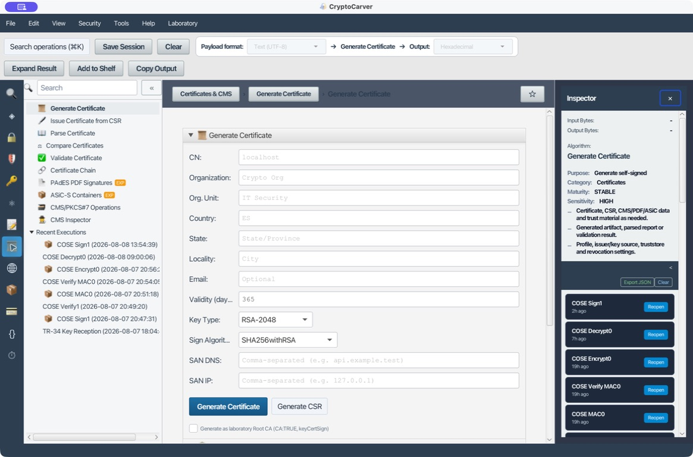
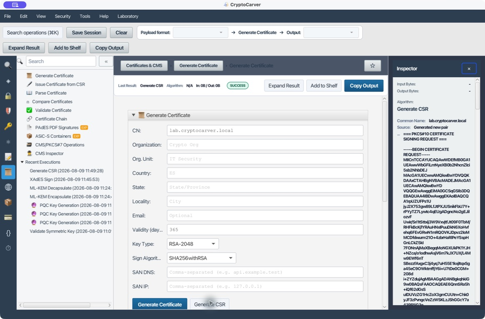

# Tutorial: Certificados, CSR, cadenas y contenedores

## Qué quiero hacer

| Objetivo | Módulo | Evidencia que debo guardar |
|---|---|---|
| Crear identidad de prueba | Generate Certificate / Generate CSR | Subject, SAN, clave, algoritmo y huella |
| Emitir una identidad | Issue Certificate from CSR | CSR, emisor, serie, extensiones y periodo |
| Aceptar un certificado externo | Validate Certificate / Certificate Chain | Cadena, trust anchor, fecha, usos y revocación |
| Confirmar que dos certificados son el mismo | Compare Certificates | Diff de sujeto, serie, validez, SAN y huella de la clave pública |
| Firmar o cifrar un archivo | CMS/PKCS#7 Operations | Perfil, contenido, destinatario y resultado de validación |

Un certificado no es una cuenta de usuario ni una autorización completa: es una declaración firmada sobre una clave. La política de confianza decide cuándo se acepta.

Un certificado vincula una identidad con una clave pública. Validarlo exige más que comprobar su firma.

## Caso 1: Certificado autofirmado de laboratorio

| Campo | Valor sugerido |
|---|---|
| CN | lab.cryptocarver.local |
| Organization | CryptoCarver Lab |
| Country | ES |
| Validity | 30 días |
| Key Type | RSA-2048 |
| Signature | SHA256withRSA |
| SAN DNS | lab.cryptocarver.local |

1. Abre **Generate Certificate** y completa la tabla.
2. Genera certificado y clave.
3. Guarda la privada en un entorno protegido.
4. Abre **Parse Certificate** y comprueba sujeto, emisor, serie, validez, SAN, usos y fingerprint.

Autofirmado significa que sujeto y emisor son el mismo; no significa confianza automática.

### Entrada reproducible

En la aplicación, usa CN `lab.cryptocarver.local`, RSA-2048, SHA256withRSA y SAN DNS `lab.cryptocarver.local`. Después de escribir los campos, pulsa **Generate Certificate**. Para ensayar una solicitud en vez de un certificado, pulsa **Generate CSR**: se obtiene una PKCS#10 y una clave privada de laboratorio; la privada no se debe pegar en documentación ni entregar a la CA.

Comprueba en **Parse Certificate** que el SAN contiene el nombre usado por el cliente. En TLS moderno, el CN por sí solo no sustituye el SAN.

## Caso 2: CSR y emisión

1. Genera el par en [Claves](05-claves.md) y pulsa **Use for Certificate / CSR**.
2. Crea un CSR con SAN y usos requeridos.
3. En **Issue Certificate from CSR**, usa una CA de laboratorio.
4. Comprueba que la pública del certificado coincide con la del CSR.
5. Verifica BasicConstraints y KeyUsage del emisor y del emitido.

La CA debe ser CA:TRUE y keyCertSign. Un certificado final normalmente es CA:FALSE.

### Cómo decidir las extensiones

| Tipo de certificado | BasicConstraints | KeyUsage / EKU orientativo |
|---|---|---|
| Raíz o intermedia | CA:TRUE | keyCertSign y cRLSign |
| Servidor TLS | CA:FALSE | digitalSignature y keyEncipherment; serverAuth |
| Firma de código/documento | CA:FALSE | digitalSignature y EKU específico |

No conviertas un certificado final en CA ni uses una CA para autenticación de servidor sólo porque la firma criptográfica sea válida.

## Caso 3: Validar una cadena

1. Introduce certificado final, intermedios y trust anchor.
2. Define fecha de validación.
3. Ejecuta **Certificate Chain**.
4. Revisa firma de cada enlace, validez, restricciones, usos, nombre y revocación.

Un certificado puede tener firma válida y aun así fallar por expiración, nombre, uso o raíz no confiable.

### Pruebas negativas

1. Cambia la fecha de validación fuera del periodo `notBefore/notAfter`: debe fallar por tiempo.
2. Elimina un intermedio: la ruta debe quedar incompleta.
3. Usa un trust anchor distinto: puede verificar una firma individual y fallar la confianza de cadena.
4. Solicita un nombre SAN no incluido: la identidad de servidor debe resultar no válida.
5. Ante CRL/OCSP desconocido o timeout, aplica la política de fallo cerrado; nunca conviertas indeterminado en bueno.

## Caso 4: Comparar dos certificados campo a campo

**Compare Certificates** decodifica dos PEM X.509 y produce un diff estructurado (`[DIFF] campo`, valor izquierdo, valor derecho) de sujeto, emisor, serie, `notBefore`/`notAfter`, algoritmo de firma, huella SHA-256 de la clave pública, `BasicConstraints`, `KeyUsage` y SAN. Úsalo para responder "¿es exactamente este certificado el que se emitió?" antes de aceptar un reemplazo, una renovación o un archivo que dice ser el mismo que ya conocías.

Para el ejercicio hay dos certificados autofirmados de laboratorio en [datos/](datos/): [certificado-laboratorio-comparacion-a.pem](datos/certificado-laboratorio-comparacion-a.pem) y [certificado-laboratorio-comparacion-b.pem](datos/certificado-laboratorio-comparacion-b.pem). Comparten emisor tipo (CN de laboratorio, misma O y C) pero tienen sujeto, clave, serie y periodo de validez distintos.

1. Abre **Certificates > Compare Certificates**.
2. Pega `certificado-laboratorio-comparacion-a.pem` en el campo izquierdo y `certificado-laboratorio-comparacion-b.pem` en el derecho.
3. Pulsa **Compare**. El informe debe listar como mínimo `[DIFF] Subject`, `[DIFF] Serial`, `[DIFF] Not Before`, `[DIFF] Not After`, `[DIFF] Public Key SHA-256` y `[DIFF] Subject Alternative Names`, además del SHA-256 completo de cada certificado codificado (`Left SHA-256` / `Right SHA-256`).

### Prueba negativa

Copia el mismo archivo (`certificado-laboratorio-comparacion-a.pem`) en ambos campos y pulsa **Compare**: el informe debe cambiar a `✓ No differences in the inspected certificate fields.`, sin listar ningún `[DIFF]`. Si ves diferencias con el mismo archivo pegado dos veces, revisa que no haya un salto de línea o espacio final distinto entre los dos pegados: el comparador trabaja sobre los campos decodificados, no sobre el texto PEM, así que un resultado idéntico exige que ambos PEM decodifiquen a la misma estructura.

## Caso 5: CMS SignedData

Usa **CMS/PKCS#7 Operations** para firmar un archivo pequeño.

- Attached incluye el contenido.
- Detached exige proporcionar el contenido original al verificar.
- El certificado puede ir incluido, pero la confianza se evalúa aparte.

Abre **CMS Inspector** para revisar signerInfo, digest, atributos firmados, certificados y encapsulatedContentInfo.

### Receta: firmar una orden adjunta

Usa un archivo pequeño, por ejemplo una orden UTF-8, y elige SignedData attached. Guarda el CMS y verifica sin proporcionar contenido externo. Repite en detached: el verificador debe recibir exactamente los mismos bytes de la orden. Cambiar incluso un salto de línea debe invalidar la firma detached.

## Caso 6: EnvelopedData

CMS cifra una clave de contenido para uno o más destinatarios. Cada destinatario usa su privada para recuperar la clave simétrica. Es cifrado híbrido, no RSA aplicado al archivo completo.

Para cada destinatario, revisa que el certificado esté destinado al cifrado o transporte de clave y que el identificador del destinatario sea el esperado. Desencriptar con una privada que produce bytes no confirma por sí mismo que esos bytes pertenezcan al negocio: la autenticación del contenido debe formar parte del protocolo.

## PAdES y ASiC-S

PAdES firma el PDF preservando su estructura incremental. ASiC-S empaqueta un payload y firma detached. Ambos están marcados como experimentales: valida con herramientas externas antes de interoperar.

No edites el PDF firmado de forma que reescriba su estructura incremental. En ASiC-S conserva el payload y manifiesto que se validaron; extraer y volver a comprimir puede alterar los bytes que cubre la firma.

## Revocación

CRL y OCSP aportan estado, pero debes registrar instante, fuente, freshness y política ante estado desconocido. No conviertas un timeout de red en “válido”.

## Checklist

- Fingerprint verificado por canal fiable.
- SAN, no solo CN.
- KeyUsage/EKU adecuados.
- Cadena completa y trust anchor explícito.
- Fecha y revocación evaluadas.
- Clave privada separada del certificado público.
- El propósito de la clave y las extensiones coinciden con el uso real.
- Resultado de integridad separado de confianza, nombre y revocación.
