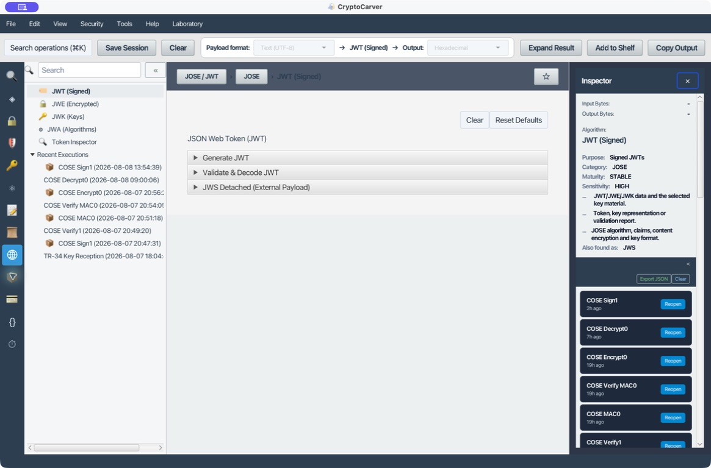
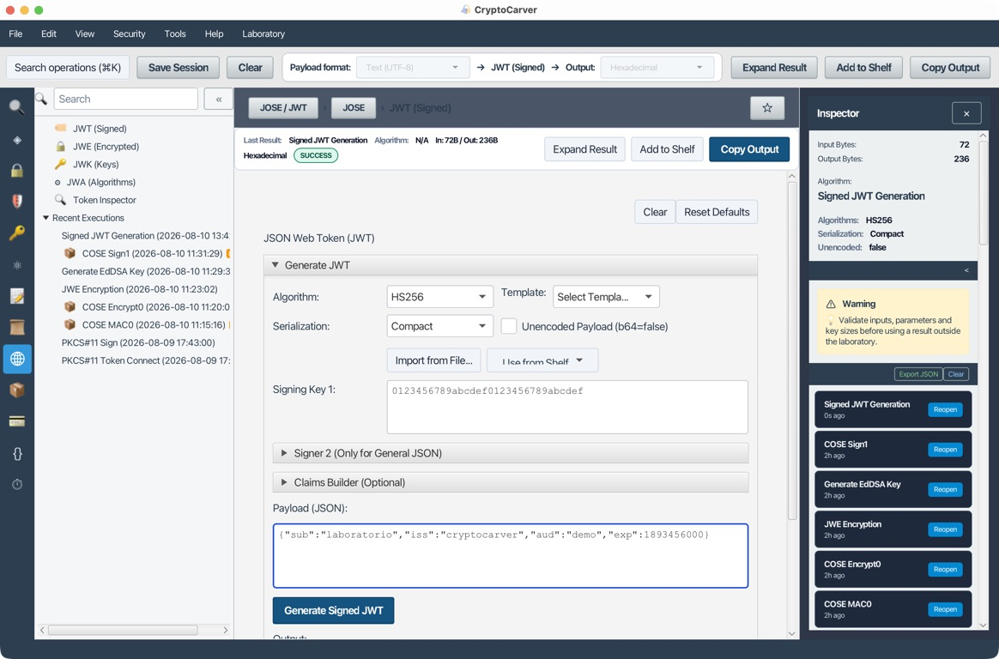
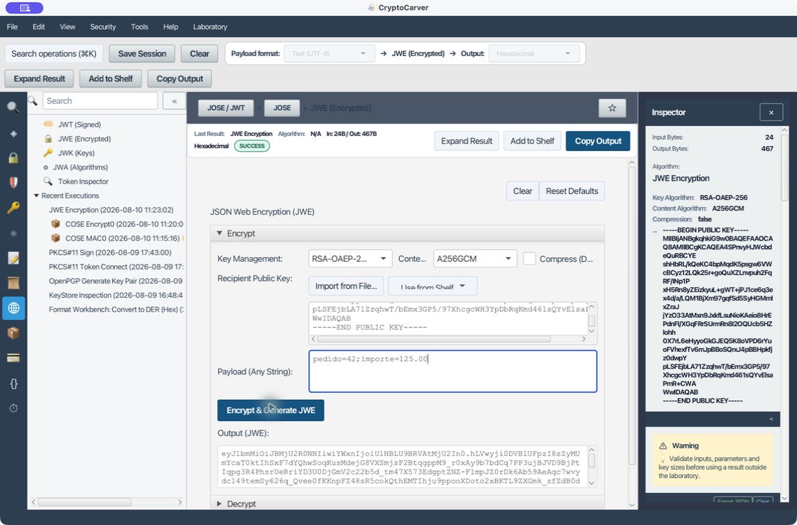
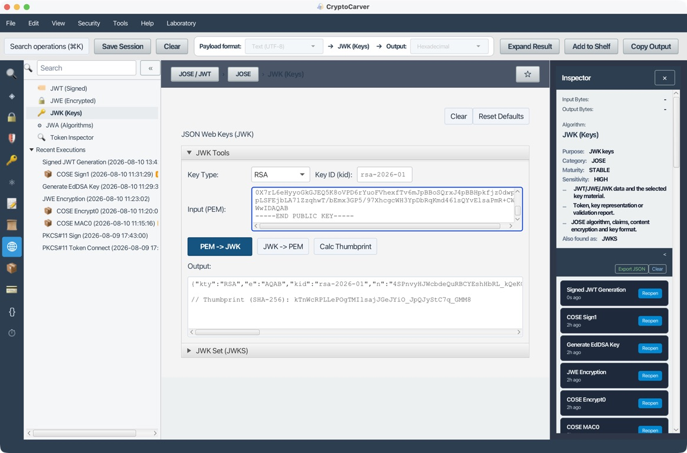

# Tutorial: JWT, JWS, JWE y claves JWK



JOSE separa firma, cifrado y representación de claves. Un JWT decodificado no está necesariamente validado.

## Modelo mental

| Objeto | Función |
|---|---|
| JWT | Conjunto de claims |
| JWS | Firma o MAC del payload |
| JWE | Cifrado del payload |
| JWK/JWKS | Representación y publicación de claves |
| JWA | Identificadores de algoritmos |

## Caso 1: JWT firmado con RSA

### Quiero emitir un token para una API y que otro servicio pueda verificarlo

1. Genera RSA-2048 en [Claves](05-claves.md).
2. Abre **JWT (Signed) → Generate JWT**.
3. Selecciona RS256.
4. Usa claims de laboratorio: issuer, audience, subject, issued-at y expiración corta.
5. Genera el token.

La salida compacta tiene tres segmentos Base64URL: header.payload.signature.

### Validación correcta

1. Abre **Validate & Decode JWT**.
2. Introduce token y clave pública.
3. Exige el algoritmo esperado; no lo aceptes desde el token sin política.
4. Configura issuer y audience exactos.
5. Valida exp, nbf e iat con tolerancia temporal limitada.

El resultado debe separar “firma válida” de “claims aceptables”.

Para que el experimento sea repetible, usa `iss=cryptocarver-lab`,
`aud=api-pedidos`, `sub=cliente-42`, `iat` igual al instante de emisión y una
`exp` de cinco minutos. El validador debe aceptar exactamente esos dos primeros
claims y rechazar el token tanto si expira como si se presenta a otra API. La
firma sólo prueba que alguien con la clave la creó; no demuestra que el token
sea aplicable a este receptor concreto.

### Ejemplo reproducible con HS256

Para entender el formato sin distribuir una clave privada, en **Generate JWT** selecciona HS256, Compact y usa como secreto de laboratorio `0123456789abcdef0123456789abcdef`. Introduce este payload UTF-8:

    {"sub":"laboratorio","iss":"cryptocarver","aud":"demo","exp":1893456000}



La ejecución generó 236 bytes, con algoritmo HS256 y payload de 72 bytes. La captura muestra el secreto, los claims y la salida producida por CryptoCarver; el secreto es público y no sirve para producción. El resultado debe tener tres segmentos compactos si el perfil pide JWS Compact; antes de transmitirlo, valida firma, `iss`, `aud`, `exp`, `nbf` e `iat` con valores de política.

En **Token Inspector** se puede leer el header y el payload sin la clave. Esa
lectura es sólo diagnóstico: no marques el usuario como autenticado hasta que
**Validate & Decode JWT** haya terminado la comprobación del MAC y de los
claims. Es una distinción especialmente importante cuando se depuran tokens
copiados de un log.

### Pruebas negativas

- Cambia un carácter del payload: firma inválida.
- Usa una audiencia distinta: firma válida, política inválida.
- Usa un token expirado: firma válida, token rechazado.
- Sustituye RS256 por otro algoritmo: rechazado por allowlist.

## Caso 2: HS256

HS256 usa una clave simétrica. Debe tener entropía suficiente y no puede publicarse en JWKS. Todos los verificadores pueden también firmar, por lo que no aporta separación emisor/verificador.

Elige HS256 sólo cuando emisor y todos los verificadores pertenezcan al mismo dominio de confianza. Para proveedores externos usa una firma asimétrica, publica sólo la clave pública y liga cada `kid` a una clave y algoritmo permitidos.

### Qué cambia entre HS256 y RS256/ES256

| Necesidad | HS256 | RS256 o ES256 |
|---|---|---|
| Verificar sin poder emitir | No | Sí, con clave pública |
| Distribuir el material de verificación | Secreto por canal seguro | JWKS o certificado público |
| Rotación | Todos los verificadores reciben el secreto nuevo | Se publica una pública nueva y se conserva la anterior temporalmente |
| Caso típico | Servicios internos bajo la misma administración | API, federación o varios verificadores |

No aceptes un token HS256 usando como secreto una clave pública RSA. Esa
confusión de algoritmo ha sido origen de vulnerabilidades históricas: el
validador debe conocer antes de leer el JWT cuál es el algoritmo y cuál es el
tipo de clave admisible para cada `kid`.

## Caso 3: JWE

### Quiero transportar datos confidenciales para un destinatario concreto

1. Abre **JWE (Encrypted)**.
2. Selecciona gestión de clave y cifrado de contenido compatibles.
3. Usa un payload pequeño.
4. Cifra y revisa los cinco segmentos compactos.
5. Descifra con la clave correspondiente.

El protected header se autentica. Para RSA usa OAEP-SHA-256; para contenido usa AES-GCM cuando sea interoperable.

**Ejecución reproducida.** En la aplicación se ha cifrado `pedido=42;importe=125.00` con la clave pública RSA de [clave-publica-laboratorio.pem](datos/clave-publica-laboratorio.pem), `alg=RSA-OAEP-256` y `enc=A256GCM`. El resultado fue un JWE compacto de 467 bytes y se muestra completo en el cuadro de salida.



La salida compacta debe tener cinco segmentos: `protected.encrypted_key.iv.ciphertext.tag`. Antes de comparar con otra parte, registra los cinco segmentos y el `kid` del destinatario; no registres la privada RSA. Como OAEP y GCM incorporan aleatoriedad, al repetir el caso el JWE cambiará: lo reproducible son los parámetros, el plaintext y que el descifrado devuelva exactamente la entrada.

### Prueba negativa JWE

Altera un carácter del ciphertext o de la etiqueta del JWE compacto; el descifrado debe fallar. No intentes recuperar parcialmente el payload ni devuelvas diferencias de error al atacante. Rechaza también un header con `alg` o `enc` fuera de tu allowlist, aunque la estructura tenga cinco segmentos.

Registra el resultado esperado de la prueba como un único fallo de
autenticación. Distinguir “tag incorrecto”, “clave inexistente” o “header no
permitido” ante el cliente facilita oráculos de descifrado; esos detalles sólo
deben quedar en telemetría protegida.

## Caso 4: Nested sign-then-encrypt

Firma primero para autenticidad del emisor y cifra después para confidencialidad del destinatario. El receptor descifra y luego verifica. Documenta el orden; encrypt-then-sign tiene semántica distinta.

Para cada token anota el algoritmo interior y exterior, el `kid` de cada clave y el tipo de serialización. Un inspector puede reconocer el contenedor, pero nunca reemplaza la validación de firma, cifrado y claims.

Un perfil de laboratorio reproducible es: JWS interior con `RS256` para
identificar al emisor y JWE exterior con `RSA-OAEP-256` + `A256GCM` para el
destinatario. Conserva la cadena de pasos: payload original, JWS, JWE y el
resultado de descifrar y verificar. Si alteras un carácter del JWE no debe
llegarse a la validación del JWS; si alteras únicamente el JWS antes de
cifrarlo, debe fallar al final la verificación de firma.

**Orden de validación.** Primero autentica y descifra el JWE; después valida el JWS interior con la pública del emisor; finalmente aplica `iss`, `aud`, `exp`, `nbf` e `iat`. Un token que no supera la capa exterior no debe producir mensajes de error sobre claims interiores.

## JWK y rotación

Publica solo claves públicas con **kid** estable. En rotación:

1. Añade la nueva pública al JWKS.
2. Empieza a firmar con su kid.
3. Mantén la anterior durante la vida máxima de tokens.
4. Retírala cuando ya no existan tokens válidos.

No permitas que el propio JWT elija un JWKS remoto, URL de clave o algoritmo sin una configuración local que lo autorice. El `kid` es un selector, no una prueba de confianza.

Para una rotación comprobable conserva dos claves públicas durante la ventana de coexistencia: `kid=2026-01` firma los tokens vigentes y `kid=2026-02` empieza a firmar los nuevos. El validador resuelve ambos únicamente desde el JWKS configurado, nunca desde `jku`, `x5u` ni una URL del header.

### Caso JWK reproducible: publicar una RSA sin publicar su privada

En **JWK (Keys) → JWK Tools**, selecciona `RSA`, escribe `rsa-2026-01` como `kid` y pega la clave pública PEM de [clave-publica-laboratorio.pem](datos/clave-publica-laboratorio.pem). Pulsa **PEM → JWK**. La ejecución devuelve una JWK pública con esta forma:

```json
{
  "kty": "RSA",
  "kid": "rsa-2026-01",
  "e": "AQAB",
  "n": "…módulo RSA codificado en Base64URL…"
}
```

`e=AQAB` representa el exponente público 65537. `n` es el módulo RSA en Base64URL; ambos son publicables. No añadas `d`, `p`, `q`, `dp`, `dq` ni `qi` a un JWKS: esos parámetros forman la privada. CryptoCarver también calcula el thumbprint SHA-256 `kTnWcRPLLePOgTMIlsajJGeJYiO_JpQJyStC7q_GMM8`, útil para identificar de forma estable la clave, pero no sustituye a una política de confianza.



Para publicar dos claves durante la rotación, el documento servido por el emisor debe ser una envoltura `{"keys":[jwk_2026_01,jwk_2026_02]}`. Cada entrada debe llevar un `kid` único y, cuando la política lo requiera, `use:"sig"` y una lista `key_ops` coherente. El verificador obtiene ese JWKS desde una URL configurada de antemano y acepta exclusivamente los `kid` y algoritmos permitidos para ese emisor.

## Inspector

Usa **Token Inspector** para identificar JWS/JWE, serialización y algoritmos. La inspección ayuda a diagnosticar, pero la seguridad depende de la validación criptográfica y de claims.

## Checklist

- Algoritmos permitidos explícitos.
- kid resuelto sin aceptar rutas o URLs arbitrarias.
- issuer, audience y tiempos validados.
- Claves privadas y secretos fuera del token.
- Tamaño y datos personales mínimos.

## Incidencias frecuentes

| Síntoma | Causa probable | Acción segura |
|---|---|---|
| El token se decodifica pero es rechazado | `aud`, `iss` o tiempo no cumplen la política | Corrige los claims, no desactives validaciones |
| `kid` desconocido | Rotación no publicada o token de otro emisor | Consulta únicamente el JWKS configurado localmente |
| JWE no descifra | Clave privada, `alg`, `enc` o AAD no coinciden | Revisa el perfil y registra el error de forma uniforme |
| Firma inválida tras copiar el token | Se alteró Base64URL, se truncó o se cambió el payload | Usa el valor completo y vuelve a emitirlo |
