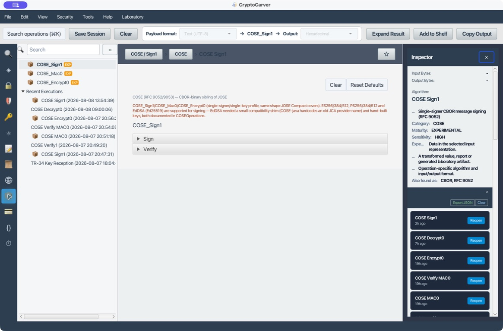
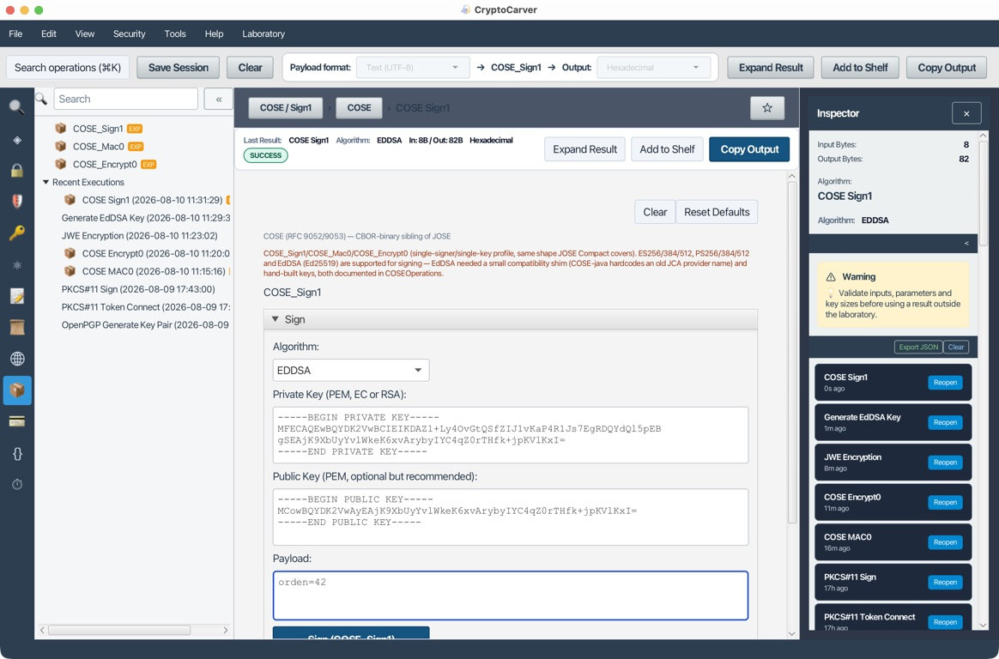
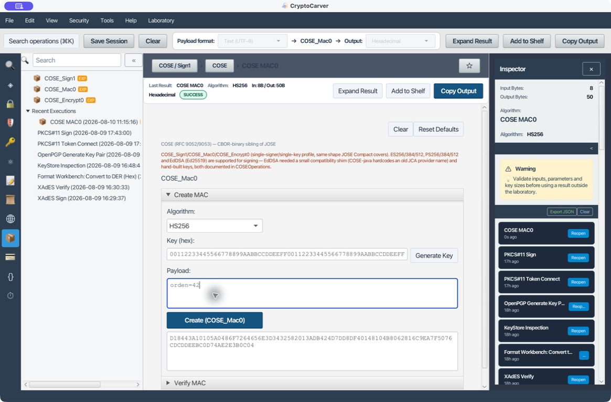
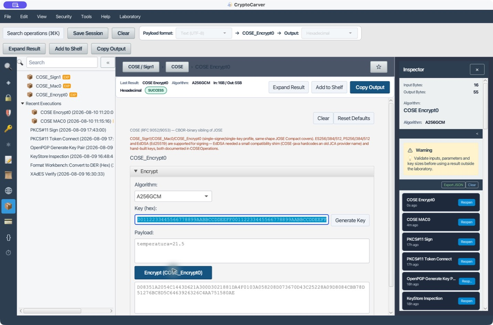

# Tutorial: COSE sobre CBOR

COSE ofrece funciones parecidas a JOSE, pero sobre CBOR y con identificadores compactos. La salida es binaria y suele mostrarse en hexadecimal.

## Estructuras

| Estructura | Uso |
|---|---|
| COSE_Sign1 | Un firmante |
| COSE_Mac0 | Una clave MAC |
| COSE_Encrypt0 | Una clave de cifrado |

## Caso 1: Sign1 con EdDSA

### Quiero firmar un mensaje CBOR para un dispositivo con pocos bytes disponibles

1. Genera Ed25519 en **Keys → EdDSA Key Generation**.
2. Abre **COSE Sign1**.
3. Usa payload UTF-8: **Hola COSE**.
4. Selecciona EdDSA y firma.
5. Conserva la salida CBOR hexadecimal.
6. Verifica con la pública.

**Ejecución reproducida.** Se generó un par Ed25519 dentro de **Claves → EdDSA Key Generation** y se firmó el payload UTF-8 `orden=42` con `alg=EdDSA`. CryptoCarver produjo un COSE_Sign1 de 82 bytes (entrada: 8 bytes) y muestra el CBOR resultante en hexadecimal. La clave privada de esta ejecución es exclusivamente de laboratorio y no debe reutilizarse.

### Receta reproducible

En **COSE_Sign1 → Sign** selecciona EdDSA, pega una privada Ed25519 en PEM y, opcionalmente, su pública para una comprobación local. Firma el texto UTF-8 `Hola COSE` y conserva el CBOR en hexadecimal junto con algoritmo COSE, curva, protected headers y external AAD. En **Verify**, usa los mismos bytes de payload y AAD; un cambio de un byte debe invalidar el resultado.

La clave puede generarse en **Claves → EdDSA Key Generation** dentro de la
misma aplicación. Para esta práctica no reutilices una clave de producción ni
copies la privada en un ticket, chat o repositorio: entrega al verificador sólo
el PEM público. Al guardar el resultado apunta si el `kid` es parte de la
cabecera protegida; dos Sign1 idénticos en apariencia pueden firmar bytes
distintos si difieren las cabeceras.

## Cabeceras protegidas

El algoritmo debe ir en protected headers para quedar autenticado. Las unprotected headers son visibles y modificables; no pongas allí decisiones de seguridad sin una protección adicional.

Una clave `kid` sin protección puede localizar material, pero no debe decidir algoritmo ni autorización. El receptor aplica una allowlist local de algoritmo y curva antes de verificar.

## Caso 2: Mac0

1. Genera una clave HMAC de laboratorio.
2. Autentica **orden=42**.
3. Verifica con la misma clave.
4. Cambia el payload y confirma fallo.

Mac0 no oculta el payload. Cualquier poseedor de la clave puede producir un MAC.

**Resultado comprobable.** Para el texto `orden=42`, guarda el CBOR hexadecimal, el algoritmo COSE elegido y los bytes de AAD. Repite con `orden=43` y la misma clave: la verificación debe rechazarlo. Si ambas verificaciones pasan, no se está verificando el mismo artefacto que se autenticó.

Usa una clave simétrica distinta por entorno y asocia el propósito al contexto externo. Conserva el MAC y sustituye `orden=42` por `orden=43`: la verificación debe fallar. No reutilices una clave Mac0 como clave de cifrado AES-GCM.

## Caso 3: Encrypt0

1. Genera AES-256.
2. Selecciona AES-GCM y un nonce nuevo.
3. Cifra el payload.
4. Descifra con clave y nonce.
5. Modifica un byte: la autenticación debe fallar.

### Datos de entrada y resultado que hay que conservar

Para reproducir un Encrypt0 almacena fuera del mensaje la clave AES, el nonce
por mensaje y los bytes de external AAD. El objeto COSE contiene ciphertext y
tag, pero no convierte automáticamente cualquier texto de contexto en AAD.
Para un laboratorio, etiqueta el contexto como `cose-lab|v1|sensor-7`; emisor y
receptor deben usar exactamente esos bytes UTF-8. Repetir un nonce con la misma
clave AES-GCM invalida la seguridad aunque el descifrado parezca funcionar.

Una salida Encrypt0 correcta se acepta solo si el tag GCM se valida. No hay «descifrado parcial» útil: cualquier alteración del ciphertext, nonce, protected headers o external AAD debe producir un único rechazo de autenticación.

## Datos externos

External AAD no se incluye en el objeto, pero participa en la autenticación. Emisor y receptor deben construir exactamente los mismos bytes.

Una receta útil es serializar en AAD un identificador de protocolo, versión, emisor y receptor. No uses JSON libre si el otro extremo espera una codificación CBOR concreta: documenta los bytes exactos.

## Interoperabilidad

Al comparar con otra biblioteca registra:

- Bytes CBOR, no una representación textual.
- Canonicalización/orden cuando el perfil lo exija.
- Identificador numérico de algoritmo.
- protected, unprotected y external AAD.
- Clave y curva exactas.

Incluye también el tag COSE esperado, los labels numéricos de cabecera y si existe canonical CBOR. Una conversión a hexadecimal es sólo transporte visual: no reinterpreta el CBOR firmado.

## Relación con JOSE

No conviertas JOSE ↔ COSE sustituyendo Base64URL por hexadecimal. Las estructuras, identificadores y bytes firmados son distintos. Migra la semántica y vuelve a firmar/cifrar.

## Madurez

Las operaciones COSE están marcadas como experimentales. Usa vectores de interoperabilidad y otra implementación antes de adoptar un formato externo.

## Diagnóstico de un intercambio COSE

| Comprobación | Sign1 | Mac0 | Encrypt0 |
|---|---|---|---|
| Secreto necesario en el receptor | No; basta pública | Sí | Sí |
| Payload legible sin clave | Sí | Sí | No |
| Cambio de un byte | Verificación falla | MAC falla | Tag falla |
| Artefactos a registrar | Algoritmo, curva, protected, AAD | Algoritmo, `kid`, AAD | Algoritmo, nonce, AAD |

Cuando otra implementación no reconoce la salida, no compares únicamente la
cadena hexadecimal. Comprueba primero el tag COSE, después la estructura CBOR,
los labels de la cabecera protegida y, finalmente, los bytes exactos de AAD y
payload. Es el camino más corto para separar un problema de formato de uno de
claves o firma.
