# Tutorial: Criptografía de pagos - PIN blocks, generación de PIN y CVV

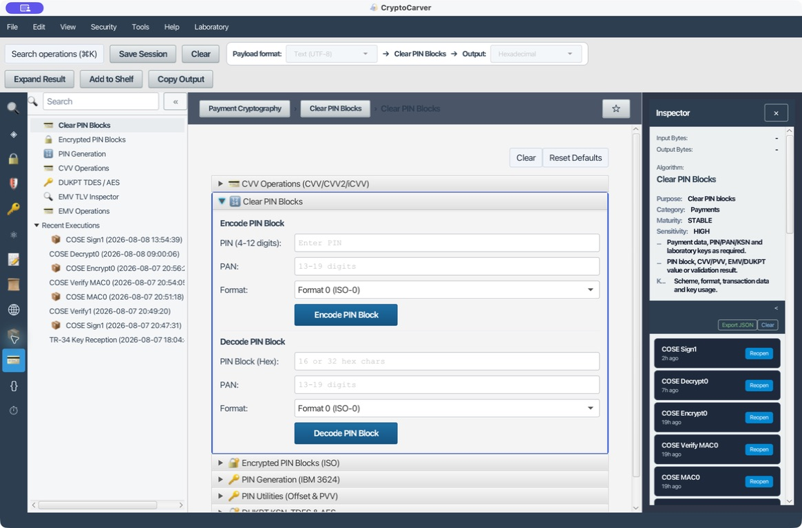

Este laboratorio recorre las capacidades de **Pagos** de CryptoCarver con un único conjunto de datos sintéticos. El objetivo es poder repetir una prueba, explicar qué representa cada salida y detectar un desacuerdo de formato antes de conectarlo a un componente de pagos. No se debe usar con PAN, PIN, CVK ni claves de producción; CryptoCarver tampoco sustituye un HSM ni los controles PCI DSS.

## Mapa del flujo

Un PIN no se debe almacenar ni transportar como texto. En una operativa típica, el terminal construye un campo PIN, lo vincula al PAN cuando el formato lo exige y lo protege bajo una clave de PIN. En el emisor se valida mediante un offset IBM 3624 o un PVV VISA. CVV/CVV2/iCVV/dCVV son verificadores de tarjeta: no verifican el PIN y no son intercambiables.

`PIN + PAN -> PIN block -> protección TDES/AES -> host`

`PVK + datos de validación + offset/PVV -> comprobación del PIN`

`CVK A + CVK B + PAN + caducidad + perfil -> CVV de tres dígitos`

Los valores usados a lo largo del tutorial son deliberadamente públicos de laboratorio:

| Elemento | Valor |
|---|---|
| PAN | `4992739871649996` |
| PIN | `1234` |
| Clave TDES/PVK de prueba | `0123456789ABCDEFFEDCBA9876543210` |
| CVK A | `0123456789ABCDEF` |
| CVK B | `FEDCBA9876543210` |
| Caducidad | `2512` |
| Service code mostrado | `101` |

## Caso 1: Calcular un offset IBM 3624

### Quiero guardar una diferencia de verificación, no un PIN

En **PIN Generation > PIN Utilities (Offset & PVV) > Generate Offset (IBM 3624)** introduce la PVK, la tabla decimal `0123456789012345`, el PAN y el PIN de la tabla anterior. Conserva `Start Pos = 0`, `Length = 16` y `Pad Char = F`. El offset se calcula dígito a dígito respecto al PIN natural que resulta de cifrar el bloque de datos de validación con la PVK.

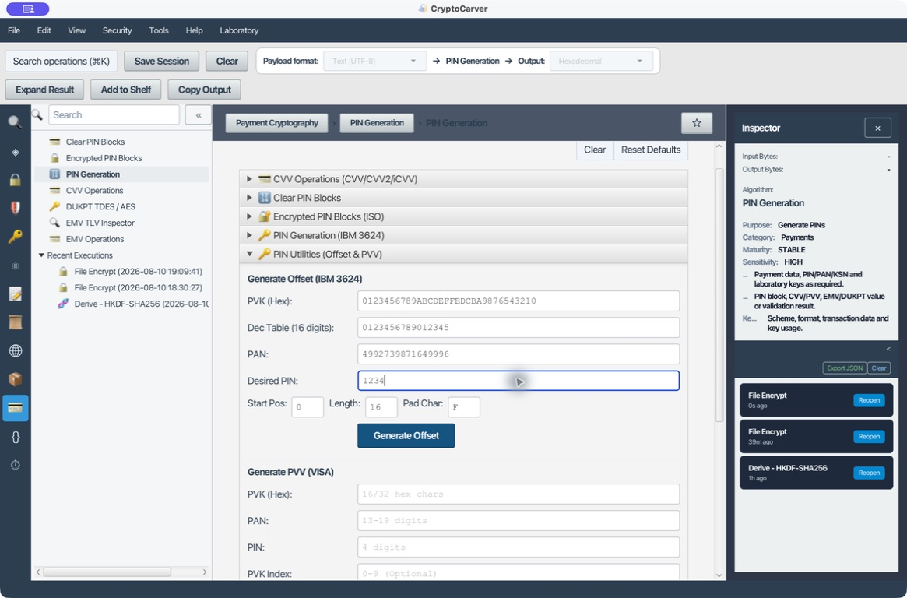

Pulsa **Generate Offset**. La ejecución devuelve `6110`. La salida también expone el bloque de datos de validación y la configuración efectiva: esto es lo que se debe comparar con el host. El PIN y la PVK no deben incluirse en una evidencia real.

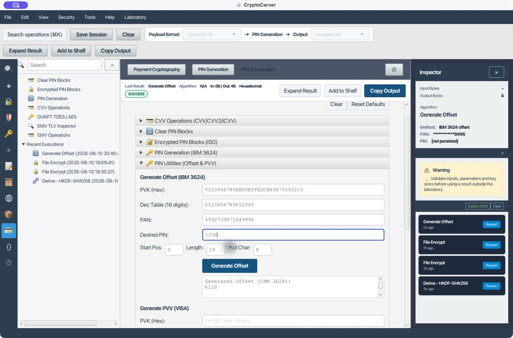

Para una prueba negativa cambia solamente la tabla decimal o la posición de inicio. El offset debe cambiar: conservar `6110` después de alterar uno de esos parámetros indicaría que se ha usado un perfil distinto del que se está documentando.

## Caso 2: Generar un PVV VISA

### Quiero que el emisor compruebe un PIN sin recuperarlo

Abre **PIN Utilities (Offset & PVV) > Generate PVV (VISA)**. Introduce la PVK TDES de laboratorio, el PAN, el PIN y `PVK Index = 0`.

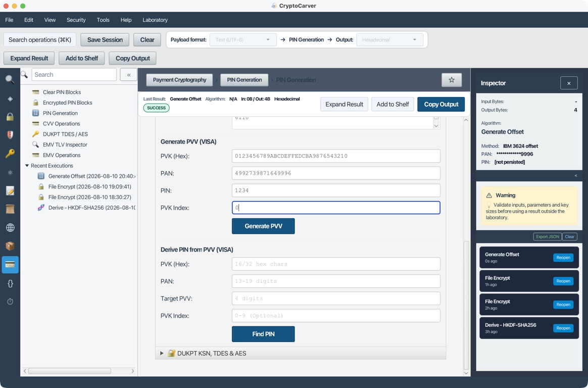

El resultado reproducible es `PVV = 5717`. El PVV es un verificador derivado del PAN, PIN, PVKI y PVK; no es un PIN block, ni un CVV, ni una clave. En una integración se conserva el perfil y el PVKI, no el PIN.

## Caso 3: Buscar el PIN candidato a partir de un PVV

### Quiero comprobar un vector de pruebas de PVV

La herramienta incluye **Derive PIN from PVV (VISA)** para un laboratorio. Con la misma PVK y PAN del caso anterior, introduce como PVV objetivo `5717` y PVKI `0`.

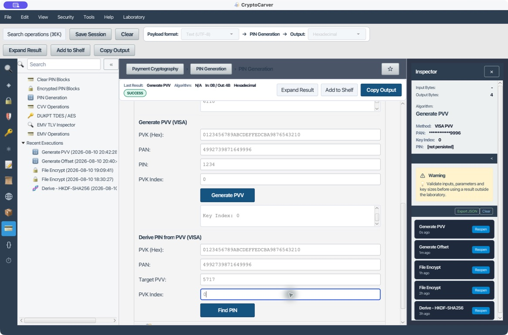

CryptoCarver prueba el espacio de PIN de cuatro dígitos y devuelve un único candidato: `1234`. Esta función sirve para comprobar vectores o investigar una configuración de laboratorio; no es un mecanismo de autenticación para producción ni autoriza registrar el PIN encontrado.

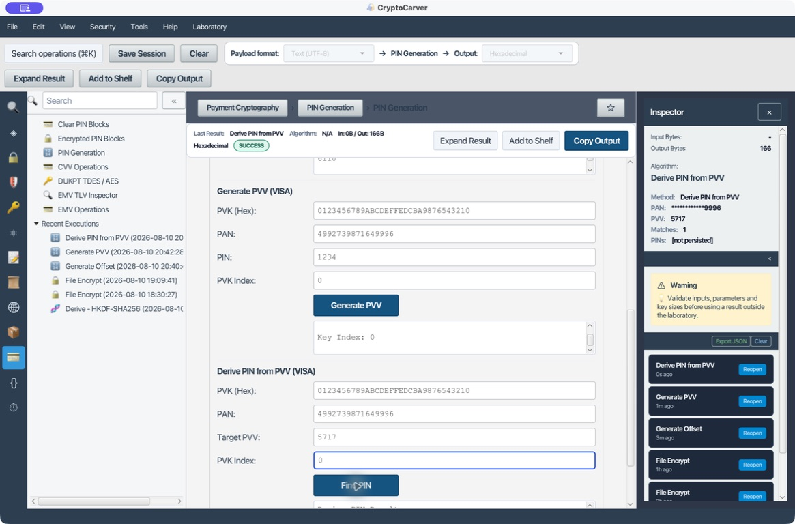

## Caso 4: Formato ISO-0

### Quiero formar el formato de interoperabilidad más habitual

En **Clear PIN Blocks**, selecciona **Format 0 (ISO-0)**, escribe el PIN y PAN de la tabla y pulsa **Encode PIN Block**. ISO-0 forma `0L || PIN || F...` y lo aplica XOR contra los doce dígitos situados a la derecha del PAN, sin el dígito de control. Por eso un PAN incorrecto impide recuperar un PIN fiable.

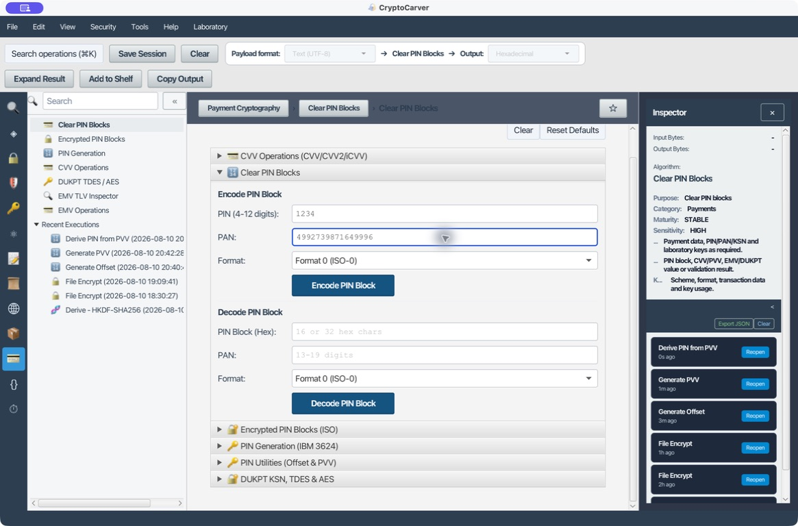

El vector calculado es `041213C678E9B666` (8 bytes). Para validar el extremo receptor, pega ese bloque en **Decode**, conserva el mismo PAN y formato y comprueba que la salida sea `1234`.

## Caso 5: Formato ISO-1

### Quiero un PIN field sin XOR de PAN y con relleno aleatorio

Selecciona **Format 1 (ISO-1)** con los mismos PIN y PAN. El PAN se muestra en la pantalla por uniformidad del formulario, pero ISO-1 no lo incorpora en el campo. El formato comienza por `1L` y rellena el resto con nibbles aleatorios.

Esta ejecución produjo `1412340F78F4224D`. No debe esperarse el mismo hexadecimal en otra ejecución porque el relleno es aleatorio. Lo reproducible es que **Decode**, con ese mismo bloque y el formato ISO-1, recupere `1234`.

## Caso 6: Formato ISO-2

### Quiero un campo PIN fijo que no dependa del PAN

Selecciona **Format 2 (ISO-2)**. Igual que ISO-1, el PAN no participa; a diferencia de ISO-1, el relleno es `F` y el control es `2L`.

El vector es `241234FFFFFFFFFF`. Es reproducible con el mismo PIN porque no hay aleatoriedad. No uses este resultado como si fuera ISO-0: el primer nibble, la regla de relleno y el uso del PAN son distintos.

## Caso 7: Formato ISO-3

### Quiero vincular el campo al PAN, pero sin relleno fijo

Selecciona **Format 3 (ISO-3)**. Este formato parte de `3L || PIN`, rellena con nibbles aleatorios y después hace XOR con el bloque PAN como ISO-0.

El bloque que se obtuvo en esta ejecución fue `34121324EB4DDB70`. Es evidencia de esta prueba, no un vector fijo: el relleno aleatorio hace que otro bloque válido sea normal. La comprobación correcta es decodificar con el mismo PAN y recuperar el PIN original.

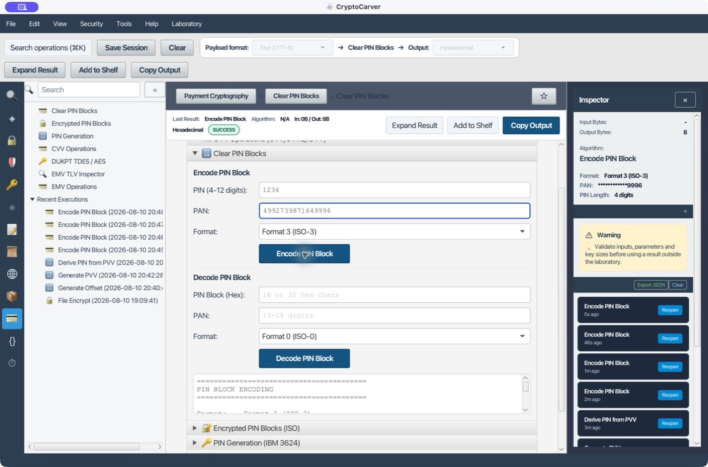

## Caso 8: Formato ISO-4

### Quiero inspeccionar el campo de 16 bytes de la familia AES

Selecciona **Format 4 (ISO-4)**. A diferencia de ISO-0/1/2/3, trabaja con campos de 16 bytes. CryptoCarver muestra el campo PIN claro y el campo PAN claro para que se pueda verificar la construcción antes de aplicar la protección AES del perfil.

En la ejecución se observan `PIN Block Clear = 441234AAAAAAAAAAD02D9B72E9FA945B` y `PAN Block Clear = 44992739871649996000000000000000`. La parte final del campo PIN contiene aleatoriedad, así que la estructura, longitud y una posterior decodificación son los criterios reproducibles; no el último tramo hexadecimal.

## Caso 9: CVV de banda magnética

### Quiero calcular CVV1 usando el service code del perfil

Abre **CVV Operations**, selecciona **CVV (Magnetic Stripe)** e introduce CVK A, CVK B, PAN, `2512` y service code `101`.

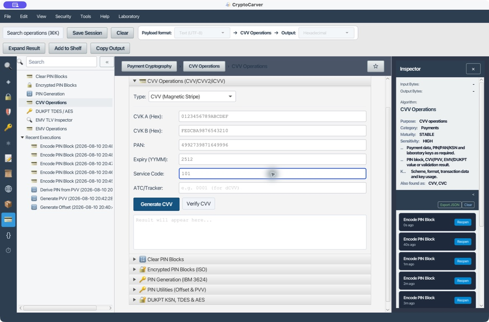

La salida es `CVV = 813`. En este perfil el service code que se introduce sí participa en el cálculo; cambia solamente `101` por otro valor para ejecutar la prueba negativa. El CVV resultante debe cambiar.

## Caso 10: CVV2 impreso

### Quiero calcular el verificador de tarjeta no presente

Con los mismos datos, cambia el selector a **CVV2 (Card Printed)**. La entrada mantiene `101` visible para hacer explícita la diferencia de perfil.

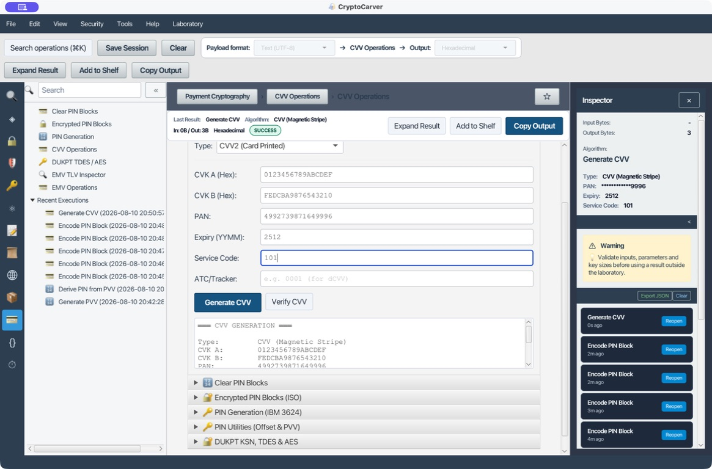

CryptoCarver devuelve `CVV = 110` e indica que emplea internamente service code `000`. Esta sustitución no es una errata: CVV2 no reutiliza el service code de banda. Copiar el `813` del caso anterior a este perfil es un error de integración.

## Caso 11: iCVV para chip

### Quiero separar el valor de chip del CVV de banda

Selecciona **iCVV (Chip)** sin alterar CVK, PAN ni caducidad. El formulario mantiene el service code de entrada para dejar claro qué ha introducido el operador.

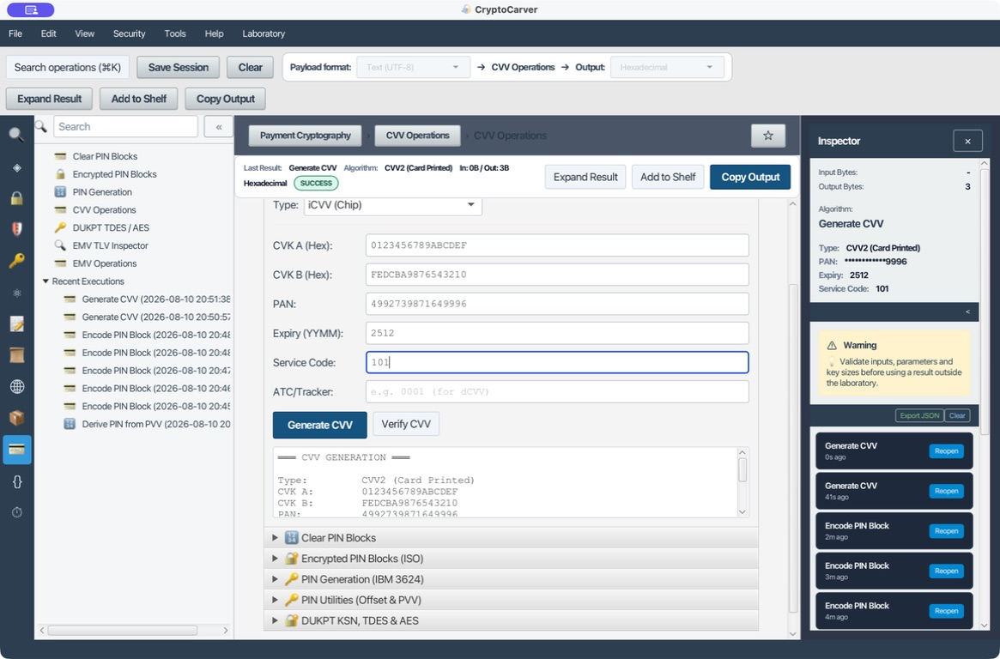

La salida es `iCVV = 501` y muestra que el cálculo ha forzado service code `999`. Esta diferencia de datos de entrada es precisamente la razón por la que iCVV, CVV y CVV2 no se pueden intercambiar aunque el PAN y las CVK sean los mismos.

## Caso 12: dCVV con ATC

### Quiero obtener un verificador dinámico que avance con la transacción

Selecciona **dCVV (Dynamic)** e introduce `ATC/Tracker = 001`. En este perfil, el ATC es obligatorio y la herramienta acepta entre uno y tres dígitos; el service code se muestra, pero no se usa en el cálculo.

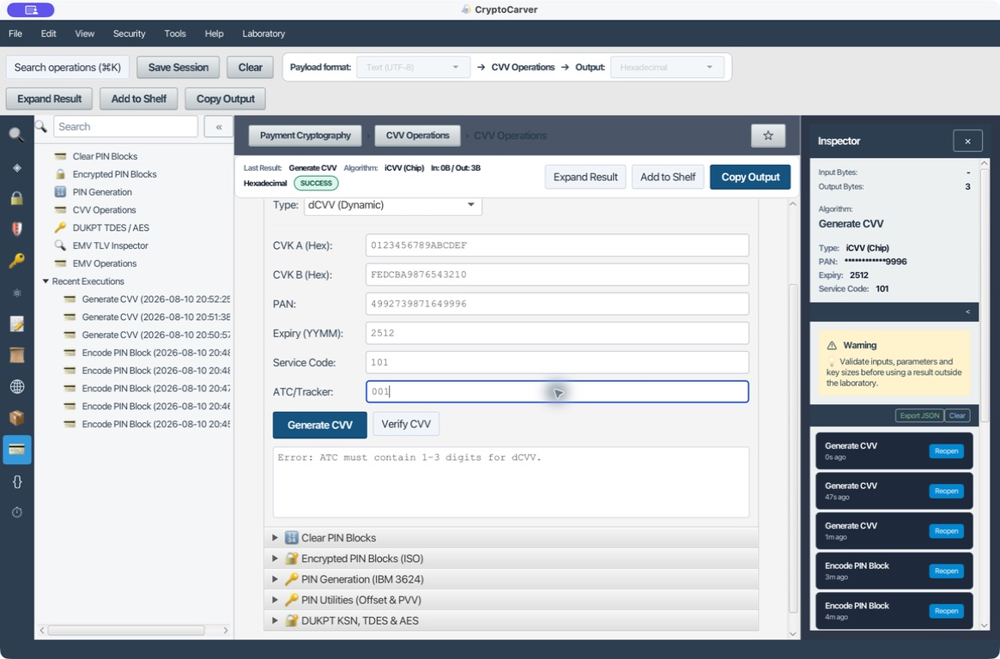

El resultado para el vector es `dCVV = 991`. Repite la operación con ATC `002`: debe producir otro valor. El cambio es esperado y permite evitar que un valor dinámico se comporte como un CVV estático.

## Caso 13: Proteger un PIN block ISO-0 con TDES

### Quiero transportar el bloque ISO-0, no su versión clara

Abre **Encrypted PIN Blocks**, selecciona **Format 0 (ISO-0)** e introduce PIN, PAN y la clave TDES de laboratorio. La clave usada aquí es sólo un vector público; una clave de PIN real debe residir y operar dentro del HSM.

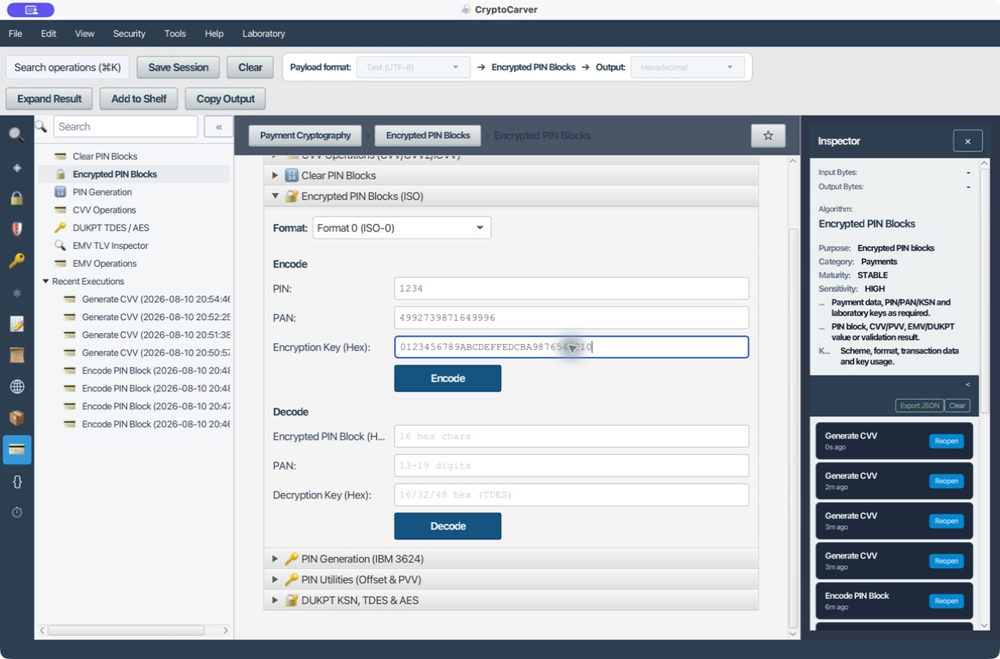

La herramienta forma primero `041213C678E9B666` y lo protege con TDES-ECB, obteniendo `7F16830E5B55F041`. Para una prueba de extremo a extremo, pega el segundo valor en **Decode** junto con el mismo PAN y clave: el resultado debe ser `1234`. Cambiar el PAN o la clave es una prueba negativa útil.

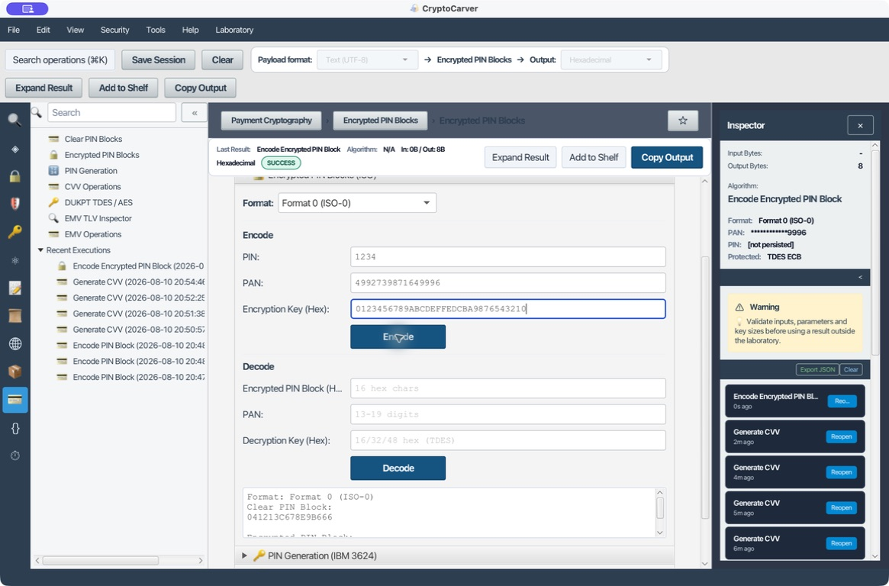

## Guía de decisión y evidencias

| Necesidad | Función | Dato que debe coincidir | Resultado esperado |
|---|---|---|---|
| Compatibilidad de terminal y host | ISO-0/ISO-3 | PAN, formato y PIN length | El decode recupera el PIN |
| Campo sin PAN | ISO-1/ISO-2 | Formato y PIN length | ISO-1 aleatorio; ISO-2 estable |
| Migración a campo AES | ISO-4 | Longitud de 16 bytes y PAN field | Estructura correcta y decode válido |
| Verificación de PIN del emisor | IBM 3624/PVV | PVK, tabla/PVKI y PAN | Offset o PVV coincidente |
| Tarjeta de banda, impresa o chip | CVV/CVV2/iCVV | Perfil, PAN, caducidad y CVK | Tres dígitos del perfil correcto |
| Verificador por transacción | dCVV | ATC y perfil dinámico | Valor distinto al variar el ATC |
| Transporte del PIN | PIN block cifrado | Formato, PAN, clave y algoritmo | Bloque protegido y decode correcto |

Antes de aprobar una integración, documenta formato, longitud, PAN enmascarado, perfil, algoritmo, KCV/identificador de clave y los datos de transacción no sensibles. Nunca incorpores PIN, PVK, CVK, ZPK, BDK o bloques PIN claros de producción a un PDF, historial o ticket.

