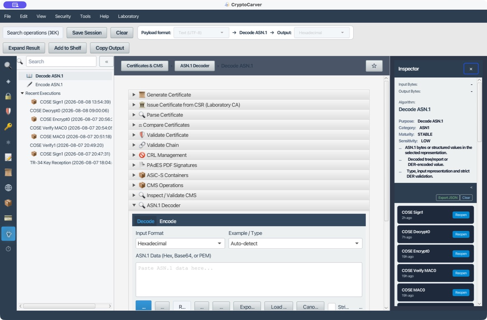
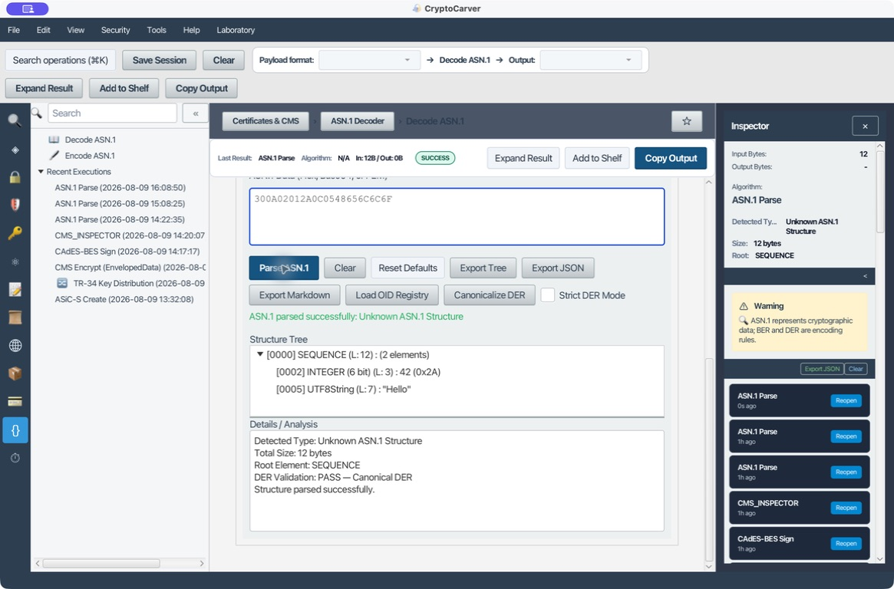
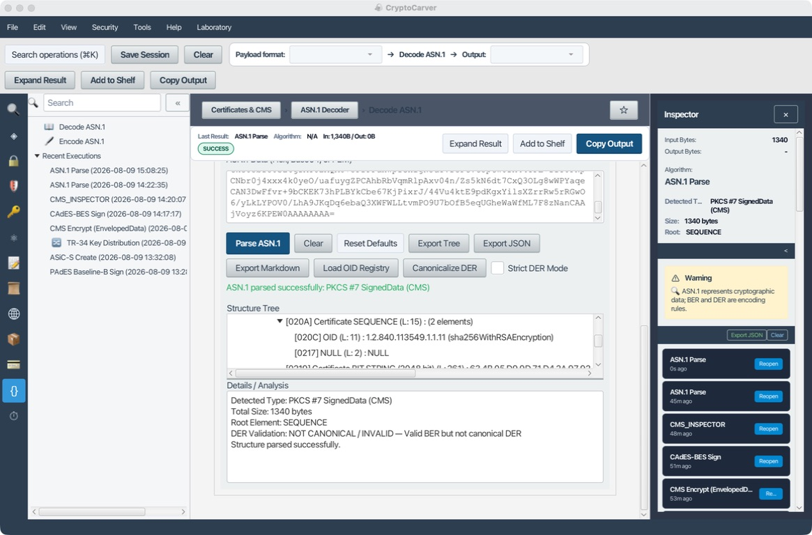
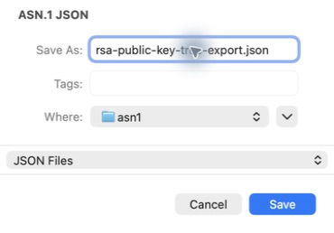

# Decodificación y construcción ASN.1

ASN.1 describe la estructura de muchos objetos criptográficos; BER y DER
definen cómo se serializan sus tags, longitudes y valores. El decodificador de
CryptoCarver permite comprobar los bytes reales antes de entregarlos a otro
módulo, exportar el árbol para una revisión y separar la estructura de la
validación criptográfica.

## Qué quiero hacer

| Objetivo | Entrada recomendada | Resultado que debo buscar |
|---|---|---|
| Entender un vector pequeño | Hexadecimal DER | Tags, longitudes y valores exactos |
| Revisar una clave pública | PEM/Base64 | `AlgorithmIdentifier`, OID y BIT STRING |
| Revisar un certificado o CSR | PEM/Base64 | TBS, subject, extensión y `subjectPublicKeyInfo` |
| Auditar una firma CMS | Base64 de PKCS#7 | `ContentInfo`, `SignedData`, atributos y certificados |
| Entregar un hallazgo reproducible | Árbol ya analizado | Exportación TXT, JSON o Markdown |

## Caso 1: Secuencia DER mínima

### Quiero comprobar manualmente una estructura antes de integrarla

En **ASN.1 → Decode ASN.1**, selecciona **Hexadecimal** e introduce:

| Bytes | Significado |
|---|---|
| `30 0A` | `SEQUENCE`, 10 bytes de contenido |
| `02 01 2A` | `INTEGER` de un byte, valor decimal 42 |
| `0C 05 48 65 6C 6C 6F` | `UTF8String`, cinco bytes, valor `Hello` |

El vector completo es `300A02012A0C0548656C6C6F`. Al pulsar **Parse ASN.1**,
la ejecución de laboratorio mostró 12 bytes, raíz `SEQUENCE`, dos elementos y
validación **DER PASS — Canonical DER**. Los botones de análisis, exportación y
canonización permanecen visibles junto al árbol.

Pruebas negativas útiles:

- Cambia `0A` por `0B` sin añadir un byte: la longitud queda inconsistente.
- Cambia el primer `02` por `04`: el primer elemento pasa a ser un `OCTET
  STRING`; la codificación puede seguir siendo válida, pero ya no cumple el
  contrato de una secuencia de enteros.
- Añade un cero de relleno innecesario a un `INTEGER`: puede ser BER aceptable
  pero no DER canónico. Activa **Strict DER Mode** para rechazar ese caso.

## Caso 2: Construir y verificar un round-trip

### Quiero emitir DER mínimo, no escribir longitudes a mano

Abre la pestaña **Encode** y selecciona **SEQUENCE (from Hex content)**. Como
contenido hexadecimal introduce `02012A0C0548656C6C6F`. La salida esperada es
`300A02012A0C0548656C6C6F`. Vuelve a **Decode**, pégala como hexadecimal y
comprueba el mismo árbol del caso anterior.

| Prueba | Resultado esperado |
|---|---|
| Construir la SEQUENCE | `300A02012A0C0548656C6C6F` |
| Decodificarla | INTEGER 42 y UTF8String `Hello` |
| Alterar longitud a `300B...` | Error o estructura truncada |
| Activar Strict DER | Rechazo de una codificación BER no canónica |

Este patrón sirve para preparar valores de pruebas, OID y wrappers, no para
inventar un formato de protocolo. La semántica siempre la fija el estándar que
consume esos bytes.

## Caso 3: Clave pública RSA en PEM

### Quiero confirmar qué algoritmo declara una clave antes de usarla

Pega una **clave pública** PEM de laboratorio y selecciona **Base64 (PEM)**.
No uses una clave privada real para una captura o exportación. En el ejemplo
ejecutado, el parser recibió 294 bytes y mostró una SEQUENCE exterior con:

| Nodo | Valor esperado |
|---|---|
| `AlgorithmIdentifier` | SEQUENCE con OID y `NULL` |
| OID | `1.2.840.113549.1.1.1` (`rsaEncryption`) |
| `subjectPublicKey` | BIT STRING que contiene la clave RSA |

El detector puede etiquetar una clave pública genérica como **Unknown ASN.1
Structure** aunque el árbol muestre correctamente `rsaEncryption`. Esa etiqueta
no invalida la estructura.

## Caso 4: Certificado X.509 y CSR

### Quiero localizar el campo que hace fallar una importación

Selecciona **Base64 (PEM)** y pega el certificado o CSR. En un certificado,
recorre `Certificate → TBSCertificate` y revisa:

| Zona | Pregunta que responde |
|---|---|
| `signatureAlgorithm` | ¿Qué algoritmo declara la firma del certificado? |
| `issuer`, `subject` | ¿Qué nombres codificados contiene? |
| `validity` | ¿Qué fechas hay realmente en DER? |
| `subjectPublicKeyInfo` | ¿Qué OID y pública se han importado? |
| `extensions` | ¿Hay extensiones críticas que el perfil debe interpretar? |

En un CSR, el `CertificationRequestInfo` es lo que firma el solicitante; la
firma exterior no debe confundirse con la que finalmente emitirá una CA. El
árbol ayuda a encontrar nombres y OID, pero usa **Certificates** para comprobar
firma, cadena, EKU, restricciones y revocación.

## Caso 5: PKCS#7/CMS y CAdES

### Quiero saber qué contiene una firma, no sólo si parece válida

Genera o copia un PKCS#7 de [CMS/PKCS#7](16-cms-pkcs7.md), elimina las
cabeceras PEM y selecciona **Base64**. Para la firma CAdES-BES de laboratorio,
CryptoCarver parseó 1.340 bytes y detectó **PKCS #7 SignedData (CMS)**. El
árbol parte de `ContentInfo` con OID exterior
`1.2.840.113549.1.7.2` (`signedData`) y continúa por `[0] EXPLICIT →
SignedData`.

Expande `digestAlgorithms`, `encapContentInfo`, `certificates` y `signerInfos`.
Para CAdES-BES, busca el atributo firmado `signingCertificateV2`
(`1.2.840.113549.1.9.16.2.47`). La sesión señaló que el contenedor era BER
válido pero no DER canónico: regístralo como hallazgo de interoperabilidad y no
como prueba de firma inválida. Confirma la firma, el perfil y la confianza en
**CMS Inspector**, no sólo en el árbol ASN.1.

## Caso 6: Exportar el análisis para una revisión reproducible

### Quiero compartir el árbol sin volver a copiar datos de la pantalla

Después de analizar un objeto, CryptoCarver ofrece tres salidas:

| Botón | Uso | Contenido |
|---|---|---|
| **Export Tree** | Lectura humana rápida | Texto con detalle y árbol completo |
| **Export JSON** | Automatización, diff o evidencias | Nodos, tags, longitudes, valores y descendientes |
| **Export Markdown** | Informe técnico | Árbol jerárquico legible en documentación |

Pulsa **Export JSON**, selecciona una carpeta de evidencia y escribe el nombre
sin añadir manualmente una segunda extensión si el diálogo ya aplica `.json`.
La exportación del ejemplo de clave pública se guardó desde la propia
aplicación como [rsa-public-key-tree-export.json](ejemplos/asn1/rsa-public-key-tree-export.json).
El diálogo de guardado identifica el tipo **JSON Files** y la carpeta destino.

Antes de compartir un export, revisa si los valores incluyen certificados,
identificadores o contenido firmado sensible. Un árbol de una clave pública es
normalmente compartible; un árbol de PKCS#8 privado, un CMS con contenido
adjunto o un CSR interno puede no serlo.

## Canonizar, validar y diagnosticar

**Strict DER Mode** sirve para controles que exigen DER canónico: ante una
longitud no mínima, orden incorrecto de `SET` o representación alternativa,
el parser detiene el flujo. **Canonicalize DER** genera una representación DER
derivada sin cambiar la entrada visible; úsala para comparar o depurar, nunca
para sustituir silenciosamente el artefacto firmado que recibiste.

| Síntoma | Primero comprueba | Acción siguiente |
|---|---|---|
| `Unexpected end` | Longitud declarada frente a bytes presentes | Corrige transporte o recorta el dato corrupto |
| `Unknown tag` | Tag de contexto y estándar aplicable | Añade el schema mental del protocolo; no inventes significado |
| BER no canónico | Reglas DER de longitud, SET e INTEGER | Activa Strict DER o conserva el hallazgo |
| PEM inválido | Cabeceras, Base64 y footer | Elige Base64 (PEM) o elimina cabeceras para Base64 puro |
| CMS parseable pero dudoso | OID exterior y árbol | Usa CMS Inspector para firma, perfil y confianza |

El árbol ASN.1 responde «qué bytes hay y cómo se agrupan». No responde por sí
solo «¿es confiable el certificado?», «¿es correcta la firma CMS?» o «¿puede
usarse esta clave?». Mantener esa separación evita aceptar una estructura bien
formada con una semántica insegura.
