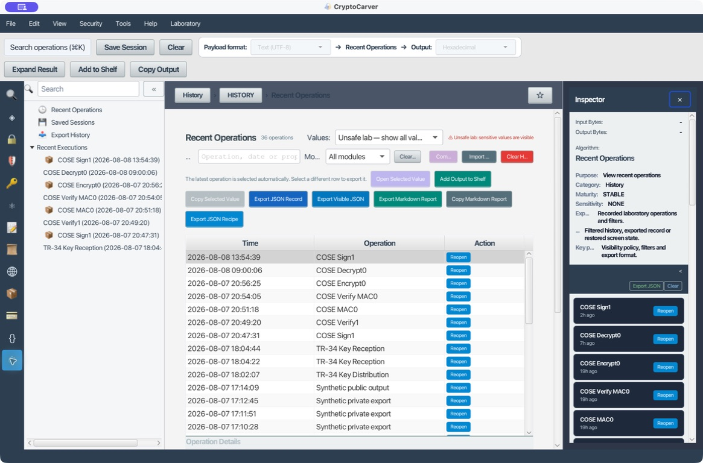

# Tutorial: Historial, recetas y sesiones reproducibles

El historial convierte una prueba aislada en evidencia reproducible. También puede exponer secretos, por lo que la visibilidad forma parte del flujo.

## Caso 1: Reproducir el ejemplo AES

### Quiero demostrar cómo se obtuvo un resultado sin volver a exponer la clave

1. Ejecuta el caso AES-256-CBC de [Cifrado](03-cifrado.md).
2. Abre **History → Recent Operations**.
3. Filtra por **Symmetric Encrypt**.
4. Selecciona la fila y revisa algoritmo, modo, padding, tamaños y formatos.
5. Pulsa **Reopen**.
6. Comprueba que la pantalla restaurada contiene el contexto permitido.

La clave puede estar redactada según la política. Eso es correcto: una receta compartible no debe incorporar secretos.

La fila del historial debe dejar claro qué se ejecutó: AES-256-CBC o AES-GCM,
padding, IV/nonce, formato de entrada y tamaño de salida. Si falta alguno de
estos datos, no declares que la ejecución sea reproducible aunque el
ciphertext esté conservado. En modos aleatorizados, compara además el
descifrado o la verificación, no necesariamente el ciphertext literal.

## Exportaciones

| Acción | Uso |
|---|---|
| Export JSON Record | Registro estructurado de una operación |
| Export Visible JSON | Respeta la visibilidad actual |
| Export Markdown Report | Informe legible |
| Export JSON Recipe | Parámetros para reproducir |
| Copy Markdown Report | Pegado rápido en una incidencia |

## Caso 2: Receta segura

### Quiero compartir una receta con otro equipo sin compartir material sensible

1. Selecciona una operación sin secretos, como Hashing.
2. Exporta JSON Recipe.
3. Importa la receta.
4. Comprueba que algoritmo y formatos se restauran.
5. Ejecuta y compara la salida.

Para cifrado, la receta debe referenciar una clave por nombre/ID o pedirla al usuario, no incluir el valor.

Antes de enviarla, importa la receta en una sesión vacía y comprueba dos cosas:
que abre la operación y que queda pendiente el secreto. Una receta que se
ejecuta porque incorpora la clave, PIN o contraseña no es una receta segura:
es una filtración exportable.

## Perfiles de visibilidad

- **Unsafe lab:** muestra todos los valores; úsalo solo localmente.
- **Masked:** permite reconocer un valor sin revelarlo completo.
- **Redacted:** elimina secretos para compartir.

Antes de exportar, cambia a Redacted y abre el archivo resultante. Busca claves hexadecimales, PEM privados, PIN, contraseñas y tokens.

### Ejercicio de comprobación

1. Genera un hash de `CryptoCarver` y exporta un informe Markdown en **Redacted**.
2. Confirma que siguen apareciendo algoritmo, formatos, hora, tamaños y digest.
3. Ejecuta una firma o cifrado de laboratorio y vuelve a exportar en
   **Redacted**.
4. Busca `BEGIN PRIVATE`, cadenas largas hexadecimales, `PIN=` y `Bearer `.
5. Si aparece un secreto, no compartas ni el informe ni la sesión: cambia la
   política y vuelve a crear la evidencia.

## Saved Sessions

Una sesión conserva estado de pantalla y selección de herramientas. Úsala para continuar un laboratorio, no como almacén permanente de secretos.

Guarda sesiones con un nombre que describa el objetivo y no el secreto, por
ejemplo `laboratorio-aes-gcm-vectores`. Al reabrirla revisa la política de
visibilidad antes de pulsar **Reopen** o exportar: que una sesión sea local no
la hace automáticamente apropiada para adjuntarla a una incidencia.

## Comparación

Selecciona dos operaciones compatibles y usa **Compare 2**. Compara primero parámetros y bytes de entrada; una salida distinta puede ser correcta si cambió IV, nonce, salt o aleatoriedad OAEP.

Para una comparación de control usa una función determinista como SHA-256 con
la misma entrada: resultado y parámetros deben ser iguales. Para AES-GCM usa
el mismo vector (clave, nonce, AAD y plaintext) si quieres comparar ciphertext
y tag. Esta distinción evita reportar como fallo la aleatoriedad esperada de
OAEP o un IV nuevo.

## Pruebas negativas

### Reabrir una operación con la clave redactada

1. Ejecuta el caso AES-256-CBC de [Cifrado](03-cifrado.md) con la política de visibilidad en **Redacted**.
2. Abre **History → Recent Operations**, selecciona esa fila y pulsa **Reopen**.
3. Confirma que la pantalla restaurada muestra algoritmo, modo, padding y tamaños, pero el campo de la clave llega vacío o marcado como redactado, nunca con el valor original relleno automáticamente.

Si al reabrir aparece la clave en claro pese a estar en **Redacted**, la política de visibilidad no se está aplicando a la reapertura y no solo a la exportación; repórtalo como fallo, no lo trates como una comodidad.

### Reabrir después de limpiar el historial

1. Ejecuta una operación de laboratorio cualquiera y anota su fila en **Recent Operations**.
2. Pulsa **Clear History**.
3. Confirma que la lista de operaciones recientes queda vacía (o solo con lo ejecutado después de la limpieza) y que ya no es posible seleccionar ni reabrir la fila borrada.

Una receta o exportación ya guardada fuera del historial (paso previo a **Clear History**) sigue siendo válida: la limpieza afecta al historial de la aplicación, no a los archivos que ya exportaste. No confundas "ya no aparece en Recent Operations" con "el resultado ha dejado de existir en disco".

### Importar una receta y esperar que no se autoejecute

Retoma el Caso 2: importa la receta JSON de una operación de cifrado en una sesión nueva. El formulario debe abrirse con algoritmo y formatos restaurados y el campo de clave/PIN vacío, a la espera de que el usuario lo rellene. Si la operación se ejecuta sola al importar la receta, es indicio de que el secreto viaja embebido en el JSON; detén el uso de esa receta y repite la exportación en **Redacted**.

## Limpieza

Exporta lo necesario, verifica el archivo y solo entonces usa **Clear History**. La limpieza del historial no revoca claves ni elimina archivos exportados.

## Evidencia mínima

Registra versión de CryptoCarver, fecha, algoritmo, parámetros, formatos, entrada pública o hash de entrada, resultado, política de visibilidad y conclusión de la prueba.

## Plantilla de una evidencia reutilizable

| Campo | Ejemplo |
|---|---|
| Objetivo | Verificar compatibilidad AES-GCM |
| Operación | `Cipher → Symmetric Encrypt` |
| Parámetros | AES-256-GCM, nonce de 96 bits, tag de 128 bits |
| Entrada | Hash de plaintext o vector público |
| Salida | Ciphertext y tag, o su hash |
| Seguridad | `Redacted`; clave referenciada por alias |
| Conclusión | Descifrado y tag válidos con la segunda implementación |

Esta plantilla es deliberadamente suficiente para repetir la prueba y
deliberadamente insuficiente para reconstruir un secreto.
