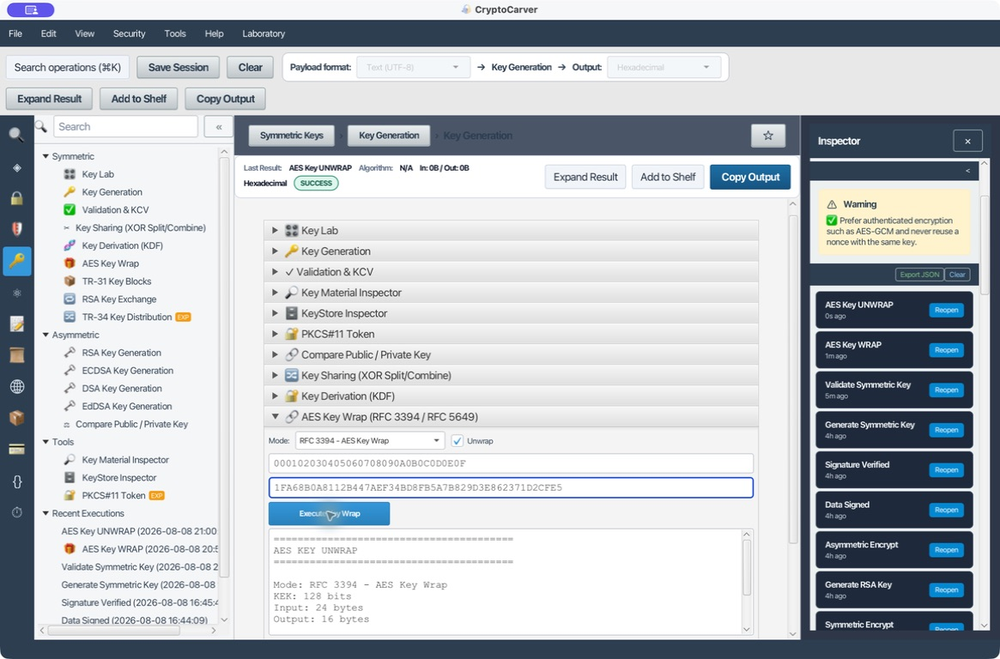
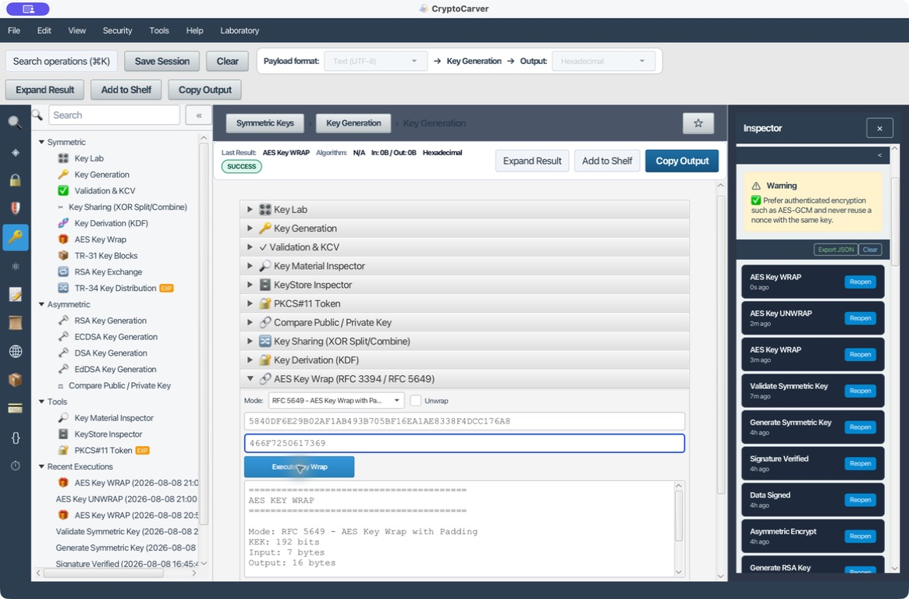
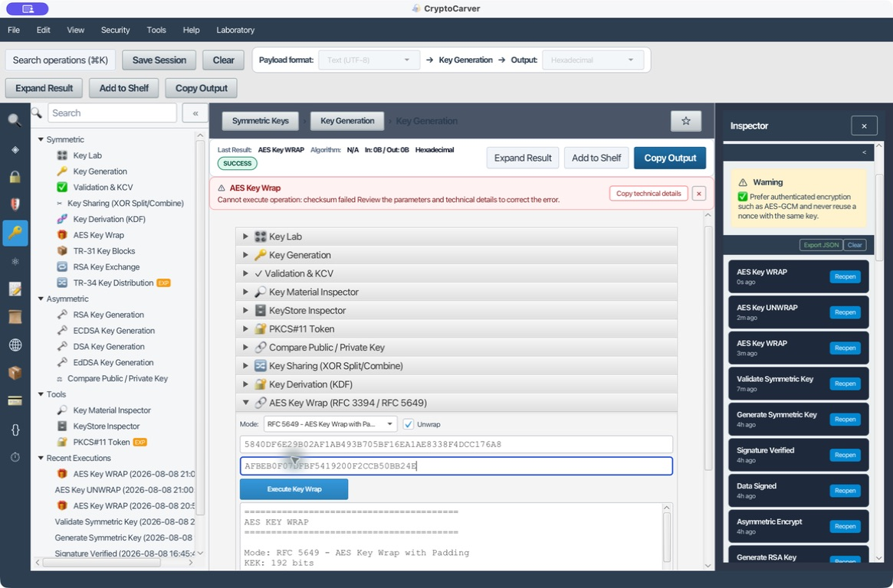

# Tutorial avanzado: AES Key Wrap con RFC 3394 y RFC 5649

AES Key Wrap protege material criptográfico durante su almacenamiento o transporte. Este laboratorio distingue la clave que protege, **KEK**, de la clave protegida, **key data**, reproduce vectores oficiales y comprueba que cualquier alteración impide recuperar la clave.

> Usa únicamente claves de laboratorio. En producción, la KEK debería permanecer dentro de un HSM, KMS o almacén de claves y la operación de *unwrap* debería realizarse dentro de ese límite de confianza.

## Objetivos

Al terminar podrás:

- Distinguir AES-KW, AES-KWP y el cifrado ordinario de datos.
- Elegir entre RFC 3394 y RFC 5649 según la longitud del material.
- Explicar los registros `A` y `R[i]`, el contador `t` y las seis vueltas.
- Reproducir los vectores oficiales en CryptoCarver.
- Interpretar el aumento de longitud y la comprobación de integridad.
- Diseñar un flujo realista de generación, envoltura, transporte y desenvoltura.

## Modelo mental: Una clave protege otra clave

| Elemento | Función | Ejemplo |
|---|---|---|
| KEK | Key-Encryption Key que ejecuta AES-KW o AES-KWP | AES-256 custodiada por un HSM |
| Key data | Material que se envuelve | DEK AES-256, clave HMAC o clave privada codificada |
| Wrapped key | Salida protegida que puede almacenarse o transportarse | Blob hexadecimal de longitud `entrada + 8` bytes |
| Unwrap | Recuperación autenticada del material | Operación realizada dentro del dominio que posee la KEK |

Un patrón habitual es el cifrado por envolvente:

1. Genera una **DEK** aleatoria para cifrar datos con AES-GCM.
2. Cifra los datos con la DEK.
3. Envuelve la DEK con una **KEK** mediante AES-KW.
4. Conserva el criptograma de los datos, el nonce de GCM y la DEK envuelta.
5. Para descifrar, desenvuelve primero la DEK dentro del límite de confianza.

AES Key Wrap no sustituye a AES-GCM para ficheros, mensajes o bases de datos. Está especializado en material de clave, no acepta nonce y es determinista: la misma KEK y el mismo material producen la misma salida.

## RFC 3394: Reglas que no debes pasar por alto

El RFC 3394 define AES Key Wrap sin padding. Sus condiciones principales son:

| Regla | Consecuencia práctica |
|---|---|
| KEK de 128, 192 o 256 bits | Debes introducir 16, 24 o 32 bytes de KEK |
| Entrada dividida en bloques de 64 bits | La longitud debe ser múltiplo de 8 bytes |
| Como mínimo dos bloques | La entrada mínima es de 16 bytes |
| IV predeterminado `A6A6A6A6A6A6A6A6` | El *unwrap* debe recuperar exactamente ese valor |
| Seis vueltas sobre todos los bloques | Se ejecutan `6 × n` operaciones AES |
| Salida de `n + 1` bloques | La salida siempre añade 8 bytes |
| Sin nonce ni IV aleatorio | La operación es determinista |

Para una clave AES-128 de 16 bytes, `n = 2`: el algoritmo hace 12 operaciones AES y genera 24 bytes. Para una AES-256 de 32 bytes, `n = 4`: hace 24 operaciones AES y genera 40 bytes.

### Núcleo del algoritmo

La entrada se separa en `P[1] ... P[n]`, cada uno de 64 bits. Se inicializa `A` con el IV y `R[i]` con cada bloque de entrada:

| Paso | Operación conceptual |
|---|---|
| Inicialización | `A = A6A6A6A6A6A6A6A6`; `R[i] = P[i]` |
| Bucle externo | `j = 0 ... 5` |
| Bucle interno | `i = 1 ... n` |
| Cifrado | `B = AES(K, concatenar(A, R[i]))` |
| Actualización | `A = MSB64(B) XOR t`, con `t = n × j + i` |
| Bloque de datos | `R[i] = LSB64(B)` |
| Salida | `C[0] = A`; después `C[i] = R[i]` |

El contador `t` se representa como un entero de 64 bits y se combina con la mitad alta mediante XOR. Las seis vueltas difunden cada bloque por todo el resultado. El *unwrap* recorre los valores de `t` en orden inverso y usa AES en descifrado.

### Qué significa la integridad

Al terminar el *unwrap*, el registro `A` debe coincidir con `A6A6A6A6A6A6A6A6`. Si no coincide, la implementación debe devolver un error y no debe entregar ningún byte de key data. El RFC estima en `2^-64` la probabilidad de que una corrupción aleatoria supere esta comprobación.

Esta integridad cubre el material envuelto, pero no vincula por sí sola metadatos externos como identificador de cliente, versión, algoritmo de uso o fecha. Esos datos deben quedar protegidos por el protocolo o contenedor que transporte la clave.

## Caso 1: Vector oficial de RFC 3394, sección 4.1

El RFC envuelve 128 bits de key data con una KEK AES-128:

| Campo y longitud | Valor hexadecimal |
|---|---|
| KEK, 16 bytes | `000102030405060708090A0B0C0D0E0F` |
| Key data, 16 bytes | `00112233445566778899AABBCCDDEEFF` |
| Salida esperada, 24 bytes | `1FA68B0A8112B447AEF34BD8FB5A7B829D3E862371D2CFE5` |

### Envolver en CryptoCarver

1. Abre **Claves > AES Key Wrap**.
2. En **Mode**, selecciona **RFC 3394 - AES Key Wrap**.
3. Deja **Unwrap** desmarcado.
4. Copia la KEK oficial en **KEK AES in hexadecimal**.
5. Copia el key data oficial en el segundo campo.
6. Pulsa **Execute Key Wrap**.
7. Comprueba `KEK: 128 bits`, `Input: 16 bytes` y `Output: 24 bytes`.
8. Compara la salida completa, no solo el prefijo.

CryptoCarver produce exactamente:

`1FA68B0A8112B447AEF34BD8FB5A7B829D3E862371D2CFE5`

La salida puede separarse como `C[0] || C[1] || C[2]`:

| Bloque | Valor |
|---|---|
| `C[0]` | `1FA68B0A8112B447` |
| `C[1]` | `AEF34BD8FB5A7B82` |
| `C[2]` | `9D3E862371D2CFE5` |

## Caso 2: Desenvolver y verificar el round-trip

1. Marca **Unwrap**.
2. Mantén la misma KEK.
3. Sustituye el segundo campo por los 24 bytes envueltos.
4. Ejecuta la operación.
5. Exige que la salida coincida byte a byte con el key data original.

Resultado esperado:

`00112233445566778899AABBCCDDEEFF`

No basta con que la operación termine: comprueba también el modo seleccionado, la longitud de la KEK, las longitudes de entrada y salida y la coincidencia completa.

## RFC 5649: AES Key Wrap con padding

RFC 5649, también llamado AES-KWP, elimina la obligación de que el material tenga una longitud múltiplo de 8 y permite entradas desde 1 octeto. La KEK sigue teniendo 128, 192 o 256 bits. El MLI de 32 bits establece el límite teórico de longitud; en cualquier sistema real, los límites de memoria, protocolo y política serán mucho menores.

La variante sustituye el IV de RFC 3394 por un **AIV** de 64 bits:

`AIV = A65959A6 || MLI`

`A65959A6` identifica la variante con padding. `MLI` es un entero sin signo de 32 bits, en orden de red, que contiene la longitud original en octetos. El material se rellena a la derecha con ceros hasta el siguiente múltiplo de 8.

Durante el *unwrap* deben cumplirse tres comprobaciones:

1. Los 32 bits altos de `A` deben ser `A65959A6`.
2. Para `n` bloques recuperados, el MLI debe cumplir `8 × (n - 1) < MLI <= 8 × n`.
3. Todos los octetos eliminados como padding deben ser cero.

Si falla una sola comprobación, no se devuelve material. Los IV distintos impiden desenvolver correctamente una salida KWP como KW, incluso cuando la entrada no necesitó padding.

### Caso especial de una entrada corta

Cuando la entrada rellenada ocupa exactamente 8 bytes, RFC 5649 no ejecuta las seis vueltas. Concatena `AIV || P[1]` y cifra ese único bloque de 128 bits mediante AES-ECB. AES-ECB aparece aquí como una llamada interna sobre un solo bloque estructurado; no convierte ECB en un modo apropiado para cifrar datos generales.

## Caso 3: Vector corto oficial de RFC 5649, sección 6

El segundo ejemplo del RFC usa 7 octetos, por lo que no puede procesarse con RFC 3394:

| Campo y longitud | Valor hexadecimal |
|---|---|
| KEK, 24 bytes | `5840DF6E29B02AF1AB493B705BF16EA1AE8338F4DCC176A8` |
| Key data, 7 bytes | `466F7250617369` |
| Padding interno, 1 byte | `00` |
| MLI, 4 bytes | `00000007` |
| AIV, 8 bytes | `A65959A600000007` |
| Salida esperada, 16 bytes | `AFBEB0F07DFBF5419200F2CCB50BB24F` |

En CryptoCarver:

1. Selecciona **RFC 5649 - AES Key Wrap with Padding**.
2. Deja **Unwrap** desmarcado.
3. Introduce la KEK de 192 bits y los 7 bytes de key data.
4. Ejecuta y comprueba `Input: 7 bytes` y `Output: 16 bytes`.

La salida exacta es:

`AFBEB0F07DFBF5419200F2CCB50BB24F`

## Caso 4: Alteración y rechazo obligatorio

Cambia solo el último nibble de la salida anterior:

| Entrada | Valor |
|---|---|
| Correcta | `AFBEB0F07DFBF5419200F2CCB50BB24F` |
| Alterada | `AFBEB0F07DFBF5419200F2CCB50BB24E` |

Marca **Unwrap**, conserva la KEK y ejecuta la entrada alterada. CryptoCarver responde `checksum failed` y no muestra key data recuperada.

Esta prueba es esencial: confirma que no estás usando un cifrado reversible sin autenticación y que la implementación respeta el requisito de fallo cerrado del RFC.

## Cómo elegir entre RFC 3394 y RFC 5649

| Situación | Elección |
|---|---|
| Clave de 16, 24 o 32 bytes y protocolo que exige AES-KW | RFC 3394 |
| Material múltiplo de 8 y de al menos 16 bytes | RFC 3394, si el protocolo no exige KWP |
| Material de 1 a 15 bytes | RFC 5649 |
| Material cuya longitud no es múltiplo de 8 | RFC 5649 |
| Interoperabilidad con un OID concreto | Usa exactamente la variante indicada por el OID |

No decidas por el hecho de que “no hace falta padding”. KW y KWP usan constantes distintas y no son intercambiables.

## Identificadores ASN.1

Los OID dependen del tamaño de la KEK:

| KEK | AES-KW | AES-KWP |
|---|---|---|
| 128 bits | `2.16.840.1.101.3.4.1.5` | `2.16.840.1.101.3.4.1.8` |
| 192 bits | `2.16.840.1.101.3.4.1.25` | `2.16.840.1.101.3.4.1.28` |
| 256 bits | `2.16.840.1.101.3.4.1.45` | `2.16.840.1.101.3.4.1.48` |

En `AlgorithmIdentifier`, el campo de parámetros debe estar ausente. No debe codificarse como `NULL`.

## Laboratorio realista: Generar KEK y DEK en CryptoCarver

El vector RFC sirve para interoperabilidad, pero sus claves son públicas y nunca deben reutilizarse. Para practicar un flujo real:

1. En **Claves > Key Generation**, genera una AES-256 y denomínala conceptualmente `KEK-LAB-01`.
2. Genera una segunda AES-256 independiente y denomínala `DEK-LAB-01`.
3. En **Validation & KCV**, registra el KCV de ambas sin guardar las claves en el informe.
4. Abre **AES Key Wrap** y selecciona RFC 3394: una DEK de 32 bytes cumple sus restricciones.
5. Usa `KEK-LAB-01` como KEK y `DEK-LAB-01` como key data.
6. La salida debe medir 40 bytes: 32 de entrada más 8.
7. Marca **Unwrap**, recupera la DEK y vuelve a calcular su KCV.
8. El KCV recuperado debe coincidir con el KCV original.
9. Repite con una KEK incorrecta y con un nibble alterado; ambas operaciones deben fallar.

En un sistema real no copiarías la KEK fuera del HSM o KMS. Pedirías al dispositivo que envolviera o desenvolviera por identificador de clave y aplicarías controles de uso, auditoría y rotación.

## Seguridad operativa

- La KEK debe tener, como mínimo, una fortaleza comparable a la del material protegido.
- Una KEK comprometida expone todas las claves envueltas con ella; limita su ámbito y planifica rotación.
- Separa claves por propósito: una KEK no debe usarse como DEK, clave HMAC o clave de cifrado de datos.
- El resultado es determinista y puede revelar que dos materiales envueltos son iguales bajo la misma KEK.
- AES-KW autentica el material, pero no aporta identidad, versión, autorización ni protección contra repetición.
- Conserva el identificador y versión de la KEK junto al blob envuelto, pero protege esos metadatos con el protocolo exterior.
- No registres KEK, DEK ni resultados de *unwrap* en logs. Registra identificadores, KCV, algoritmo y resultado.
- No aceptes key data cuando la comprobación de integridad falle, aunque una biblioteca exponga bytes parciales.
- Usa los OID y nombres de algoritmo exactos del protocolo; KW y KWP no son sustituibles.

## Diagnóstico

Empieza por confirmar la variante, las longitudes en bytes y la KEK antes de atribuir el fallo a la implementación.

| Síntoma | Causa probable | Comprobación |
|---|---|---|
| Longitud inválida en RFC 3394 | Entrada menor de 16 bytes o no múltiplo de 8 | Cuenta octetos, no caracteres hexadecimales |
| `checksum failed` | KEK incorrecta, variante incorrecta o blob alterado | Verifica KEK, modo y valor completo |
| La salida difiere del RFC | Espacios, prefijo `0x`, formato o valor mal copiado | Usa hexadecimal continuo |
| KW no desenvuelve una salida KWP | IV/AIV distintos | Selecciona RFC 5649 |
| KWP pierde longitud original | MLI o padding inválidos | El *unwrap* debe rechazar, no adivinar |
| El blob mide igual que la entrada | No se ejecutó AES-KW/KWP | La salida correcta añade al menos 8 bytes |

## Checklist de validación

- [ ] La KEK tiene 16, 24 o 32 bytes.
- [ ] RFC 3394 recibe al menos 16 bytes y un múltiplo de 8.
- [ ] RFC 5649 se usa para longitudes arbitrarias o cuando lo exige el protocolo.
- [ ] La salida del vector oficial coincide byte a byte.
- [ ] El *unwrap* reproduce exactamente el material original.
- [ ] Una KEK incorrecta produce error.
- [ ] Un solo nibble alterado produce error y cero key data.
- [ ] El informe conserva algoritmo, variante, tamaños, identificador de KEK y KCV, no secretos.

## Referencias normativas y técnicas

- [RFC 3394 - Advanced Encryption Standard (AES) Key Wrap Algorithm](https://www.rfc-editor.org/rfc/rfc3394.html)
- [RFC 5649 - AES Key Wrap with Padding Algorithm](https://www.rfc-editor.org/rfc/rfc5649.html)
- [NIST SP 800-38F - Methods for Key Wrapping](https://csrc.nist.gov/pubs/sp/800/38/f/final)
