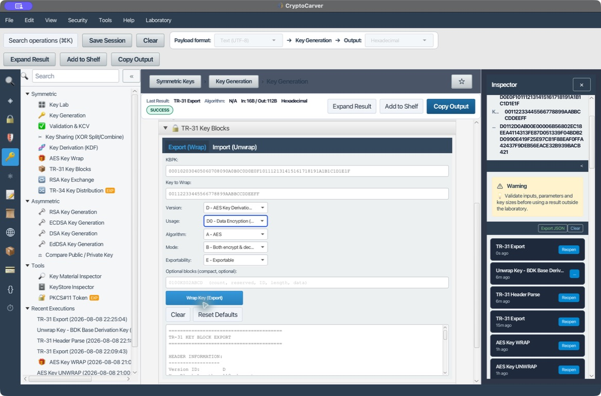
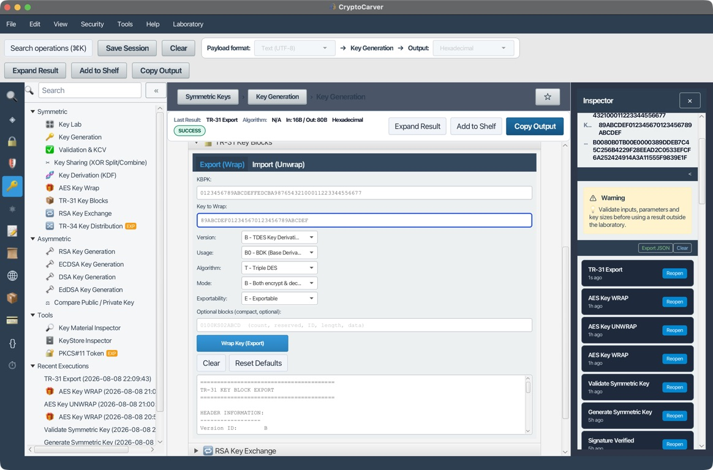
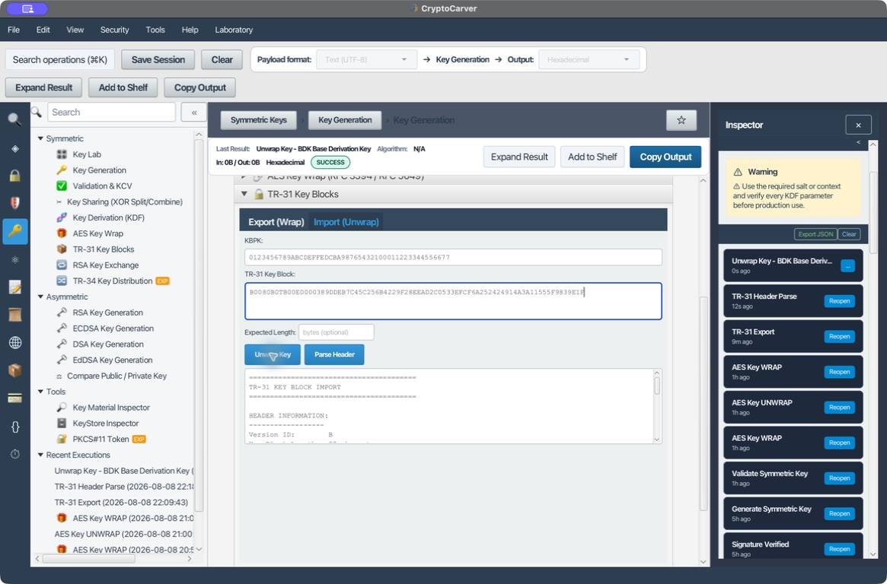
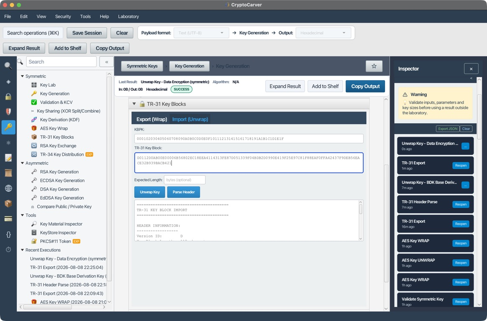
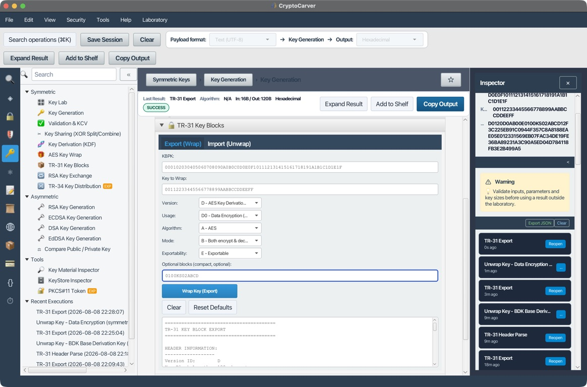
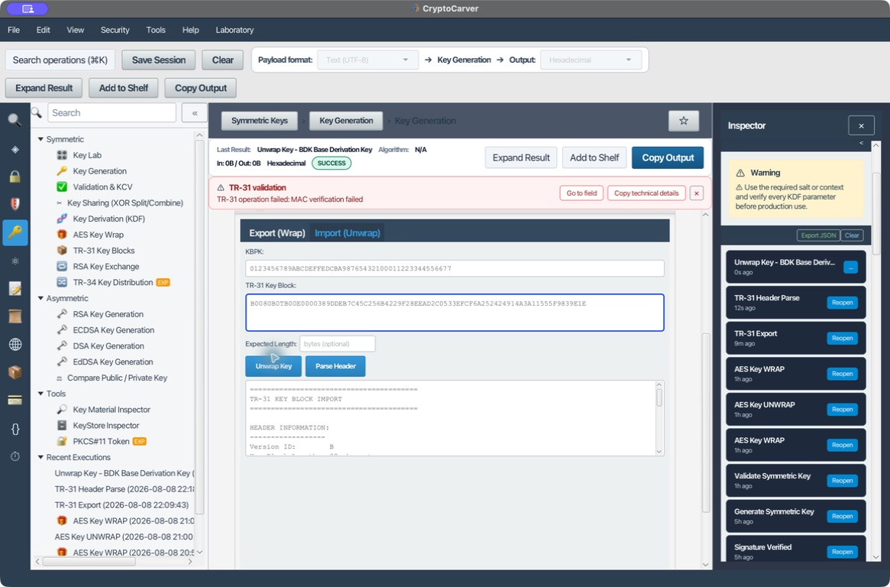

# Tutorial avanzado: TR-31 y bloques de clave interoperables

TR-31 protege una clave simétrica y vincula criptográficamente sus atributos: propósito, algoritmo, operaciones permitidas, versión y exportabilidad. Este laboratorio construye, interpreta e importa bloques reales con CryptoCarver, compara las versiones B y D y demuestra que una modificación mínima del autenticador provoca un rechazo cerrado.

> Usa únicamente claves de laboratorio. En producción, la KBPK debe permanecer dentro de un HSM o KMS y las políticas expresadas en la cabecera deben validarse y aplicarse durante la importación.

## Objetivos

Al terminar podrás:

- Distinguir TR-31 de AES Key Wrap y de TR-34.
- Explicar la función de una KBPK y de las claves derivadas de protección.
- Leer la cabecera fija de 16 caracteres por posición.
- Elegir con criterio entre las versiones B y D.
- Definir uso, algoritmo, modo y exportabilidad sin contradicciones.
- Exportar e importar bloques reproducibles con CryptoCarver.
- Añadir y analizar bloques opcionales autenticados.
- Detectar errores estructurales, una KBPK incorrecta y alteraciones del MAC.
- Diseñar un flujo de generación, distribución, importación y auditoría para HSM.

## Antes de empezar: TR-31 ya no es un RFC

No existe un RFC de TR-31. El formato nació como **ASC X9 TR 31** y su sucesor normativo es **ANSI X9.143**, denominado *Retail Financial Services — Interoperable Secure Key Block Specification*. En documentación comercial siguen usándose “TR-31”, “X9.143” y “TR-31/X9.143” casi como sinónimos.

La especificación completa de ANSI X9.143 es de acceso comercial. Este tutorial se apoya en la interfaz de CryptoCarver y en documentación técnica pública de IBM y AWS. Antes de intercambiar claves reales, confirma la edición del estándar, el perfil del fabricante y los valores aceptados por ambos extremos.

## Modelo mental: Clave, atributos y protección inseparables

| Elemento | Función | Ejemplo del laboratorio moderno |
|---|---|---|
| KBPK | *Key Block Protection Key* que protege el bloque | AES-256 `000102...1F` |
| Clave transportada | Secreto que se exporta o importa | Clave AES-128 `001122...EEFF` |
| Cabecera | Atributos legibles que describen y limitan la clave | `D0112D0AB00E0000` |
| Carga confidencial | Clave, longitud y relleno cifrados | Segmento hexadecimal posterior a la cabecera |
| Autenticador | Detecta cambios en cabecera y carga protegida | MAC final de 16 caracteres en esta implementación |
| Bloques opcionales | Metadatos adicionales autenticados | `KS02ABCD` en el laboratorio |

La cabecera viaja en claro. Eso permite enrutar y prevalidar el bloque sin conocer la KBPK, pero también revela metadatos como el propósito de la clave. Su integridad queda vinculada al bloque: cambiar `D0` por `P0`, `E` por `N` o cualquier dato opcional debe invalidar la autenticación.

## Qué resuelve y qué no resuelve TR-31

TR-31 aporta confidencialidad del material secreto, integridad del bloque y unión criptográfica entre la clave y sus atributos. No aporta por sí solo:

- Identidad ni autenticación del sistema remitente.
- Protección contra repetición de un bloque antiguo todavía válido.
- Autorización para importar la clave en un dominio concreto.
- Gestión de la KBPK entre organizaciones.
- Evidencia de que el receptor aplicará realmente los atributos.

El protocolo exterior debe aportar canal autenticado, inventario, control de versiones, prevención de reinyección, aprobación dual y auditoría.

## TR-31, AES Key Wrap y TR-34

| Mecanismo | Protege con | Atributos unidos a la clave | Uso típico |
|---|---|---|---|
| AES-KW/KWP | KEK AES simétrica | No, salvo que el protocolo exterior los autentique | Envolver bytes de clave |
| TR-31/X9.143 | KBPK simétrica TDES o AES | Sí, en cabecera fija y bloques opcionales | Intercambio entre dominios de pago o HSM |
| TR-34 | Técnicas asimétricas y certificados | Sí, dentro de un protocolo de distribución | Carga remota cuando no existe una KBPK compartida |

AES-KW responde a “¿cómo protejo estos bytes bajo una KEK?”. TR-31 añade “¿qué clase de clave es, qué puede hacer y se puede volver a exportar?”. TR-34 aborda el establecimiento y transporte asimétrico entre participantes.

## Anatomía de la cabecera fija

Todo bloque comienza con una parte fija de 16 caracteres ASCII. Después pueden aparecer entre 0 y 99 bloques opcionales de longitud variable.

El ejemplo moderno generado por CryptoCarver empieza así:

`D0112D0AB00E0000`

| Posición | Longitud | Valor | Significado |
|---|---:|---|---|
| 0 | 1 | `D` | Versión y método de protección AES |
| 1–4 | 4 | `0112` | Longitud total codificada: 112 caracteres |
| 5–6 | 2 | `D0` | Clave de cifrado simétrico de datos |
| 7 | 1 | `A` | Algoritmo de la clave transportada: AES |
| 8 | 1 | `B` | Modo: cifrar y descifrar |
| 9–10 | 2 | `00` | Versión de la clave |
| 11 | 1 | `E` | Exportable bajo una KEK de confianza |
| 12–13 | 2 | `00` | Número de bloques opcionales |
| 14–15 | 2 | `00` | Campo reservado o contexto, según edición y perfil |

La longitud `0112` incluye el bloque completo codificado: cabecera, datos opcionales, carga cifrada y autenticador. Son 112 caracteres, no 112 bytes de clave.

### Regla de lectura segura

Analizar la cabecera no equivale a confiar en ella. Antes de verificar el autenticador solo dispones de metadatos no autenticados. Puedes usarlos para decidir qué KBPK o perfil intentar, pero no para autorizar una operación sensible.

## Versiones de protección

| Versión | Familia de KBPK | Método | Recomendación |
|---|---|---|---|
| A | DES/TDES | Unión por variantes, edición antigua | Obsoleta; no usar en diseños nuevos |
| B | TDES | Unión por derivación | Compatibilidad con dominios TDES existentes |
| C | TDES | Unión por variantes | Obsoleta; no usar en diseños nuevos |
| D | AES | Unión por derivación AES | Preferida para nuevos perfiles AES compatibles |

AWS Payment Cryptography, por ejemplo, exporta con B cuando la clave de envoltura es TDES y con D cuando es AES; acepta A y C solo para importación. Esto es una política de producto coherente con la retirada de los métodos por variantes, no una prueba de compatibilidad universal.

La versión describe cómo se protege el bloque y qué familia tiene la KBPK. El campo **Algorithm** describe la clave que viaja dentro. No confundas ambos:

- Versión `D` significa KBPK y derivación basadas en AES.
- Algoritmo `A` significa que la clave transportada es AES.
- Un perfil puede permitir que una KBPK AES versión D proteja material AES, TDES o HMAC.
- La matriz exacta de combinaciones depende de la edición y del receptor.

## Protección interna: Separación de funciones

CryptoCarver recibe una KBPK, pero el esquema no debería utilizar directamente la misma clave para cifrar y autenticar. Las versiones por derivación obtienen subclaves funcionalmente separadas:

| Subclave conceptual | Responsabilidad |
|---|---|
| KBEK | Cifrar la carga confidencial |
| KBAK | Autenticar la cabecera, datos opcionales y carga protegida |

La derivación incorpora constantes de separación de dominio y el tamaño del material necesario. En versión B las primitivas son TDES; en versión D son AES. No implementes estas derivaciones a partir de un resumen: usa una biblioteca validada y prueba vectores de la edición exacta que declares soportar.

Una validación robusta sigue este orden conceptual:

1. Comprueba sintaxis y longitud mínima sin asignar confianza.
2. Selecciona la KBPK correspondiente a la versión y al dominio.
3. Deriva las claves de cifrado y autenticación.
4. Verifica el autenticador sobre el bloque completo protegido.
5. Solo si la verificación es correcta, descifra y elimina el relleno.
6. Valida coherencia entre longitud, algoritmo, uso y política local.
7. Crea la clave interna con restricciones iguales o más estrictas.
8. No devuelve ni registra material parcial si falla cualquier paso.

## Atributos que deben formar un perfil coherente

### Uso de la clave

El campo de dos caracteres expresa el propósito, no el algoritmo.

| Código | Uso común | Ejemplo de política |
|---|---|---|
| `B0` | BDK para DUKPT | Solo derivación de claves iniciales o transaccionales |
| `C0` | Clave de verificación de tarjeta | Cálculo o verificación de CVV/CVC |
| `D0` | Cifrado simétrico de datos | AES o TDES para datos, según perfil |
| `K0` | Clave de cifrado o envoltura | KEK genérica |
| `K1` | KBPK TR-31 | Protección de bloques de clave |
| `M6` | CMAC | Generación o verificación de MAC |
| `M7` | HMAC | HMAC; el hash puede requerir metadato adicional |
| `P0` | Cifrado de PIN | Operaciones sobre bloques PIN |
| `V0`–`V2` | Verificación de PIN | Perfil dependiente del método |

### Algoritmo

Los valores interoperables de uso frecuente son `A` para AES, `T` para TDEA y `H` para HMAC. No asumas que porque una interfaz ofrezca RSA, DSA o curva elíptica otro HSM los aceptará en TR-31: comprueba el perfil X9.143 y la documentación del fabricante.

### Modo de uso

| Código | Permiso | Aplicación práctica |
|---|---|---|
| `B` | Cifrar y descifrar, o envolver y desenvolver | Evítalo si basta una sola dirección |
| `C` | Generar y verificar | MAC o valores de comprobación |
| `D` | Solo descifrar o desenvolver | Clave importadora |
| `E` | Solo cifrar o envolver | Clave exportadora |
| `G` | Solo generar | Generación sin verificación |
| `N` | Sin restricción especial adicional | Solo cuando el uso ya limita suficientemente |
| `V` | Solo verificar | Verificación sin generación |
| `X` | Derivar otras claves | Claves de derivación |

Aplica mínimo privilegio. Una KBPK dedicada a exportación debería usar un perfil unidireccional si el ecosistema lo admite, en vez de `B` por comodidad.

### Exportabilidad

| Código | Significado operativo |
|---|---|
| `E` | Exportable bajo una KEK de confianza que cumpla el perfil exigido |
| `N` | No exportable fuera del dominio receptor |
| `S` | Sensible; exportable bajo una KEK admitida por el perfil |

El receptor puede endurecer la política, pero no debería relajarla. Una importación marcada `N` debe terminar como objeto interno no exportable, no como bytes retornados a una aplicación.

## Laboratorio 1: Versión B con KBPK TDES

Este caso reproduce un dominio heredado con derivación TDES. Todos los valores son públicos y exclusivos del laboratorio.

| Campo y longitud | Valor |
|---|---|
| KBPK TDES, 24 bytes | `0123456789ABCDEFFEDCBA98765432100011223344556677` |
| Clave TDES, 16 bytes | `89ABCDEF012345670123456789ABCDEF` |
| Versión | `B` — TDES Key Derivation Binding |
| Uso | `B0` — BDK |
| Algoritmo | `T` — Triple DES |
| Modo | `B` — cifrar y descifrar |
| Exportabilidad | `E` — exportable |
| Bloques opcionales | Ninguno |

### Exportar en CryptoCarver

1. Abre **Claves > TR-31 Key Blocks**.
2. En **Export (Wrap)**, introduce la KBPK y la clave que se va a proteger.
3. Selecciona versión `B`, uso `B0`, algoritmo `T`, modo `B` y exportabilidad `E`.
4. Deja vacío **Optional blocks**.
5. Pulsa **Wrap Key (Export)**.
6. Comprueba que la cabecera mostrada es `B0080B0TB00E0000`.
7. Comprueba que la longitud declarada y la longitud real son 80 caracteres.

CryptoCarver genera exactamente:

`B0080B0TB00E0000389DDEB7C45C256B4229F28EEAD2C0533EFCF6A252424914A3A11555F9839E1F`

Separación mostrada por la aplicación:

| Parte | Valor |
|---|---|
| Cabecera | `B0080B0TB00E0000` |
| Clave cifrada | `389DDEB7C45C256B4229F28EEAD2C0533EFCF6A252424914` |
| MAC | `A3A11555F9839E1F` |

### Importar y verificar

1. Abre la pestaña **Import (Unwrap)**.
2. Introduce la misma KBPK.
3. Pega el bloque completo de 80 caracteres.
4. Pulsa **Parse Header**: debe informar “No structural warnings detected”.
5. Pulsa **Unwrap Key**.
6. Compara la salida completa con la clave original.

Salida recuperada:

`89ABCDEF012345670123456789ABCDEF`

La coincidencia demuestra el *round-trip* del laboratorio. No convierte esas claves públicas en aptas para uso real.

## Laboratorio 2: Versión D con KBPK AES-256

Este caso representa el perfil moderno. La KBPK es AES-256 y la clave transportada es AES-128 destinada al cifrado simétrico de datos.

| Campo y longitud | Valor |
|---|---|
| KBPK AES-256, 32 bytes | `000102030405060708090A0B0C0D0E0F101112131415161718191A1B1C1D1E1F` |
| Clave AES-128, 16 bytes | `00112233445566778899AABBCCDDEEFF` |
| Versión | `D` — AES Key Derivation Binding |
| Uso | `D0` — cifrado simétrico de datos |
| Algoritmo | `A` — AES |
| Modo | `B` — cifrar y descifrar |
| Exportabilidad | `E` — exportable |
| Bloques opcionales | Ninguno |

### Exportar el bloque moderno

1. En **Export (Wrap)**, pega la KBPK AES-256 y la clave AES-128.
2. Selecciona versión `D`.
3. Selecciona uso `D0` y algoritmo `A`.
4. Mantén modo `B` y exportabilidad `E` para reproducir este ejemplo.
5. Deja vacíos los bloques opcionales.
6. Ejecuta **Wrap Key (Export)**.

El resultado exacto obtenido es:

`D0112D0AB00E00006B56802EC18EEA4114313FE87D051339F04BDB2D0990E419F25E97C81F88EAF0FFA42437F9DEB56EACE32B939BACB421`

| Parte | Valor |
|---|---|
| Cabecera | `D0112D0AB00E0000` |
| Clave cifrada | `6B56802EC18EEA4114313FE87D051339F04BDB2D0990E419F25E97C81F88EAF0FFA42437F9DEB56E` |
| MAC | `ACE32B939BACB421` |

El bloque mide 112 caracteres. No compares su tamaño con el ejemplo B sin considerar que la versión D usa una construcción y un relleno diferentes.

### Importar el bloque moderno

Pega la misma KBPK y el bloque completo en **Import (Unwrap)**. CryptoCarver interpreta `D0`, `A`, `B` y `E`, verifica la autenticación y recupera:

`00112233445566778899AABBCCDDEEFF`

Comprueba siempre tres niveles:

1. La estructura se analiza sin avisos.
2. El autenticador se verifica con la KBPK correcta.
3. La clave recuperada coincide y el perfil es aceptable para tu política.

## Laboratorio 3: Bloque opcional autenticado

CryptoCarver acepta una representación compacta:

`NNRR || ID || LL || DATA`

| Campo | Ejemplo | Interpretación en CryptoCarver |
|---|---|---|
| `NN` | `01` | Un bloque opcional, expresado en hexadecimal |
| `RR` | `00` | Campo reservado |
| `ID` | `KS` | Identificador del bloque |
| `LL` | `02` | Dos bytes de datos, expresados en hexadecimal |
| `DATA` | `ABCD` | Dos bytes de contenido |

Introduce `0100KS02ABCD` en **Optional blocks** manteniendo el perfil D anterior. La aplicación genera:

`D0120D0AB00E0100KS02ABCD12F3C225EB91C0944F357C8A8188EAE05E012331569EB07FAC34DE19FE36BA89231A3C90A5ED04D784118FB3E2B499A5`

La cabecera autenticada pasa de `D0112D0AB00E0000` a:

`D0120D0AB00E0100KS02ABCD`

Cambian la longitud total, el contador de opcionales, la carga cifrada y el MAC. Aunque la clave y la KBPK son las mismas, el resultado no puede conservar el autenticador anterior porque los metadatos forman parte del contenido protegido.

> `KS02ABCD` es un valor sintáctico de laboratorio. Acuerda el identificador, el contenido, la codificación y la semántica con el receptor. Los bloques opcionales se transmiten en claro y están autenticados, pero no necesariamente son secretos ni universalmente admitidos.

## Laboratorio 4: Alteración y fallo cerrado

Toma el bloque correcto de la versión B y cambia únicamente el último nibble del MAC:

| Entrada | Final |
|---|---|
| Correcta | `...A3A11555F9839E1F` |
| Alterada | `...A3A11555F9839E1E` |

Bloque alterado completo:

`B0080B0TB00E0000389DDEB7C45C256B4229F28EEAD2C0533EFCF6A252424914A3A11555F9839E1E`

CryptoCarver muestra `MAC verification failed` y no produce una nueva clave recuperada.

El área de salida puede conservar visualmente el resultado de la ejecución válida anterior. La evidencia decisiva es el aviso de validación y que la ejecución fallida no entregue material nuevo. En automatización, trata la excepción o el estado de error como único resultado válido; nunca reutilices un buffer anterior.

Repite la prueba cambiando un carácter de cada zona:

- Cabecera: cambia el uso `B0` por otro valor sintácticamente válido.
- Datos opcionales: cambia `ABCD` por `ABCE`.
- Carga cifrada: altera un nibble intermedio.
- MAC: altera el último nibble.
- KBPK: conserva el bloque y usa otra KBPK de la misma longitud.

Todas deben fallar sin devolver key data.

## Relación con la generación de claves simétricas

El ejemplo público facilita la reproducción, pero un flujo realista empieza en **Claves > Key Generation**:

1. Genera una KBPK AES-256 dentro del dominio emisor.
2. Regístrala como `K1` o como el tipo de KBPK exigido por tu plataforma.
3. Limita su modo a envolver, desenvolver o ambos según el rol del sistema.
4. Genera una DEK AES-256 independiente para cifrado de datos.
5. Calcula y registra el KCV de la DEK sin exponer su valor.
6. Exporta la DEK en versión D con uso `D0`, algoritmo `A` y la exportabilidad mínima.
7. Envía bloque, identificador de KBPK y versión por un canal autenticado.
8. El receptor importa dentro del HSM y crea un objeto no exportable si la política lo exige.
9. Compara el KCV y los atributos esperados.
10. Usa la DEK importada por referencia; no la vuelques en registros ni respuestas.

El KCV detecta que ambos dominios poseen la misma clave; no sustituye la autenticación del bloque ni autoriza el uso. Registra también el fingerprint del bloque, la versión de KBPK, el perfil negociado, el resultado y los identificadores de origen y destino.

## Diseño de una ceremonia de intercambio

### Acuerdo previo

- Edición de TR-31/X9.143 e implementación del fabricante.
- Versiones permitidas, preferiblemente D para nuevos dominios AES.
- Tipo y tamaño de KBPK.
- Matriz de uso, algoritmo, modo y exportabilidad.
- Bloques opcionales obligatorios, permitidos y rechazados.
- Codificación, transporte, límites de longitud y tratamiento de errores.
- KCV, identificadores y procedimiento de confirmación.

### Controles del emisor

- Generación de claves en HSM con doble control cuando proceda.
- Selección explícita del perfil; no confiar en valores predeterminados.
- Exportación por identificador de clave, sin revelar la KBPK.
- Registro del bloque o su hash según la política de sensibilidad.
- Rotación de KBPK con identificador y ventana de vigencia claros.

### Controles del receptor

- Resolver la KBPK por dominio y versión, no por prueba indiscriminada de claves.
- Verificar autenticación antes de usar atributos o material.
- Rechazar combinaciones no autorizadas aunque sean criptográficamente válidas.
- Impedir que `N` termine convertido en una clave exportable.
- Detectar reinyección mediante versión, inventario o identificador de transacción.
- Responder con KCV o confirmación sin retornar la clave en claro.

## Errores de diseño frecuentes

| Error | Riesgo | Corrección |
|---|---|---|
| Usar la DEK como KBPK | Mezcla propósito y amplía el impacto de compromiso | Genera una KBPK dedicada |
| Elegir versión D pero suministrar KBPK TDES | Perfil incoherente o fallo de interoperabilidad | Alinea versión con familia de KBPK |
| Confundir `K1` con algoritmo de la clave | Atributos incorrectos | Separa uso, algoritmo y modo |
| Usar modo `B` siempre | Permisos excesivos | Elige `D`, `E`, `G` o `V` cuando baste |
| Aceptar cabecera antes del MAC | Escalada de uso mediante manipulación | Autoriza solo tras verificar |
| Convertir `N` en exportable | Ruptura de política | Conserva o endurece atributos |
| Reintentar contra muchas KBPK | Oráculo y mala gestión de inventario | Resuelve KBPK por identificador seguro |
| Registrar claves o resultados de *unwrap* | Exposición de secretos | Registra IDs, KCV, hash y estado |
| Suponer que un bloque opcional es universal | Rechazo o interpretación distinta | Negocia el perfil del receptor |
| Tratar TR-31 como defensa contra repetición | Reinyección de una clave antigua válida | Añade control de versión y transacción |

## Diagnóstico en CryptoCarver

| Síntoma | Causa probable | Comprobación |
|---|---|---|
| Longitud declarada distinta de la real | Bloque truncado, espacios o copia incompleta | Cuenta caracteres ASCII del bloque normalizado |
| `MAC verification failed` | KBPK incorrecta, bloque alterado o versión errónea | Verifica KBPK, versión y bloque completo |
| Cabecera válida pero importación falla | La estructura no prueba autenticidad | Ejecuta *unwrap* con la KBPK correcta |
| Algoritmo incompatible | Campo `Algorithm` y longitud de clave no concuerdan | Revisa `A`, `T`, `H` y tamaño recuperado |
| Bloques opcionales truncados | `NN`, `LL` o datos no coinciden | Cuenta bytes y caracteres hexadecimales |
| Otro HSM rechaza el bloque | Perfil o edición distintos | Compara matrices y bloques opcionales admitidos |
| Se muestra una salida antigua tras un error | El panel conserva la ejecución previa | Usa estado de error; no reutilices la salida visible |

## Checklist de validación

- [ ] La edición y el perfil están acordados con el receptor.
- [ ] La versión coincide con la familia de KBPK.
- [ ] Uso, algoritmo, modo y exportabilidad son coherentes.
- [ ] La cabecera fija tiene 16 caracteres antes de los opcionales.
- [ ] La longitud declarada coincide con el bloque completo.
- [ ] El número y las longitudes de bloques opcionales son exactos.
- [ ] La importación verifica el MAC antes de entregar material.
- [ ] La clave recuperada coincide por valor de laboratorio o KCV de producción.
- [ ] Una KBPK incorrecta y un nibble alterado producen fallo cerrado.
- [ ] La política local conserva o endurece los atributos importados.
- [ ] Existe control de versión o reinyección fuera de TR-31.
- [ ] Los registros no contienen KBPK, claves ni material recuperado.

## Referencias normativas y técnicas

- [IBM: Cabecera de bloque TR-31](https://www.ibm.com/docs/en/linux-on-systems?topic=data-tr-31-key-block-header)
- [IBM: Gestión de claves simétricas TR-31](https://www.ibm.com/docs/en/linux-on-systems?topic=verbs-tr-31-symmetric-key-management)
- [IBM: Cabecera X9.143/TR-31 y datos opcionales](https://www.ibm.com/docs/en/linux-on-systems?topic=formats-tr-31-key-header-optional-data)
- [AWS Payment Cryptography: Exportación de claves TR-31](https://docs.aws.amazon.com/payment-cryptography/latest/userguide/keys-export.html)
- [AWS Payment Cryptography: Cabeceras de bloques de clave](https://docs.aws.amazon.com/payment-cryptography/latest/APIReference/API_KeyBlockHeaders.html)
- [AWS Payment Cryptography: Terminología TR-31 y X9.143](https://docs.aws.amazon.com/payment-cryptography/latest/userguide/terminology.html)
