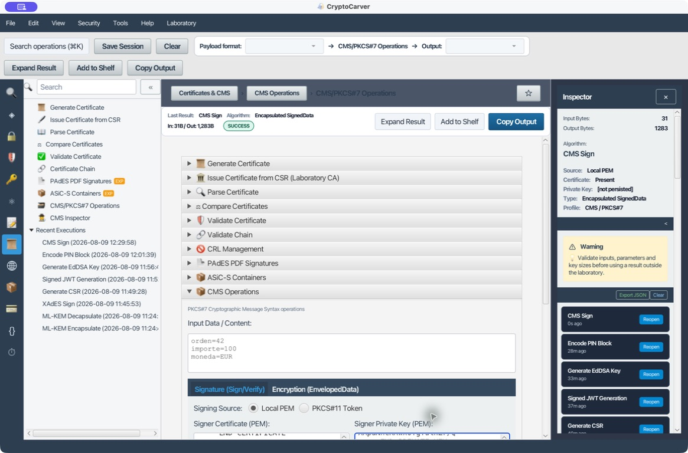
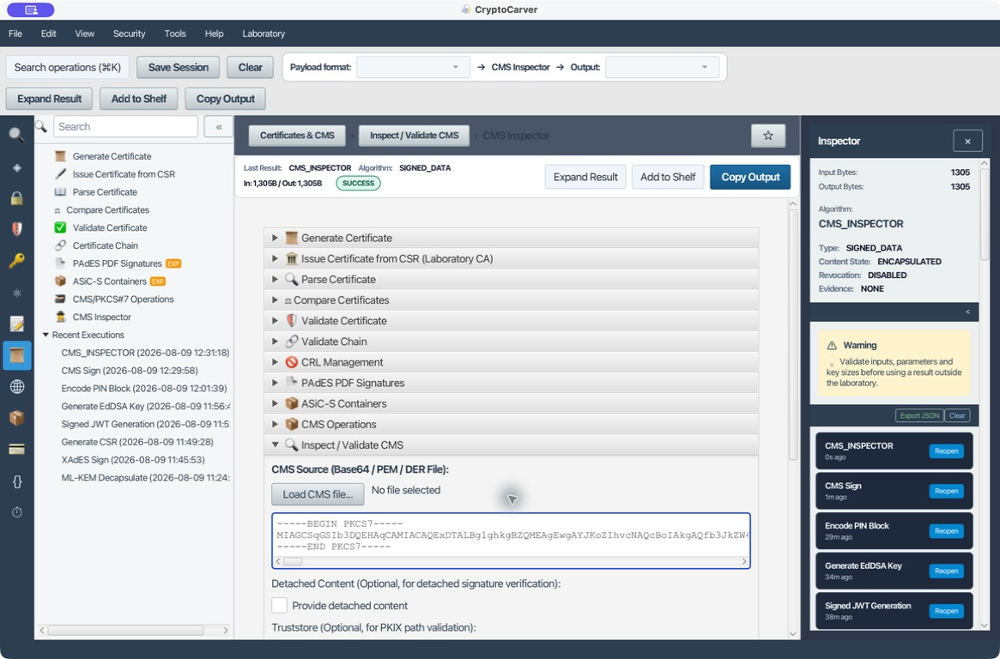
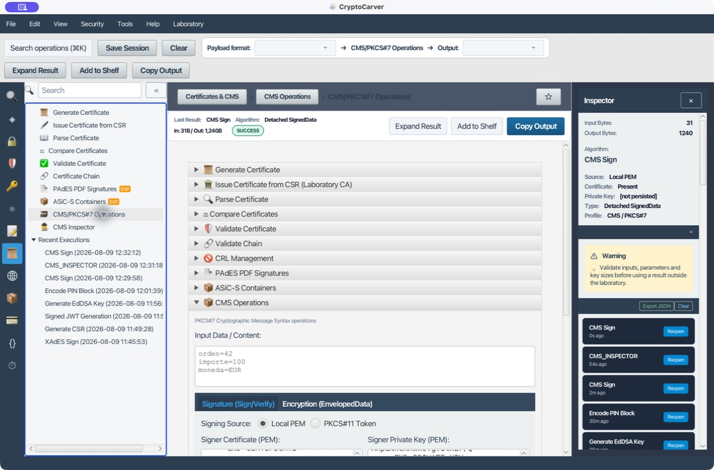
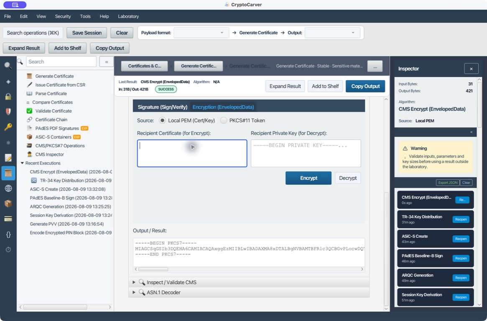
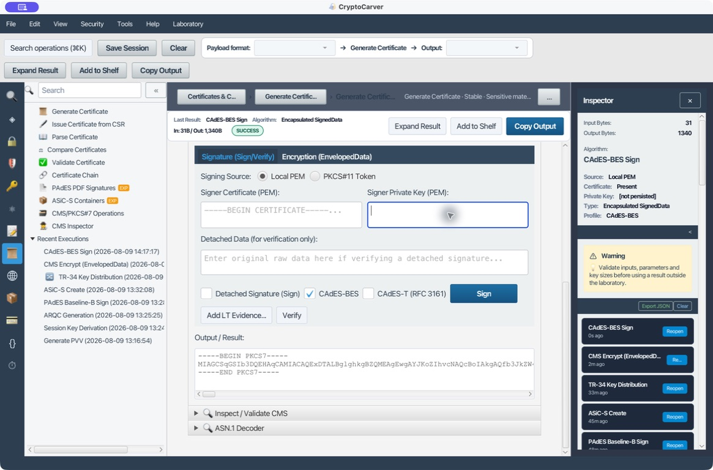
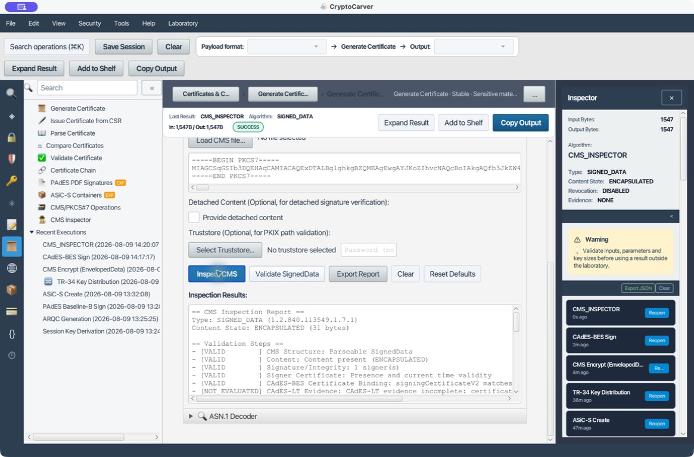
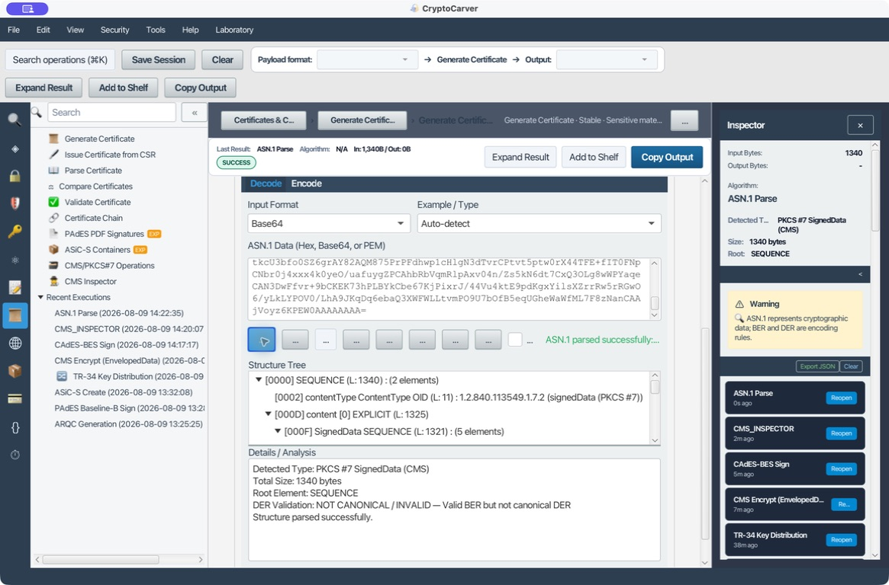

# Sintaxis de mensajes criptográficos (CMS/PKCS#7)

CMS (Cryptographic Message Syntax, antes PKCS#7) es un contenedor ASN.1 que
combina contenido, firmas, certificados y/o cifrado. No es sinónimo de
"firma": `SignedData`, `EnvelopedData`, `AuthenticatedData` y `CompressedData`
son tipos de contenido con propiedades distintas.

Este tutorial usa exclusivamente el material de prueba incluido con la
aplicación. La clave privada de laboratorio se carga sólo para la ejecución y
no forma parte de ninguna captura ni receta exportable.

## Qué quiero hacer

| Objetivo | Tipo CMS | ¿El contenido viaja dentro? | ¿Qué debe conservar el receptor? |
|---|---|---|---|
| Enviar una orden firmada como un único fichero | SignedData attached | Sí | El CMS y la política de confianza |
| Firmar un fichero que ya se transporta por otro canal | SignedData detached | No | El CMS **y los bytes originales** |
| Entregar un secreto a un certificado receptor | EnvelopedData | Cifrado | CMS y la clave privada receptora |
| Probar identidad, integridad y confidencialidad | SignedData + EnvelopedData | Depende del orden | Perfil, claves, certificados y ambos objetos |
| Auditar una estructura recibida | CMS Inspector + ASN.1 Decoder | No aplica | El artefacto exacto y, si procede, contenido detached |

## Anatomía mínima

Todos los objetos comienzan con `ContentInfo`. Su `contentType` exterior
identifica, entre otros, `signedData` (`1.2.840.113549.1.7.2`) o
`envelopedData` (`1.2.840.113549.1.7.3`). Dentro de SignedData, el
`encapContentInfo.eContentType` suele ser `data`
(`1.2.840.113549.1.7.1`). No confundas ambos OID: uno describe el contenedor y
el otro el contenido firmado.

| Campo | Pregunta que responde |
|---|---|
| `digestAlgorithms` | ¿Qué hash se calculó sobre el contenido? |
| `encapContentInfo` | ¿El contenido está adjunto o es detached? |
| `certificates` | ¿Qué certificados se incluyen como ayuda de verificación? |
| `signerInfos` | ¿Quién firma y qué atributos están protegidos? |
| `recipientInfos` | ¿Qué destinatario puede abrir EnvelopedData? |
| `encryptedContentInfo` | ¿Cómo se protegió el contenido simétricamente? |

Un certificado incluido permite localizar la pública del firmante, pero no
convierte su cadena en confiable. Integridad de firma, validez temporal,
identidad, cadena y revocación son comprobaciones separadas.

## Caso 1: SignedData adjunto

### Quiero enviar una orden firmada en un solo archivo

En **Certificates → CMS/PKCS#7 Operations → Signature**, selecciona **Local
PEM** y carga el certificado público y la privada de laboratorio. Como
contenido UTF-8 usa exactamente estas tres líneas, sin añadir una línea final:

| Línea | Bytes UTF-8 |
|---|---|
| 1 | `orden=42` |
| 2 | `importe=100` |
| 3 | `moneda=EUR` |

Deja desmarcada **Detached Signature (Sign)** y pulsa **Sign**. La ejecución
real produjo un `Encapsulated SignedData`: 31 bytes de entrada y 1.283 bytes de
salida. El resultado se muestra como PEM `BEGIN PKCS7`; su representación PEM
no es el contenido original, sino Base64 del DER CMS.

### Verificación correcta

Pega el PKCS#7 en **CMS Inspector** y pulsa **Inspect CMS**. En este laboratorio
el informe confirmó: contenido **ENCAPSULATED** de 31 bytes, un firmante,
digest SHA-256 (`2.16.840.1.101.3.4.2.1`), firma válida y certificado válido en
fecha. El informe también indicó correctamente que la cadena de confianza no
se había evaluado porque no se proporcionó un truststore, y que revocación
estaba desactivada.

Una firma válida en este punto significa que los bytes encapsulados no se han
alterado respecto a la firma. No prueba todavía que `CN=Test` sea una entidad
autorizada para emitir órdenes ni que el certificado sea confiable para tu
entorno.

### Qué atributos deben aparecer

En el informe de la aplicación se observaron atributos firmados como:

| OID | Atributo | Por qué importa |
|---|---|---|
| `1.2.840.113549.1.9.3` | `contentType` | Liga la firma al tipo de contenido esperado |
| `1.2.840.113549.1.9.4` | `messageDigest` | Liga la firma al digest del contenido |
| `1.2.840.113549.1.9.5` | `signingTime` | Declaración del firmante; no equivale a sellado de tiempo |
| `1.2.840.113549.1.9.52` | `cmsAlgorithmProtection` | Evita ambigüedades de algoritmo |

El valor de `signingTime` no es una prueba independiente de cuándo existía la
firma. Para evidencia temporal de un tercero utiliza CAdES-T/RFC 3161 y valida
el token de tiempo y su cadena.

### Pruebas negativas

- Modifica `importe=100` por `importe=101` después de firmar. La firma debe
  fallar.
- Borra un carácter del Base64 PEM. El parser debe rechazar el objeto o la
  verificación debe fallar; no intentes reparar el valor a mano.
- Sustituye el certificado de confianza por otro. La firma matemática puede
  seguir siendo válida, pero la confianza de cadena debe fallar o quedar no
  evaluada según la política.

## Caso 2: SignedData detached

### Quiero que la firma viaje separada del fichero original

Con los mismos tres renglones, marca **Detached Signature (Sign)** y pulsa
**Sign**. CryptoCarver generó un `Detached SignedData` de 1.240 bytes. Es más
pequeño que el adjunto porque el contenedor no lleva los 31 bytes del payload.

Para verificar, pega el CMS en el área principal, proporciona exactamente el
contenido original en **Detached Data** y usa **Verify** o **CMS Inspector**
con contenido detached. «Exactamente» significa mismos bytes: UTF-8 frente a
Windows-1252, `LF` frente a `CRLF`, BOM o un salto final cambian el digest.

| Elemento | Attached | Detached |
|---|---|---|
| Contenido dentro de CMS | Sí | No |
| Verificar sin otro fichero | Sí | No |
| Tamaño de CMS | Crece con payload | Casi independiente del payload |
| Riesgo operativo | Duplicar datos sensibles | Perder o normalizar los bytes externos |
| Uso típico | Correo, paquete autosuficiente | ASiC-S, manifiestos, ficheros grandes |

### Prueba de integridad reproducible

- Verifica con los tres renglones anteriores: debe resultar válida.
- Repite cambiando solamente `EUR` por `USD`: debe resultar inválida.
- Restaura el texto pero termina la última línea con `CRLF` en vez de `LF`:
  debe resultar inválida si los bytes firmados usaron `LF`.
- Guarda la huella SHA-256 del contenido externo junto al CMS para detectar
  errores de transporte antes de iniciar la validación.

No uses un editor que reformatée JSON, XML o texto al preparar contenido
detached; para CMS se firman bytes, no una interpretación visual del documento.

## Caso 3: EnvelopedData

### Quiero cifrar una orden para un destinatario con certificado

Abre **Certificates → CMS/PKCS#7 Operations → Encryption (EnvelopedData)** y
selecciona **Local PEM (Cert/Key)**. Como mensaje usa, sin salto final, estas
tres líneas UTF-8:

| Línea | Valor |
|---|---|
| 1 | `orden=42` |
| 2 | `importe=100` |
| 3 | `moneda=EUR` |

Pega solamente el certificado PEM público del destinatario en **Recipient
Certificate (for Encrypt)** y pulsa **Encrypt**. En la ejecución de
laboratorio, CryptoCarver recibió 31 bytes, produjo un `EnvelopedData` de 421
bytes y publicó el resultado como `BEGIN PKCS7`. La ficha del resultado indica
explícitamente **CMS Encrypt (EnvelopedData)**, fuente **Local PEM** y estado
correcto.

No se aplica RSA directamente a la orden. El contenedor genera una clave de
contenido aleatoria, cifra el payload con un algoritmo simétrico y protege esa
clave de contenido para el certificado receptor. Por eso el receptor necesita
la privada asociada; el emisor no necesita ni debe disponer de ella.

### Quiero recuperar la orden recibida

Copia el bloque `BEGIN PKCS7` de EnvelopedData al área Input Data / Content,
pega la privada PEM correspondiente en Recipient Private Key (for Decrypt) y
pulsa Decrypt. La privada no se guarda como resultado ni se incluye en el
historial. Comprueba que la salida coincida, byte a byte, con las tres líneas
de la tabla anterior.

Si el sistema posterior consume binario, compara bytes o una huella SHA-256;
no valides por apariencia en pantalla. Para texto, además, confirma UTF-8 y la
ausencia/presencia esperada de BOM y salto final.

### Qué analizar en EnvelopedData

| Campo | Verificación |
|---|---|
| `recipientInfos` | El identificador de emisor/serie o SKI corresponde al certificado receptor |
| Algoritmo de transporte | Es admisible para la clave y la política local |
| `contentEncryptionAlgorithm` | Algoritmo simétrico permitido por el perfil; cifra el contenido, no RSA directamente |
| `encryptedContent` | No debe exponerse ni registrarse como texto claro |
| Resultado de descifrado | Debe coincidir byte a byte con el contenido original |

### Pruebas negativas y semántica

- Usa otra privada: el descifrado debe fallar.
- Corta o modifica el CMS: el parser o descifrado debe fallar sin devolver
  contenido parcial.
- Usa un certificado destinado sólo a firma cuando tu política exige
  transporte/cifrado: recházalo antes de cifrar.

EnvelopedData proporciona confidencialidad, no identidad del emisor. Para
ambas propiedades define el orden del perfil:

- **sign-then-encrypt:** el receptor descifra y después verifica quién firmó;
  la firma queda oculta durante el transporte.
- **encrypt-then-sign:** el destinatario no es el único que puede observar la
  firma exterior; las propiedades y metadatos son distintos.

No aceptes un contenedor "descifrado" como orden autorizada hasta verificar su
firma, identidad y reglas de negocio.

## Caso 4: CAdES-BES, CAdES-T y evidencia a largo plazo

### Quiero producir una firma CAdES-BES comprobable

CMS es la base de CAdES. En **CMS/PKCS#7 Operations → Signature**, usa el
mismo mensaje de 31 bytes, desmarca **Detached Signature (Sign)** y activa
**CAdES-BES**. Carga certificado y privada PEM de laboratorio y pulsa
**Sign**. La ejecución produjo una firma encapsulada de 1.340 bytes. El panel
de resultados la identifica como **CAdES-BES Sign**, con perfil **CAdES-BES**
y la privada marcada como `[not persisted]`.

La diferencia funcional frente a CMS simple es el atributo firmado
`signingCertificateV2` (`1.2.840.113549.1.9.16.2.47`): enlaza la firma con la
huella del certificado utilizado. No es una marca de tiempo y no reemplaza la
validación de cadena ni la comprobación de revocación.

### Quiero comprobar el perfil, no sólo la firma matemática

Pega el PKCS#7 recién generado en **CMS Inspector** y pulsa **Inspect CMS**.
El informe de la ejecución confirmó `SIGNED_DATA`, contenido **ENCAPSULATED**
de 31 bytes, un firmante y firma/certificado válidos en fecha. También marcó
como válido **CAdES-BES Certificate Binding: signingCertificateV2 matches**.
Como no se suministró truststore, confianza de cadena queda sin evaluar; no es
un resultado de confianza positiva.

**CAdES-T (RFC 3161)** solicita un timestamp sobre la firma y necesita una TSA
alcanzable. Para usarlo con seguridad conserva: URL/política de TSA, token de
tiempo, cadena de la TSA, instante de validación y la conclusión de revocación.
No habilites un servicio de tiempo externo para datos sensibles sin aprobar el
destino y el perfil operativo.

Para crear CAdES-T, activa **CAdES-T (RFC 3161)**; CryptoCarver activa
automáticamente el requisito CAdES-BES y exige una URL `http(s)` de TSA. El
timestamp debe cubrir el valor de firma, no sólo el documento. Al validar,
separa tres conclusiones: integridad del token y su *imprint*, confianza de la
TSA frente al truststore y vigencia/revocación de su certificado.

La evidencia LT/LTA añade certificados y estados de revocación para validar en
el futuro. No sustituye la política: registra la fecha de validación y si se
acepta revocación desconocida, ausente o caducada.

Para **CAdES-LT**, parte de un CAdES-T válido y usa **Add LT Evidence…** para
seleccionar localmente al menos una CRL (y, opcionalmente, certificados). La
aplicación no descubre ni descarga evidencia de revocación por su cuenta. Una
CRL incorporada debe seguir verificándose por firma, periodo de validez y
adecuación a la política de la organización.

## Caso 5: Analizar CMS como ASN.1

### Quiero entender qué contiene un PKCS#7, no sólo si valida

Copia la firma CAdES-BES anterior, conservando su Base64, y abre
Certificates → ASN.1 Decoder → Decode. Selecciona Base64 en Input Format,
pega el contenido sin las cabeceras `BEGIN/END PKCS7` y pulsa Parse ASN.1.
Expande `SEQUENCE → contentType → [0] EXPLICIT → SignedData`. Dentro de
`SignedData`, revisa `digestAlgorithms`, `encapContentInfo`, `certificates` y
`signerInfos`; en los atributos firmados localiza `signingCertificateV2` para
relacionarlo con el resultado CAdES-BES del inspector.

La ejecución parseó los 1.340 bytes de la firma y detectó **PKCS#7
SignedData (CMS)**, raíz `SEQUENCE` y OID exterior
`1.2.840.113549.1.7.2` (`signedData`). El aviso de DER indica que la
estructura es BER válida pero no DER canónica: consérvalo como hallazgo de
interoperabilidad; no implica por sí solo que la firma sea falsa.

Compara cada OID con el informe de **CMS Inspector**: el árbol enseña bytes y
estructura; el inspector realiza comprobaciones criptográficas y de perfil.
Un `SEQUENCE` parseable no equivale a firma válida, cadena confiable ni
autorización del firmante.

Consulta también [Decodificación y construcción ASN.1](12-asn1.md) para los
tags, longitudes DER y OID. Un parser ASN.1 que acepta una secuencia no prueba
que la firma, cadena de confianza o política sean correctas.

### Ruta de diagnóstico

| Síntoma | Primero mira | Después verifica |
|---|---|---|
| "No es CMS" | PEM/Base64 y ContentInfo ASN.1 | OID exterior y longitud DER |
| Firma detached inválida | Hash y bytes del contenido externo | Codificación, BOM y saltos de línea |
| Firma válida pero no confiable | Certificado incluido | Truststore, cadena, EKU y revocación |
| No se puede descifrar | `recipientInfos` | Privada, certificado receptor y política de algoritmo |
| CAdES no reconocido | Atributos firmados | `signingCertificateV2`, timestamp y evidencia LT |

## Checklist de entrega

- El tipo de CMS y el perfil se han acordado explícitamente.
- Attached/detached se registra junto con el contenido exacto o su hash.
- Firma matemática, cadena, identidad, revocación y autorización se informan
  por separado.
- El certificado incluido no se trata automáticamente como trust anchor.
- EnvelopedData se combina con una firma cuando se requiere autenticidad.
- Las claves privadas, CMS con información sensible y contenido claro no se
  exportan en capturas o informes sin redactar.
