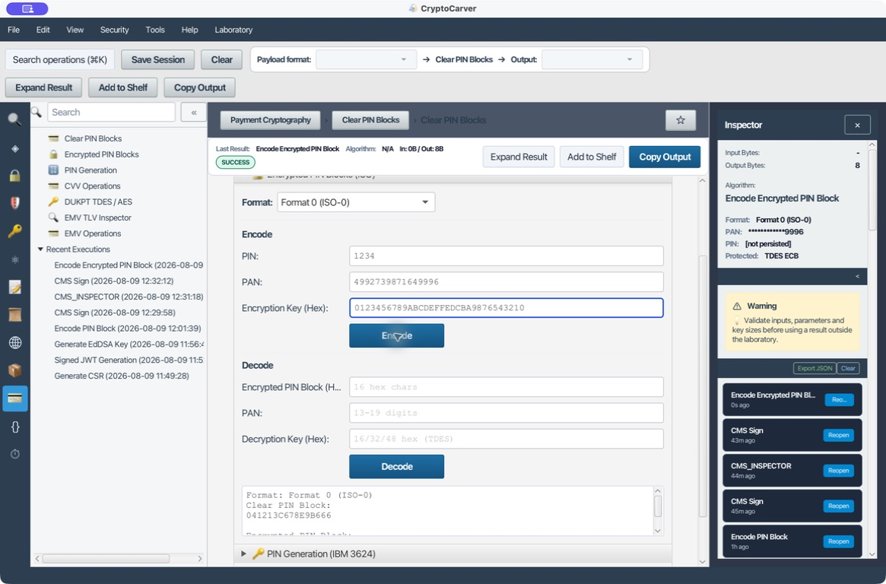
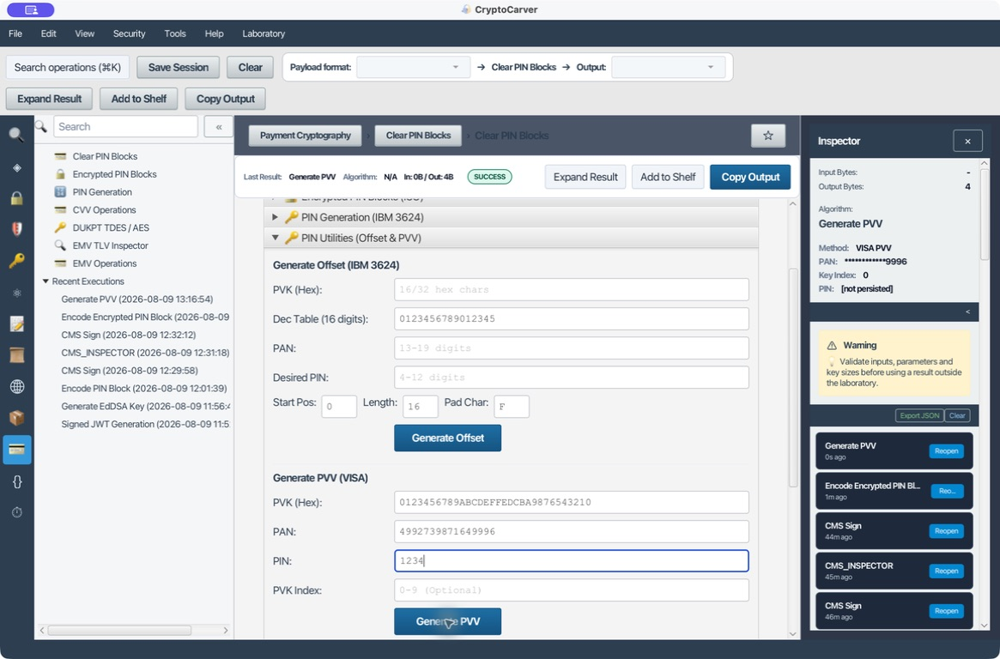
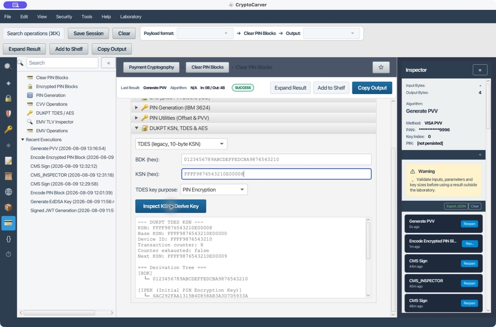
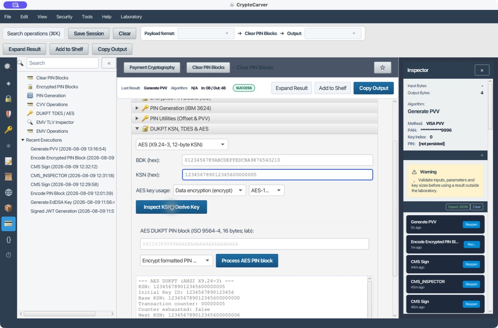
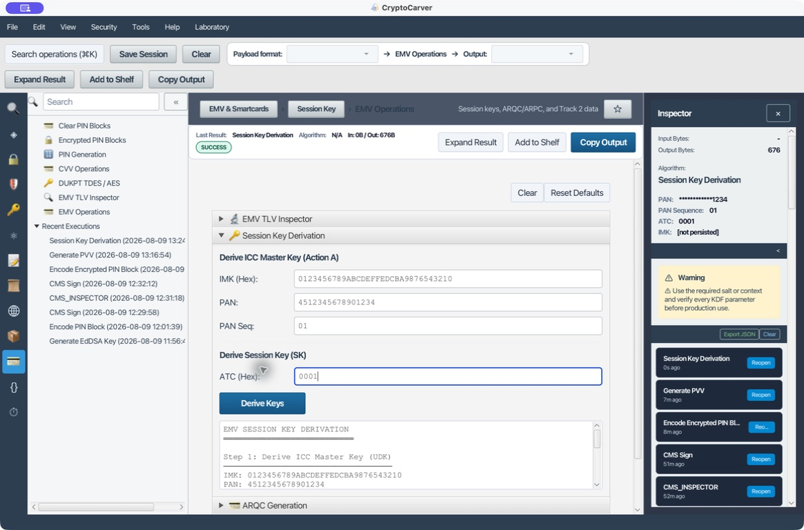
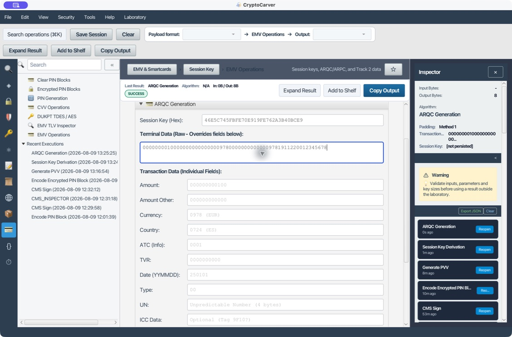

# Pagos avanzados: PIN, DUKPT y EMV

Este laboratorio usa únicamente datos, claves y PAN de prueba. No copies los
valores a una integración real ni uses CryptoCarver como sustituto de un HSM o
de los controles PCI DSS.

## Qué se va a demostrar

La cadena no es "cifrar un PIN" sin más. Un terminal forma un PIN block,
un componente autorizado lo protege bajo una clave de transporte, DUKPT deriva
una clave distinta para cada contador y EMV deriva una clave de sesión para
calcular el criptograma de la transacción. El mismo PAN de laboratorio permite
seguir el hilo, pero cada primitiva tiene su propia clave y propósito.

Flujo de PIN: `PIN + PAN → ISO-0 claro → TDES → PIN block protegido`.

Derivación DUKPT: `BDK + KSN → IPEK/clave de trabajo por transacción`.

Derivación EMV: `IMK + PAN + PSN + ATC → clave EMV de sesión → ARQC → ARPC`.

## Caso 1: Proteger un PIN block ISO-0 con 3DES

### Quiero enviar un PIN block al host sin enviar el PIN

Abre **Pagos > Encrypted PIN Blocks**, conserva `Format 0 (ISO-0)` e introduce
estos valores de laboratorio:

| Campo | Valor |
|---|---|
| PIN | `1234` |
| PAN | `4992739871649996` |
| Clave TDES de prueba | `0123456789ABCDEFFEDCBA9876543210` |

Pulsa **Encode**. CryptoCarver primero forma el bloque claro
`041213C678E9B666` y después lo protege con TDES-ECB. La salida exacta del
laboratorio es `7F16830E5B55F041`.

La captura también evidencia el control que interesa en una auditoría: el
inspector persiste el PAN enmascarado y no persiste el PIN. En producción, la
clave no debe aparecer en una pantalla, fichero ni evidencia exportada: este
valor es una clave pública de laboratorio.

### Verificación y fallo útil

En la mitad **Decode**, pega `7F16830E5B55F041`, el mismo PAN y la misma clave.
El resultado debe recuperar `1234`. Repite con el último dígito del PAN como
`...9995`: si el formato participa en el XOR (ISO-0), el descifrado deja de ser
una prueba válida del PIN. Registra formato, longitud de PAN, algoritmo y KCV
de la clave, no el PIN ni la clave.

## Caso 2: Generar y usar un PVV VISA; distinguirlo de un offset IBM 3624

### Quiero almacenar un verificador de PIN, no el PIN

En **PIN Utilities (Offset & PVV) > Generate PVV (VISA)** usa:

| Campo | Valor |
|---|---|
| PVK de prueba | `0123456789ABCDEFFEDCBA9876543210` |
| PAN | `4992739871649996` |
| PIN | `1234` |
| Índice PVK | vacío (equivale a `0`) |

Pulsa **Generate PVV**. El resultado reproducible es `5717`, con `Key Index:
0`.

El PVV no es un PIN cifrado: es una comprobación corta derivada del PAN, PIN,
índice y PVK. Debe tratarse como dato sensible porque permite intentos de
verificación, pero no puede reutilizarse como bloque ISO ni como CVV.

### ¿Cuándo uso IBM 3624?

El flujo IBM 3624 produce un **PIN natural** a partir de PVK, PAN, tabla de
decimalización, posición, longitud y carácter de relleno. El sistema puede
guardar un **offset**, calculado dígito a dígito como:

`offset[i] = (PIN_deseado[i] - PIN_natural[i]) mod 10`

Por tanto, PVV VISA e IBM 3624 resuelven el mismo objetivo operativo
(verificación del PIN), pero no son intercambiables. En **Generate Offset
(IBM 3624)** usa una tabla de decimalización de 16 dígitos, declara la posición
y longitud de extracción y documenta el offset. Prueba negativa: cambia sólo
la tabla; el PIN natural y el offset deben cambiar. Si no lo hacen, no se está
aplicando el perfil seleccionado.

## Caso 3: DUKPT TDES - una clave de trabajo por contador

### Quiero comprobar que terminal y host derivan la misma clave

Abre **DUKPT TDES / AES**, selecciona **TDES (legacy, 10-byte KSN)** y el uso
**PIN Encryption**. Introduce:

| Campo | Valor |
|---|---|
| BDK de prueba | `0123456789ABCDEFFEDCBA9876543210` |
| KSN | `FFFF9876543210E00008` |

Pulsa **Inspect KSN / Derive Key**. La evidencia de CryptoCarver muestra:

- KSN base: `FFFF9876543210E00000`.
- Identificador de dispositivo: `FFFF9876543210`.
- Contador: `8`; siguiente KSN: `FFFF9876543210E00009`.
- IPEK: `6AC292FAA1315B4D858AB3A3D7D5933A`.
- Clave de trabajo para PIN: `27F66D5244FF621EAA6F6120EDEB427F`.

El árbol separa la clave intermedia de las variantes PIN, MAC y datos. Esa
separación no es decorativa: una clave derivada para MAC no debe cifrar un PIN.
En una integración guarda KSN, uso y KCV/huella de la clave de trabajo; no
guarde la clave derivada.

### Prueba negativa

Cambia el contador de `...00008` a `...00009`. Debe cambiar la clave de
trabajo. Si el host mantiene la clave anterior cuando el terminal avanza el
KSN, detén el flujo: es un problema de sincronización, no un PIN incorrecto.

## Caso 4: DUKPT AES conforme a ANSI X9.24-3

### Quiero migrar del KSN TDES al formato AES

Selecciona **AES (X9.24-3, 12-byte KSN)**, **AES-128** y, para el ejemplo,
`Data encryption (encrypt)`. Introduce:

| Campo | Valor |
|---|---|
| BDK AES-128 de prueba | `0123456789ABCDEFFEDCBA9876543210` |
| KSN AES (12 bytes) | `123456789012345600000005` |

El inspector desglosa el ID inicial `1234567890123456`, el contador
`00000005`, el siguiente KSN `123456789012345600000006` y la clave de trabajo
`943A1AACEBB4B636C472A4AB37929A09`.

No adaptes un KSN TDES por relleno: TDES usa 10 bytes y AES DUKPT usa 12 bytes,
con árbol de derivación y datos de derivación distintos. Si procesas PIN blocks
ISO 9564-4, usa el selector de operación AES y un bloque de 16 bytes; no
recicles el bloque ISO-0 de ocho bytes.

## Caso 5: Derivar la clave EMV de tarjeta y calcular un ARQC

### Quiero reconstruir exactamente la solicitud enviada al emisor

En **EMV Operations > Session Key Derivation** introduce:

| Campo | Valor |
|---|---|
| IMK | `0123456789ABCDEFFEDCBA9876543210` |
| PAN | `4512345678901234` |
| PAN sequence number | `01` |
| ATC | `0001` |

CryptoCarver obtiene la clave maestra de tarjeta
`D942A14951D1F58D1762D692E7977977` y la clave de sesión
`46E5C745FBFE70E919FE762A3B40BCE9`.

Después abre **ARQC Generation** y usa la clave de sesión anterior. Para evitar
ambigüedad de campos individuales, pega como **Terminal Data (Raw)**:

`000000001000000000000000097800000000000009781911220012345678`

Con padding **Method 1 (ISO 9797-1)**, la salida es:

`ARQC = 0F3432AE696C3331`

Ese valor sólo es comparable cuando se preservan exactamente los bytes,
longitudes y orden de CDOL1, además de PAN/PSN, ATC, UN y clave de sesión.
Cambiar un único nibble del UN, o un ATC, debe producir otro ARQC.

### ARPC: responder al ARQC, no recalcularlo

En **ARQC Validation & ARPC**, usa la misma clave de sesión, el ARQC recibido y
un ARC de dos bytes (por ejemplo `3030` para el laboratorio). El método 1
calcula `ARPC = 3DES(SK, ARQC XOR (ARC || 00...))`; el método 2 usa `ARC ||
CSU`. Antes de comparar una respuesta, anota qué método ha definido el perfil
de la tarjeta. El ARPC viaja normalmente en el tag `91`, junto con la
información de autenticación del emisor.

## Caso 6: Inspeccionar TLV y Track 2 sin confundir análisis con autenticación

El TLV es estructura, no una verificación de ARQC. En el inspector usa una
cadena BER-TLV y confirma tags y longitudes; por ejemplo:

`9F02060000000001005F2A020978`

Aquí `9F02` declara seis bytes de importe (`000000000100`) y `5F2A` dos bytes
para la moneda `0978` (EUR). La prueba negativa útil consiste en declarar
`9F0207` sin añadir un byte: el analizador debe rechazar el valor truncado.
Si una versión de la interfaz muestra un error de formato con un valor que has
copiado literalmente, elimina espacios invisibles y vuelve a pegarlo; el
parser exige hexadecimal de longitud par.

Para **Track 2 Data**, recuerda que el equivalente EMV usa BCD y separador `D`
en vez de `=`. El parser puede explicar PAN, caducidad, service code y datos
discrecionales, pero no valida que la tarjeta ni el criptograma sean auténticos.

## Checklist de entrega

| Operación | Evidencia mínima segura | Error que debe probarse |
|---|---|---|
| PIN block | Formato, PAN enmascarado, KCV y bloque protegido | PAN/formato distinto |
| PVV u offset | Perfil, índice y resultado de prueba | Tabla, PIN o PAN distinto |
| DUKPT | KSN, contador, uso y KCV | Contador distinto |
| EMV | Tags/CDOL, ATC, UN, método y estado | Campo o longitud diferente |
| ARPC | Método, ARC/CSU y estado | Método opuesto o ARC alterado |

Nunca incluyas PIN, PVK, BDK, IMK ni claves de sesión reales en la evidencia.
