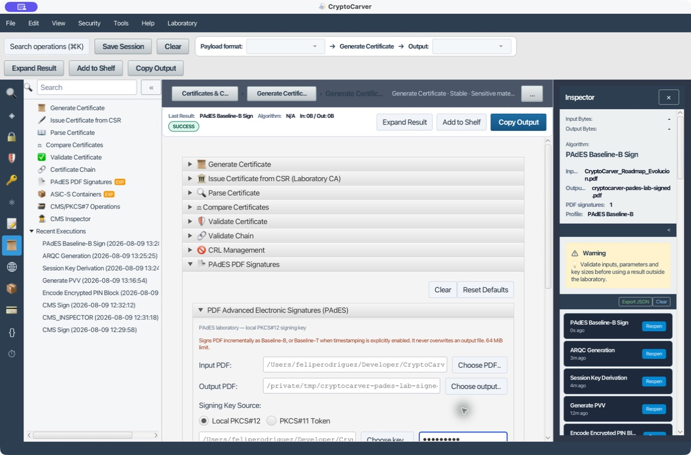
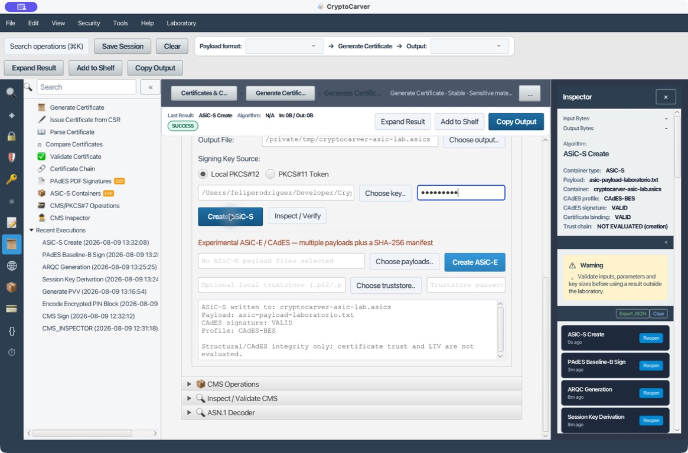

# PAdES, ASiC-S y evidencia de revocación

PAdES y ASiC-S no responden a la misma necesidad: PAdES firma un PDF sin
alterar su estructura documental; ASiC-S empaqueta un único fichero y una firma
CAdES separada en un contenedor ZIP con una estructura definida. Ambos pueden
tener una firma matemáticamente válida y, aun así, carecer de confianza,
revocación o preservación a largo plazo.

## Mapa de decisión

| Quiero proteger | Formato adecuado | Artefacto de firma |
|---|---|---|
| Un PDF que debe seguir siendo PDF | PAdES | Firma incremental PDF/CMS |
| Un fichero único con distribución y firma conjunta | ASiC-S | `mimetype`, payload y CAdES-BES |
| Varios ficheros con manifiesto | ASiC-E experimental | Manifiesto SHA-256 y CAdES |
| Preservar evidencia temporal | PAdES-T/LT/LTA o CAdES equivalente | TSA, certificados y evidencia de estado |

## Caso 1: Firmar un PDF con PAdES Baseline-B

### Quiero firmar sin sobrescribir el documento de origen

Abre **Certificados > PAdES PDF Signatures**. El ejemplo usa deliberadamente
un PDF y PKCS#12 de laboratorio:

| Campo | Valor |
|---|---|
| Input PDF | `output/pdf/CryptoCarver_Roadmap_Evolucion.pdf` |
| Output PDF | `/private/tmp/cryptocarver-pades-lab-signed.pdf` |
| PKCS#12 | `src/test/resources/testks.p12` |
| Contraseña de laboratorio | `storepass` |
| Perfil | PAdES Baseline-B (sin sello de tiempo) |

Pulsa **Sign PDF**. La salida confirma que se ha escrito un fichero nuevo y
que el PDF contiene un diccionario de firma. No sobrescribas el original:
conservar ambos es imprescindible para comparación forense.

La evidencia obtenida muestra una firma PDF, pero también declara cero
certificados, CRL y OCSP embebidos. Esto es normal para un Baseline-B de
laboratorio: prueba integridad y autoría criptográfica, no confianza ni
revocación histórica.

### Inspección, validación y prueba negativa

- Sitúa el PDF firmado como entrada y pulsa **Inspect Signatures**. Debe
  aparecer al menos una firma con `ByteRange` que cubra el documento.
- Pulsa **Validate PDF** sin truststore: espera una firma criptográfica
  analizable, pero confianza no configurada y revocación no evaluada.
- Como prueba negativa, modifica una copia del PDF después de firmarla;
  `ByteRangeCoversDocument` o la integridad debe fallar.

Una validación completa necesita ancla de confianza local y, si corresponde,
evidencia CRL/OCSP disponible. «Firma válida» y «certificado confiable en el
momento de firma» son afirmaciones diferentes.

## Caso 2: Elegir Baseline-B, T, LT o LTA

| Perfil | Añade | Qué no garantiza por sí solo |
|---|---|---|
| B | Firma y certificado del firmante según el contenedor | Hora confiable, estado de revocación, conservación |
| T | Sello RFC 3161 sobre la firma | Material de revocación persistente |
| LT | Certificados y evidencia de revocación para validación futura | Renovación de la evidencia con el paso del tiempo |
| LTA | Sellos de archivado renovables | Que una TSA o política externa sea aceptada automáticamente |

La casilla **Add RFC 3161 signature timestamp (PAdES-T)** solamente debe
activarse cuando se dispone de una TSA autorizada y alcanzable. No simules una
fecha local: una hora del ordenador no aporta la evidencia de una TSA. Para LT
y LTA planifica la recolección y renovación de CRL/OCSP antes de que caduquen
los certificados o los algoritmos.

## Caso 3: Crear e inspeccionar un ASiC-S

### Quiero distribuir un único fichero junto con una firma separada

La colección incluye el payload reproducible
[`asic-payload-laboratorio.txt`](fixtures/asic-payload-laboratorio.txt). En
**ASiC-S Containers** introduce:

| Campo | Valor |
|---|---|
| Input File | `tutoriales/fixtures/asic-payload-laboratorio.txt` |
| Output File | `/private/tmp/cryptocarver-asic-lab.asics` |
| PKCS#12 | `src/test/resources/testks.p12` |
| Contraseña | `storepass` |

Pulsa **Create ASiC-S**. CryptoCarver escribe un contenedor con el payload y
una firma CAdES-BES detached; la ejecución informa de `CAdES signature: VALID`
y `Certificate binding: VALID`.

La validación estructural comprobada significa que el contenedor, el payload y
la firma son coherentes. La misma pantalla advierte correctamente que la
confianza de certificado y LTV no se evalúan durante la creación.

### Verificación y fallo útil

Usa **Inspect / Verify** sobre el `.asics` creado. Deben ser válidos el
`mimetype`, la firma CAdES y el enlace con el certificado. Cambia un byte del
payload dentro de una copia del ZIP y conserva la firma: la comprobación de
firma debe fallar. Cambiar la extensión a `.asics` sin el `mimetype` correcto
debe fallar la comprobación estructural incluso antes de valorar la firma.

ASiC-S admite un único payload. Si el caso exige varios documentos, elige
ASiC-E experimental y valida además cada entrada y el manifiesto SHA-256; no
supongas que un ZIP con varios ficheros es ASiC-E por el nombre.

## Caso 4: Emitir desde CSR y construir una cadena verificable

### Quiero que un firmante tenga un certificado emitido por una CA de laboratorio

- En **Generate Certificate**, genera una CSR con el sujeto y SAN de prueba.
- Crea una CA raíz de laboratorio activando `CA:TRUE, keyCertSign`.
- En **Issue Certificate from CSR (Laboratory CA)** pega la CSR y los
  materiales de la CA de laboratorio.
- Emite un certificado de firmante con la extensión de uso apropiada.
- En **Validate Chain**, aporta el certificado del firmante, intermedias y la
  ancla de confianza de esa CA.

La CSR demuestra la posesión de una clave al solicitar el certificado; no
convierte al solicitante en confiable. La confianza nace de la política de la
CA y de que el validador tenga una ancla explícita.

## Caso 5: CRL, truststore y revocación

### Quiero distinguir la integridad del estado de revocación

En **CRL Management** importa o genera la CRL de laboratorio que corresponda a
la CA. En la validación de PAdES/ASiC o cadenas:

- Configura el truststore local con la CA raíz/intermedia correcta.
- Adjunta la CRL como evidencia local cuando aplique.
- Comprueba fecha `thisUpdate`, `nextUpdate`, emisor y número de CRL.
- Valida el certificado en la fecha relevante, no sólo en el presente.

| Resultado | Significado |
|---|---|
| `VALID` | Cadena confiable bajo el truststore y evidencia disponible |
| `REVOKED` | La CRL/OCSP identifica el certificado como revocado |
| `NOT EVALUATED` | No se proporcionó evidencia suficiente; no equivale a «no revocado» |
| `INDETERMINATE` | La evidencia no es concluyente, está vencida o no se puede verificar |

Prueba negativa: valida el mismo documento sin truststore o sin CRL. El
resultado debe degradarse de forma explícita a confianza/revocación no
evaluada, sin declarar el documento plenamente confiable.

## Checklist de entrega

| Entregable | Debe acompañarse de |
|---|---|
| PAdES-B | PDF original, PDF firmado, informe de `ByteRange` y política |
| PAdES-T/LT/LTA | Lo anterior más TSA y evidencia de revocación conservada |
| ASiC-S | Nombre del payload, `mimetype`, perfil CAdES e informe de firma |
| Validación | Truststore, fecha de evaluación, CRL/OCSP y estado explícito |

No incorpores contraseñas, claves privadas ni certificados de producción a las
capturas o a los documentos de evidencia.
