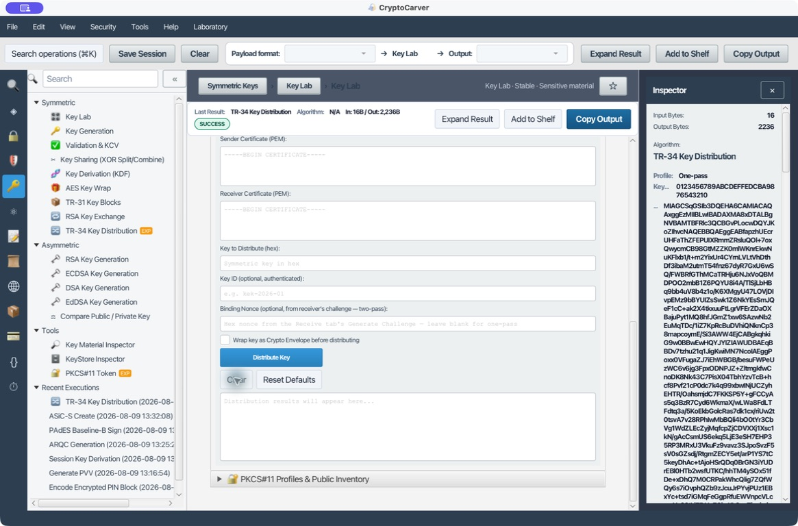
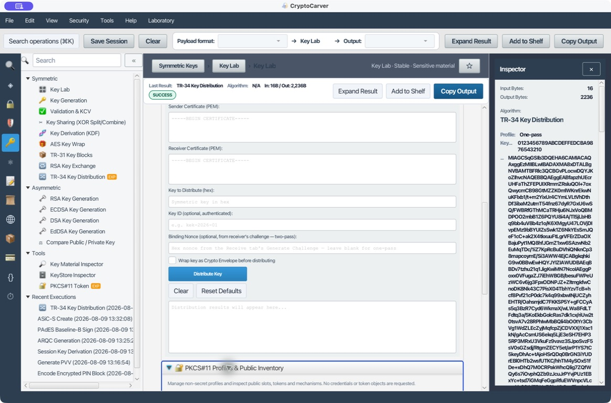

# TR-34 de laboratorio, PKCS#11 y transporte de claves RSA

Este tutorial separa tres mecanismos que suelen confundirse. **TR-31** protege una clave simétrica bajo una KBPK simétrica; **RSA-OAEP/JWE/CMS** transporta una clave hacia un destinatario RSA; **TR-34** es una especificación de carga remota con perfiles, roles y PDUs concretas. La operación TR-34 de CryptoCarver ilustra la forma criptográfica «firmar y después ensobrar», pero no implementa la PDU ANSI X9 TR-34-2019 byte a byte y no debe cargar un HSM de producción.

## Qué elegir

| Necesidad | Operación | Confianza que aporta | No sustituye |
|---|---|---|---|
| Transportar una DEK a una clave pública conocida | RSA Key Exchange | Confidencialidad de destinatario | Autenticación del emisor si no se firma |
| Enviar una clave firmada y cifrada | TR-34 de laboratorio | Firma CMS, cifrado RSA y nonce opcional | Perfil TR-34 interoperable |
| Cargar clave en un HSM de pagos real | TR-34 certificado con KDH/KRD | Política y formato del estándar implantado | El laboratorio de la aplicación |
| Usar clave que no sale del dispositivo | PKCS#11 | Operaciones en token y mecanismos | Exportación de clave privada |

## Caso 1: Distribuir una clave en un flujo inspirado en TR-34

### Quiero demostrar la secuencia KDH → KRD sin exponer la clave privada

En **Claves > TR-34 Key Distribution**, la pestaña **Distribute (Sender)** necesita estos elementos:

| Campo | Valor o procedencia |
|---|---|
| Sender Private Key | PEM de la entidad remitente (KDH) de laboratorio |
| Sender Certificate | Certificado PEM correspondiente a esa clave |
| Receiver Certificate | Certificado PEM de la entidad receptora (KRD) |
| Key to Distribute | `0123456789ABCDEFFEDCBA9876543210` — 16 bytes de prueba |
| Key ID | `lab-kek-2026` (recomendado para trazabilidad autenticada) |
| Binding nonce | Vacío para el primer recorrido de una sola pasada |

Pulsa **Distribute Key**. La ejecución real de laboratorio produjo un artefacto CMS de **2.236 bytes** a partir de **16 bytes**, con perfil `one-pass` y sin envolver antes la clave como Crypto Envelope. El contenido cambia en cada ejecución porque incorpora aleatoriedad de CMS/RSA: para repetir el caso vuelve a ejecutar la operación; no compares el Base64 completo como un vector determinista.

La evidencia visual conserva el estado `SUCCESS`, los tamaños de entrada y salida, el perfil y el rastro de ejecución; los campos PEM se limpiaron antes de guardarla. En un expediente real, registra huellas SHA-256 de certificados, identidad KDH/KRD, perfil y KCV de la clave, nunca la clave ni PEM privado.

### Qué sucede criptográficamente

1. El KDH construye un contenido que identifica la clave y el perfil.
2. Lo firma con su clave privada: el KRD podrá comprobar quién lo emitió.
3. Cifra el resultado CMS para el certificado del KRD: sólo su clave privada puede abrirlo.
4. El KRD descifra, verifica la firma y compara el enlace/nonce cuando aplique.

La firma debe verificarse **después** de descifrar, contra el certificado del remitente esperado. Aceptar cualquier certificado incluido en el mensaje es un error de sustitución de identidad.

### Prueba negativa reproducida: PEM contaminado

Un PEM exportado por ciertas herramientas puede empezar con líneas como `Bag Attributes`, `friendlyName:` o `subject=`. Si se pega el fichero completo, el parser puede rechazarlo con `Illegal base64 character 3a`. Conserva sólo el bloque delimitado por `-----BEGIN ...-----` y `-----END ...-----`; después la distribución se completa. Esta comprobación evita atribuir un fallo de codificación a TR-34 o RSA.

## Caso 2: Recibir y verificar; activar el enlace de dos pasadas

### Quiero impedir que un mensaje válido se reutilice en otra sesión

En la pestaña **Receive (Receiver)** genera primero un desafío. El KRD remite ese nonce al KDH por el canal de control autenticado. El KDH lo pega en **Binding Nonce** al distribuir; el KRD lo proporciona como desafío esperado al recibir.

| Comprobación | Una pasada | Dos pasadas con nonce |
|---|---|---|
| Confidencialidad para el KRD | Sí | Sí |
| Firma del KDH | Sí | Sí |
| Asociación a una sesión concreta | No necesariamente | Sí, si el nonce se compara |
| Defensa ante reenvío de un mensaje antiguo | Limitada por política | Mejorada por desafío único y caducidad |

En **Receive**, introduce la clave privada del KRD, el certificado esperado del KDH y el Base64 producido por **Distribute**. El resultado correcto debe indicar firma del remitente válida, clave recuperada y, si se solicitó, nonce coincidente. La clave recuperada es sensible: comprueba su KCV y destruye la representación exportada antes de registrarla en un HSM.

Pruebas negativas:

- Cambia un carácter del Base64: el descifrado o la verificación CMS debe fallar.
- Usa otro certificado esperado de KDH: la identidad no debe ser aceptada.
- Reutiliza un nonce distinto: debe marcarse `nonce mismatch` y no promoverse la clave a uso operativo.

## Caso 3: Transporte RSA sin afirmar que es TR-34

### Quiero enviar una clave de datos a una aplicación, no cargar un HSM

Abre **RSA Key Exchange**. La operación ofrece OAEP bruto, JWE o CMS. Para una DEK AES-128 de prueba usa `00112233445566778899AABBCCDDEEFF` y una clave pública RSA de laboratorio del destinatario.

| Modo | Salida | Úsalo cuando | Revisa |
|---|---|---|---|
| Raw RSA-OAEP | Base64 de un bloque RSA | Protocolo interno con contrato exacto | SHA-256, MGF1, etiqueta y tamaño de módulo |
| JWE | Compact serialization de cinco segmentos | API JOSE | `alg=RSA-OAEP-256`, `enc`, `kid` y algoritmo de contenido |
| CMS EnvelopedData | DER/Base64 CMS | Entorno PKI/CMS | Certificado receptor y algoritmos de transporte/contenido |

RSA-OAEP no cifra datos arbitrarios. Para RSA-2048 y SHA-256, el máximo aproximado es `256 - 2×32 - 2 = 190` bytes. Transporta una clave de sesión corta y usa AES-GCM o AES-CBC según política para el payload; no cifres un fichero entero con RSA. Si además necesitas autoría del emisor, firma el mensaje o usa CMS firmado y cifrado. «Sólo cifrado» no prueba quién creó el mensaje.

## Caso 4: Configurar PKCS#11 sin almacenar secretos en el perfil

### Quiero inspeccionar un token o HSM, no copiar sus claves privadas

**PKCS#11 Profiles & Public Inventory** guarda sólo metadatos no secretos: nombre del perfil, ruta absoluta de la biblioteca nativa y `slotListIndex`. En un banco de pruebas con SoftHSM, por ejemplo:

| Campo | Ejemplo |
|---|---|
| Profile name | `softhsm-lab` |
| Library path | Ruta de la biblioteca PKCS#11 instalada localmente |
| slotListIndex | `0` |

Pulsa **Diagnose** para confirmar biblioteca y slot; después usa **Inventory** para enumerar mecanismos y objetos públicos. El perfil no contiene PIN, contraseña ni el valor de una clave. Introduce el PIN sólo durante la operación puntual que use el token y no lo guardes en sesiones, capturas ni scripts.

| Síntoma | Causa frecuente | Acción segura |
|---|---|---|
| Biblioteca no cargable | Ruta o arquitectura incorrecta | Comprueba ruta y arquitectura antes de introducir PIN |
| Slot inexistente | Índice equivocado o token no presente | Enumera slots sin autenticación |
| Alias no encontrado | Etiqueta privada o sesión distinta | Consulta inventario y política del token |
| Mecanismo no admitido | HSM sin soporte o política restrictiva | Elige mecanismo aprobado; no exportes la clave como atajo |

## Checklist de control

| Entregable | Debe conservarse | Debe excluirse |
|---|---|---|
| Transporte RSA | Algoritmos, `kid`/huellas, tamaño y estado | DEK y clave privada |
| TR-34 de producción | Perfil, KDH/KRD, KCV, challenge y auditoría HSM | Artefacto de laboratorio como PDU certificada |
| PKCS#11 | Ruta, slot, alias y mecanismos autorizados | PIN y valores de objetos privados |

Consulta también [AES-WRAP avanzado](14-aes-wrap-avanzado.md) y [TR-31 avanzado](15-tr31-avanzado.md): son mecanismos complementarios, no formatos intercambiables con un transporte RSA o TR-34.
