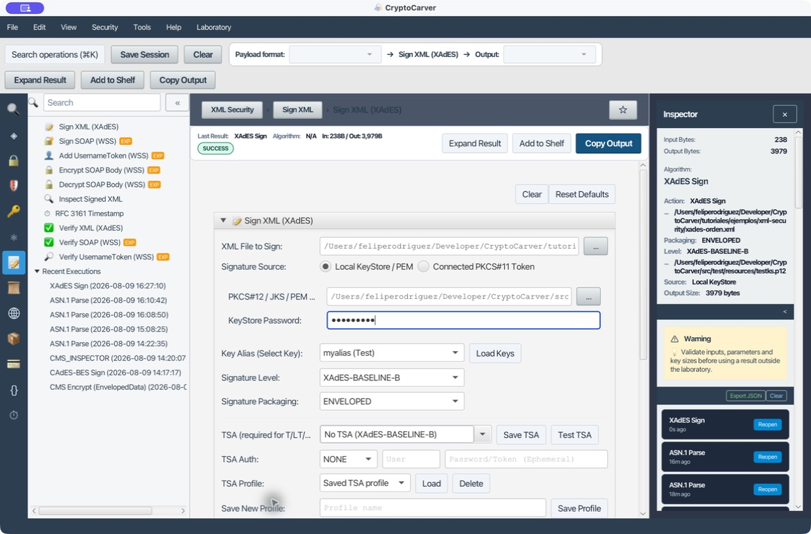

# XAdES y WS-Security avanzados

XAdES protege documentos XML; WS-Security protege mensajes SOAP. Ambos usan
XMLDSig, pero no son intercambiables: XAdES firma un documento y describe al
firmante; WS-Security coloca los tokens, las referencias y la firma dentro de
`soap:Header` para proteger el intercambio de un mensaje. Este laboratorio
parte de ejemplos locales reproducibles y termina con una validación cuyo
resultado explica tanto la integridad como el límite de confianza.

> Las claves y la contraseña de este tutorial pertenecen exclusivamente al
> almacén de pruebas incluido en el proyecto. Sustituye esos valores por un
> certificado autorizado, un truststore y una TSA de tu organización antes de
> llevar el flujo a producción.

## Qué flujo elegir

| Necesito | Operación | Resultado que debo conservar |
|---|---|---|
| Firmar un XML de negocio | **Sign XML (XAdES)** | XML firmado, perfil, certificado y política de validación |
| Conocer referencias y algoritmos sin decidir confianza | **Inspect Signed XML** | Informe estructural |
| Decidir integridad y confianza | **Verify XML (XAdES)** | Informe DSS, truststore y evidencia de revocación |
| Autenticar un cliente SOAP | **Add UsernameToken** | SOAP con nonce, `Created` y digest; siempre sobre TLS |
| Proteger cuerpo SOAP e impedir modificaciones | **Sign SOAP (WSS)** | `BinarySecurityToken`, referencias firmadas y política de receptor |
| Ocultar el contenido del cuerpo | **Encrypt SOAP Body (WSS)** | `EncryptedData`, `EncryptedKey` y certificado de destinatario |

La hora local no sustituye una TSA. Un sello RFC 3161 prueba que la TSA emitió
un token para una huella en un momento; el reloj de la estación sólo sirve para
diagnóstico. Del mismo modo, una firma matemáticamente coherente no prueba que
el certificado sea confiable: para ello hacen falta una ancla de confianza y,
cuando la política lo exige, CRL/OCSP.

## Caso 1: Firmar una orden con XAdES Baseline-B

### Quiero firmar un XML sin depender de la red

Abre **XML Security > Sign XML (XAdES)**. El fichero
[`xades-orden.xml`](ejemplos/xml-security/xades-orden.xml) contiene una orden
de 238 bytes. Configura estos campos:

| Campo | Valor reproducible |
|---|---|
| XML File to Sign | `tutoriales/ejemplos/xml-security/xades-orden.xml` |
| KeyStore | `src/test/resources/testks.p12` |
| KeyStore Password | `storepass` (sólo laboratorio) |
| Key Alias | `myalias (Test)` tras **Load Keys** |
| Signature Level | `XAdES-BASELINE-B` |
| Signature Packaging | `ENVELOPED` |
| TSA | `No TSA (XAdES-BASELINE-B)` |

Pulsa **Sign XML**. La salida observada fue de 3.979 bytes. No se compara por
igualdad entre ejecuciones: cambian identificadores y firma. En cambio, deben
existir `ds:Signature`, una referencia al documento, otra a
`xades:SignedProperties`, `SigningTime`, `SigningCertificateV2` y el
certificado X.509 embebido.

La captura muestra el perfil `ENVELOPED`, nivel Baseline-B, 238 bytes de
entrada y 3.979 de salida. En una integración, guarda el XML de salida y el
identificador de política junto con el documento original; no guardes la
contraseña ni exportes la clave privada.

### Qué protegen las referencias

La referencia con `URI=""` cubre el documento completo y aplica el filtro que
excluye la propia `ds:Signature`; sin esa exclusión una firma se incluiría a sí
misma. La referencia cuyo `Type` es `SignedProperties` vincula las propiedades
XAdES, entre ellas la hora declarada y la huella del certificado. Cambiar
`importe`, `SigningTime`, una URI o una transformación debe invalidar la firma.

## Caso 2: Revisar la estructura antes de confiar

### Quiero saber qué firma contiene un XML recibido

Abre **Inspect Signed XML**, pega el XML del caso anterior y pulsa
**Inspect Signed XML**. Esta operación es local y descriptiva: no sustituye la
validación. En la ejecución se identificaron una firma, dos referencias,
canonicalización exclusiva, RSA-SHA256, SHA-256 en los digest y un certificado
embebido; también se muestra que no había sellos de tiempo.

Usa este informe para contestar preguntas concretas antes de aceptar un
documento: qué nodo se firma, si hay referencias externas, qué transformaciones
se usan, qué certificado se transporta y si hay propiedades XAdES. Si aparece
una URI remota, no la resuelvas de forma automática en una plataforma de
validación: aplica allowlists y límites de tamaño para evitar SSRF y XML
malicioso.

## Caso 3: Validar integridad, confianza y revocación

### Quiero distinguir «no modificado» de «confiable»

Para evitar caracteres no ASCII durante el pegado, la segunda muestra es
[`xades-orden-ascii.xml`](ejemplos/xml-security/xades-orden-ascii.xml). Fírmala
como en el caso 1 y pega la salida en **Verify XML (XAdES)**. Sin truststore,
pulsa **Verify XML** y cierra el diálogo opcional de guardado de informes si no
quieres persistir diagnóstico con datos del certificado.

La ejecución produce `INDETERMINATE / NO_CERTIFICATE_CHAIN_FOUND` bajo la
política «integrity only». Es la respuesta correcta: el XML conserva una firma
analizable, pero no hay ancla de confianza para construir una cadena. No lo
conviertas en `VALID` por una regla de negocio.

| Situación | Resultado esperado | Acción |
|---|---|---|
| Firma intacta, sin truststore | `INDETERMINATE` | Aportar CA raíz/intermedias autorizadas |
| Cadena confiable pero sin evidencia suficiente | Estado de revocación no concluyente | Añadir CRL/OCSP o ajustar la política |
| Se cambia `100.00` por `999.00` | Firma inválida | Rechazar; no «reparar» el XML |
| Se añade una TSA corporativa y nivel T/LT/LTA | Debe haber token RFC 3161 | Validar TSA y cadena del token |

Para Baseline-T, selecciona `XAdES-BASELINE-T`, proporciona una TSA corporativa
en el selector y prueba **Test TSA** antes de firmar. LT y LTA requieren además
evidencia de certificados y revocación que permita verificar cuando el
certificado ya no esté vigente. Conserva el XML firmado, los informes DSS y la
evidencia de validación como un conjunto, no como archivos aislados.

## Caso 4: Añadir un UsernameToken PasswordDigest

### Quiero autenticar un cliente SOAP sin enviar la contraseña en texto

Abre **WSS Security > Add UsernameToken (WSS)** y usa el SOAP de
[`soap-orden.xml`](ejemplos/xml-security/soap-orden.xml), o pega la entrada
siguiente en una línea:

`<soap:Envelope xmlns:soap="http://schemas.xmlsoap.org/soap/envelope/"><soap:Header/><soap:Body><Order id="ORD-2026-00042"><Amount currency="EUR">100.00</Amount></Order></soap:Body></soap:Envelope>`

| Campo | Valor de laboratorio |
|---|---|
| Username | `demo-api` |
| Password | `DemoPassword-2026` |
| Password format | `PasswordDigest` |

Pulsa **Add UsernameToken**. La salida contiene `wsse:Username`, un
`wsse:Password` de tipo `PasswordDigest`, un nonce Base64 y `wsu:Created`.
Nonce, marca temporal y digest cambian en cada ejecución: la evidencia es su
presencia y que el receptor pueda verificar el token, no una coincidencia de
bytes.

El digest del perfil UsernameToken es `Base64(SHA-1(nonce + Created + password))`.
La compatibilidad histórica del perfil no convierte SHA-1 en un algoritmo de
firma recomendado; úsalo sólo cuando lo exija el interlocutor y protégelo con
TLS autenticado. `PasswordText` expone el secreto dentro del mensaje y sólo es
aceptable, si una política lo permite, sobre TLS autenticado. Después de crear
el token, compruébalo con **Verify UsernameToken (WSS)** usando el nombre,
secreto y edad máxima esperados; prueba una contraseña incorrecta y un token
caducado.

## Caso 5: Firmar el cuerpo SOAP y el timestamp

### Quiero que el receptor detecte cambios y replay durante la ventana definida

Abre **Sign SOAP (WSS)** y usa el mismo SOAP. Configura:

| Campo | Valor reproducible |
|---|---|
| Signature Algorithm | `RSA_SHA256` |
| Add `wsu:Timestamp` | Activado |
| Validity | `5` minutos |
| Protect Timestamp | Activado |
| KeyStore | `src/test/resources/testks.p12` |
| Password / Alias | `storepass` / `myalias` |

Pulsa **Sign SOAP Body**. CryptoCarver inserta un `wsse:BinarySecurityToken`,
un `wsu:Timestamp`, una firma XMLDSig y una `SecurityTokenReference`. La firma
del ejemplo referencia tanto `soap:Body` como el timestamp; de ese modo, un
atacante no puede extender la ventana de validez sin invalidar la firma.

En el receptor usa **Verify SOAP (WSS)** y aporta el certificado de confianza
del firmante. Una prueba negativa útil es cambiar el importe del cuerpo firmado:
la verificación debe ser inválida. Otra es borrar la referencia al timestamp o
ampliar `Expires`: si el timestamp estaba protegido, el digest de referencia
debe fallar. La ventana de cinco minutos no sustituye un almacén de nonces o
identificadores de mensaje cuando la amenaza incluye replay dentro de la misma
ventana.

## Cifrado SOAP: diseño de un intercambio completo

Cuando el requisito incluye confidencialidad, encadena **Encrypt SOAP Body
(WSS)** después de construir el mensaje. En la ejecución de laboratorio se usó
el SOAP del caso 5, un certificado X.509 del destinatario derivado del almacén
de prueba, `AES-256-GCM` y `RSA-OAEP SHA-256`. El informe confirma que se cifró
el contenido de `SOAP Body`, que GCM aporta autenticación y que el receptor fue
`CN=Test`.

La salida contiene `xenc:EncryptedData` para el cuerpo y `xenc:EncryptedKey`
para la clave AES efímera. El destinatario usa **Decrypt SOAP Body (WSS)** con
su PKCS#12/JKS. La clave AES debe ser nueva en cada mensaje y no se debe
registrar ni mostrar. Como prueba negativa, cambia un carácter de
`CipherValue`: GCM debe rechazar la autenticación durante el descifrado.

El orden de operaciones debe acordarse con el receptor: firmar y cifrar tienen
semánticas distintas. «Firmar y luego cifrar» oculta la identidad/metadata de
firma durante el tránsito; «cifrar y luego firmar» permite al intermediario
verificar quién envió el sobre sin descifrarlo. No alteres manualmente las
referencias XML ni los namespaces entre pasos: la canonicalización cambiaría la
entrada firmada.

## Checklist de entrega

| Control | XAdES | WS-Security |
|---|---|---|
| Algoritmo y tamaño de clave aprobados | RSA/ECDSA y digest conforme a política | RSA-SHA256, AES y RSA-OAEP según contrato |
| Confianza | Truststore, cadena y revocación | Certificado de firmante o destinatario anclado |
| Anti-replay | TSA para evidencia temporal cuando aplique | `Created`, `Expires` y control de nonce/ID |
| Evidencia | XML, informe estructural y validación DSS | SOAP protegido, informe de verificación y parámetros |
| Secretos | Nunca en el XML, informe o captura | Nunca en `PasswordText`, logs o capturas |

Antes de integrar, repite cada caso con el certificado, las suites, la
canonicalización, los namespaces y la política exactos del sistema receptor.
