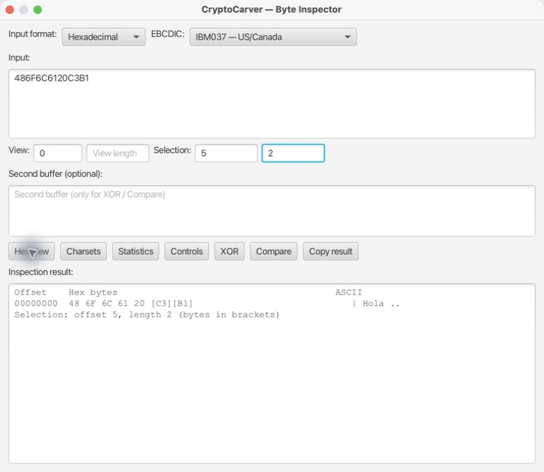
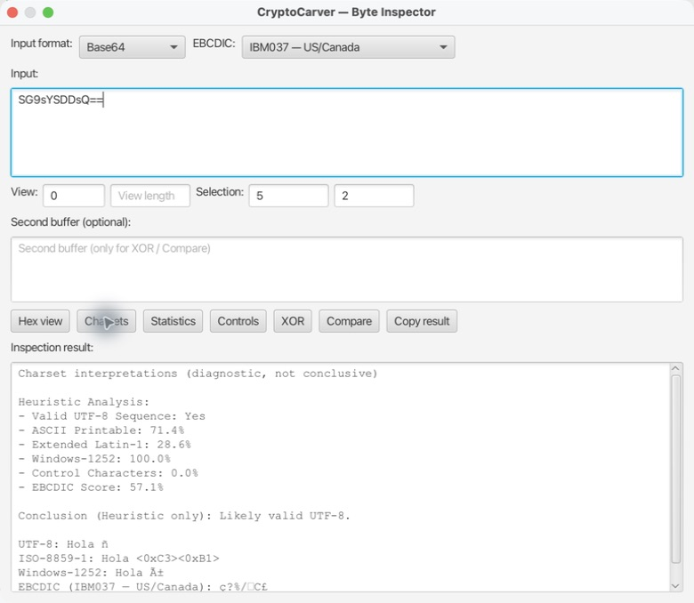
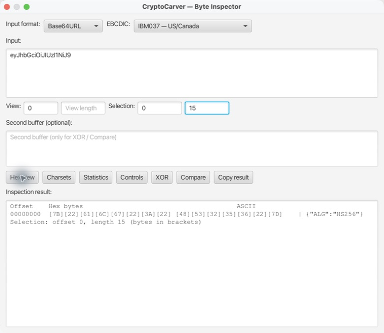
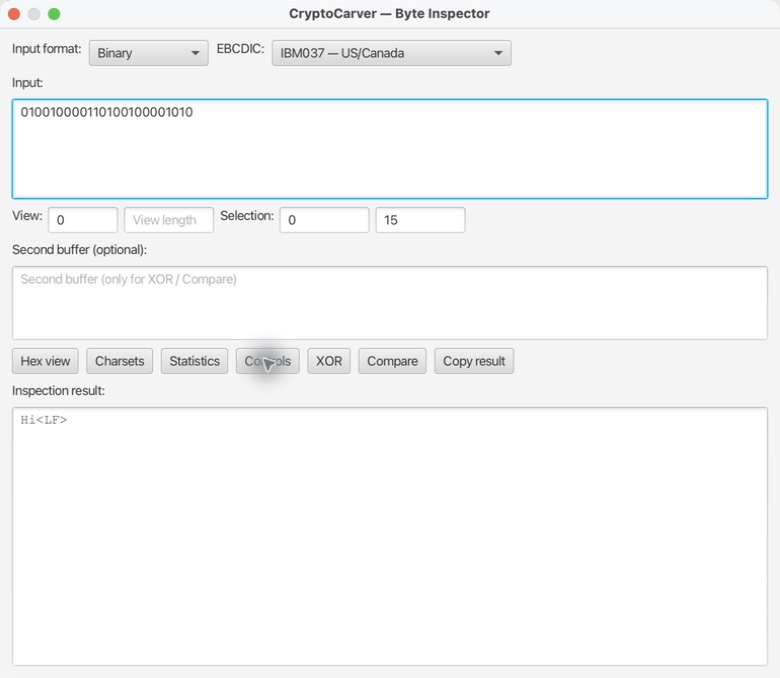

# Inspector de bytes y codificaciones

El **Inspector de bytes** no transforma un mensaje para enviarlo: permite comprobar qué bytes se han recibido realmente y cómo cambian sus interpretaciones. Es útil antes de calcular un hash, un MAC, una firma, de cifrar o de atribuir un fallo a una biblioteca externa.

Ábrelo desde **Tools → Byte Inspector**. Selecciona el formato que tiene la *entrada escrita* y después usa las vistas. El resultado siempre se refiere a los bytes decodificados, no a los caracteres con los que los pegaste.

## Mapa de formatos

| Formato de entrada | Ejemplo que representa `Hola ñ` | Regla importante |
|---|---|---|
| Hexadecimal | `486F6C6120C3B1` | Dos dígitos por byte; espacios no añaden bytes |
| Base64 | `SG9sYSDDsQ==` | `=` es padding, no contenido |
| Base64URL | `eyJhbGciOiJIUzI1NiJ9` | Usa `-` y `_`; normalmente no lleva `=` |
| Text (UTF-8) | `Hola ñ` | `ñ` son dos bytes: `C3 B1` |
| Binary | `010010000110100100001010` | Ocho bits por byte |
| Decimal | `72 105 10` | Cada número debe estar entre 0 y 255 |

## Caso 1: Localizar los bytes UTF-8 de un carácter no ASCII

### Quiero comprobar por qué `ñ` no cabe en un único byte UTF-8

1. Selecciona **Hexadecimal**.
2. Pega `486F6C6120C3B1`.
3. Escribe `5` en **Select offset** y `2` en **Select length**.
4. Pulsa **Hex view**.

| Dato | Valor |
|---|---|
| Bytes de entrada | `48 6F 6C 61 20 C3 B1` |
| Texto UTF-8 esperado | `Hola ñ` |
| Offset de `ñ` | 5, contando desde cero |
| Longitud de `ñ` en UTF-8 | 2 bytes: `C3 B1` |

La columna ASCII muestra puntos para bytes no ASCII. No significa que la entrada sea errónea: es una limitación de esa columna de diagnóstico. La selección entre corchetes es la evidencia útil para comparar con otro sistema.

**Prueba negativa.** Cambia `C3 B1` por `F1`: la interpretación ya no es el mismo UTF-8. Si un MAC calculado sobre ambas entradas difiere, es correcto: se han autenticado bytes distintos.

## Caso 2: Decodificar Base64 y decidir si el texto es UTF-8 o Latin-1

### Quiero entender un texto que llega codificado en Base64

1. Selecciona **Base64**.
2. Pega `SG9sYSDDsQ==`.
3. Pulsa **Charsets**.

El Base64 se convierte exactamente en `48 6F 6C 61 20 C3 B1`. El informe de CryptoCarver indica una secuencia UTF-8 válida y muestra varias interpretaciones del mismo buffer.

| Interpretación | Resultado esperado | Qué demuestra |
|---|---|---|
| UTF-8 | `Hola ñ` | La secuencia `C3 B1` codifica U+00F1 |
| ISO-8859-1 | `Hola <0xC3><0xB1>` | Los bytes no forman el mismo carácter en la vista segura |
| Windows-1252 | `Hola ñ` | Síntoma típico de decodificar UTF-8 como página de códigos occidental |
| EBCDIC IBM037 | Texto no semántico | No corresponde usar una página EBCDIC para esos bytes |

El diagnóstico es heurístico: “parece UTF-8” no reemplaza el contrato del protocolo. Si el emisor declara ISO-8859-1, no elijas UTF-8 solo porque sea legible.

## Caso 3: Revisar una cabecera JWT Base64URL sin confundirla con Base64

### Quiero verificar los bytes del primer segmento de un JWT

1. Selecciona **Base64URL**.
2. Pega `eyJhbGciOiJIUzI1NiJ9`.
3. Usa **Select offset** `0` y **Select length** `15`.
4. Pulsa **Hex view**.

El resultado es el UTF-8 `{"alg":"HS256"}`, cuyos 15 bytes empiezan por `7B 22 61 6C 67`. La captura deja visible tanto la representación Base64URL como los bytes inspeccionados.

No cambies `Base64URL` por Base64 por comodidad: Base64URL sustituye `+`/`/` por `-`/`_` y puede omitir padding. Para validar un JWT, el Inspector solo ayuda a observar; la validación criptográfica debe seguir haciéndose en **JOSE → JWT (Signed) → Validate & Decode JWT** con allowlist, clave y claims.

## Caso 4: Visualizar controles desde una entrada binaria

### Quiero distinguir una nueva línea de un carácter visible

1. Selecciona **Binary**.
2. Pega `010010000110100100001010`.
3. Pulsa **Controls**.

La entrada contiene tres octetos: `01001000` (`48`, `H`), `01101001` (`69`, `i`) y `00001010` (`0A`, LF). El Inspector representa el último como `<LF>`, no como un salto de línea real oculto.

Este caso evita errores de firma y MAC muy habituales: `Hi` (dos bytes) no es igual que `Hi\n` (tres bytes). Compara el hash o MAC de ambos solo después de fijar si el mensaje debe llevar LF, CRLF o ningún terminador.

## Caso 5: Decimal, rangos y comparación de buffers

### Quiero cotejar una traza decimal con una captura hexadecimal

Selecciona **Decimal** e introduce `72 105 10`. La misma secuencia debe aparecer en **Hex view** como `48 69 0A` y en **Controls** como `Hi<LF>`. El formato decimal admite espacios o comas, pero cada valor debe estar entre 0 y 255; `256` y `-1` deben ser rechazados.

Para localizar una modificación concreta, deja el primer buffer como `48 69 0A`, introduce `48 68 0A` en **Second buffer** y pulsa **Compare**. El resultado esperado es una primera diferencia en el offset `1` (`0x1`): `69` (`i`) frente a `68` (`h`). Esto es más rápido y menos ambiguo que comparar cadenas ya decodificadas.

### XOR: solo con buffers alineados

Con formato hexadecimal, usa como primer buffer `A1B2C3` y como segundo `010203`, y pulsa **XOR**. La salida debe ser `A0 B0 C0`. Ambos buffers deben tener la misma longitud: XOR no es una forma de “arreglar” datos de distinto tamaño ni un cifrado completo sin un protocolo que defina clave, nonce y autenticación.

## Statistics, offsets y límites

**Statistics** resume tamaño, distribución y entropía aproximada; es útil para sospechar de compresión, texto o material aleatorio, pero no clasifica de forma criptográficamente concluyente. **View offset** y **View length** limitan lo que se dibuja sin modificar los bytes. Úsalos para revisar un campo en un blob grande, manteniendo siempre anotados el offset base cero y la longitud en bytes.

## Checklist antes de comparar resultados criptográficos

- [ ] He anotado el formato de la entrada y el charset acordado.
- [ ] He confirmado la longitud en bytes, no solo en caracteres.
- [ ] He comprobado LF frente a CRLF y espacios finales.
- [ ] He usado Base64URL para segmentos JOSE y Base64 solo donde corresponde.
- [ ] He comparado offsets y bytes antes de cambiar claves o algoritmos.
- [ ] No he usado el diagnóstico de charset como sustituto de la especificación del protocolo.
