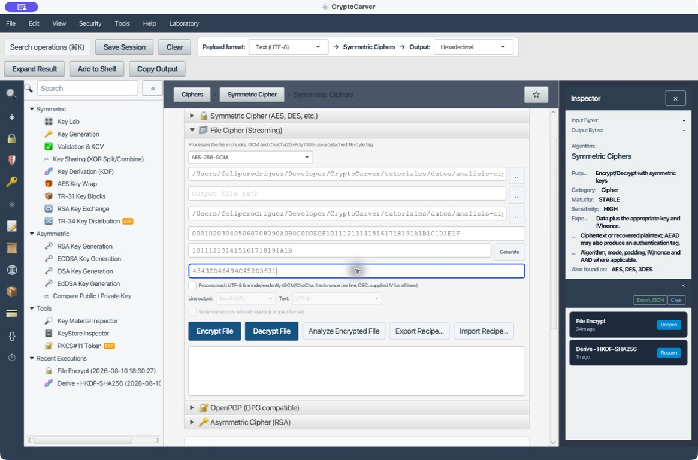
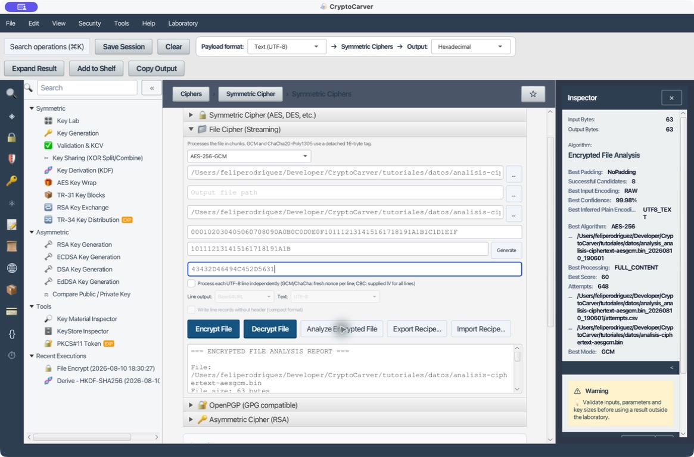
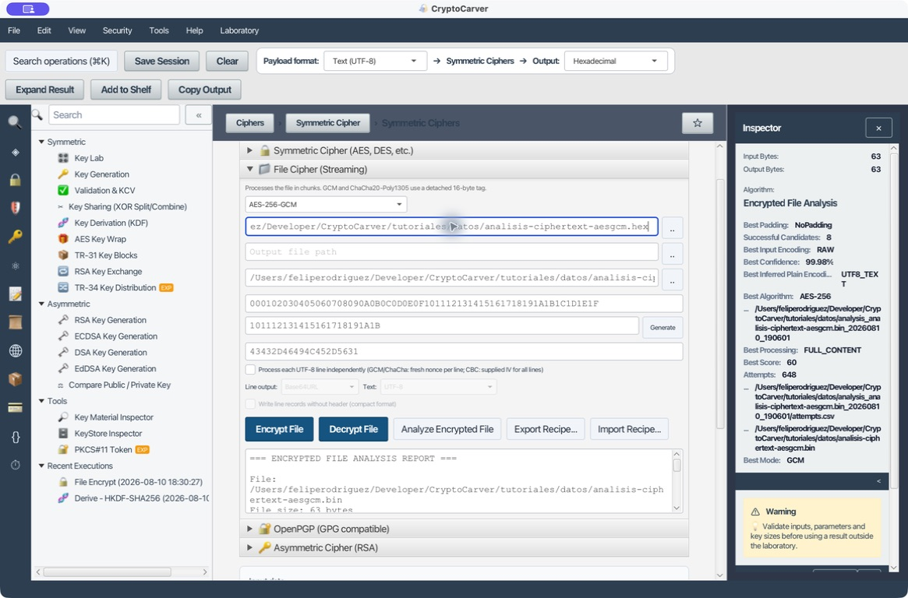
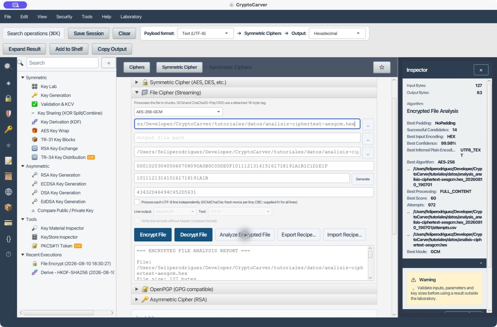
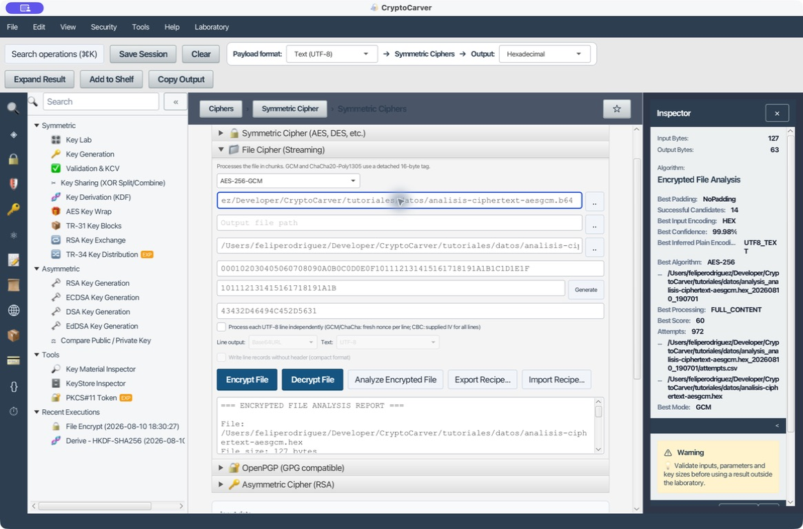
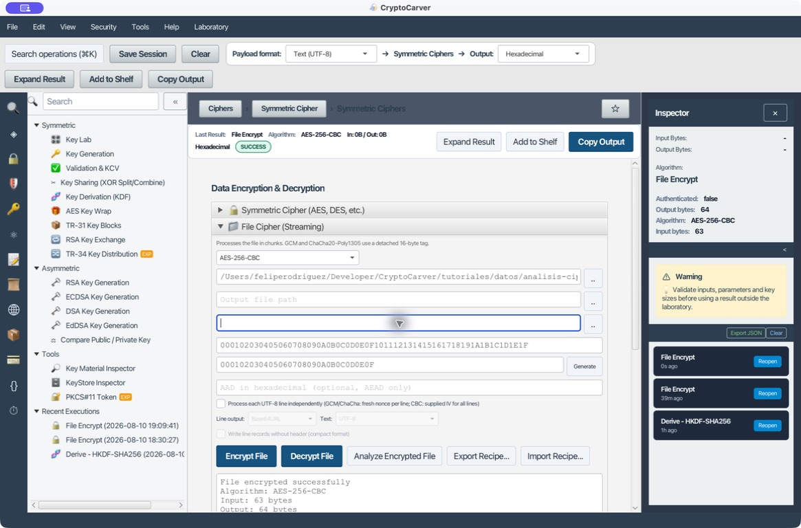
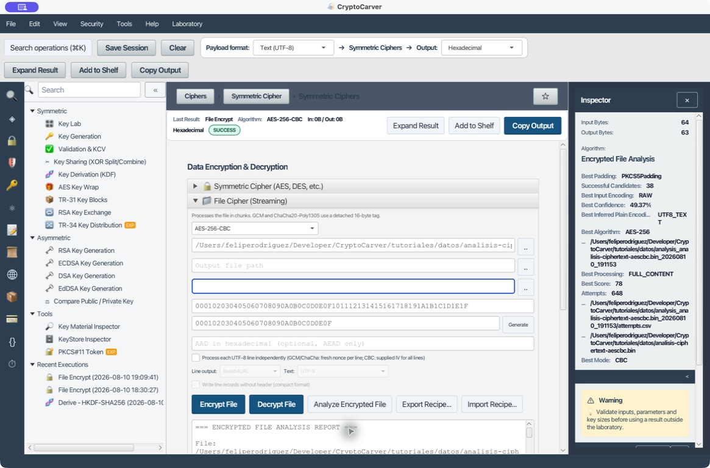
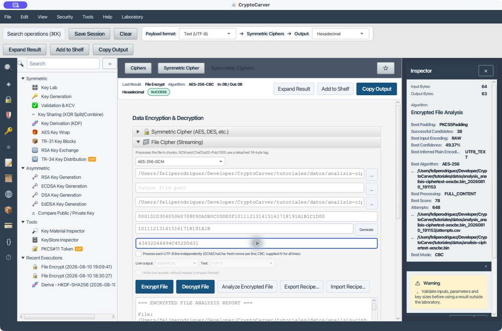

# Análisis de un archivo cifrado

**Cipher → File Cipher (Streaming) → Analyze Encrypted File** es un laboratorio de recuperación asistida. No busca claves: parte de una clave y, cuando proceda, de IV/nonce, AAD y tag conocidos, para probar formatos y combinaciones compatibles, puntuar los plaintexts obtenidos y dejar una traza auditable. Un candidato legible no es una prueba; en AEAD, la prueba criptográfica es que el tag verifique.

La acción se ejecuta en el mismo panel donde se introducen los parámetros del fichero. El botón copia esos valores al analizador: clave, IV/nonce, AAD y, para GCM/ChaCha20-Poly1305, el contenido del fichero `.tag` separado. Por tanto, la pantalla de entrada de cada caso es parte de la evidencia: muestra exactamente qué material se ha sometido al análisis.

## Qué comprueba CryptoCarver

| Componente | Comprobación |
|---|---|
| Datos de entrada | Prueba RAW, hexadecimal, Base64, UTF-8, EBCDIC Cp037 y EBCDIC Cp500. En cada caso registra cuál produjo el candidato. |
| Clave | La longitud reduce los algoritmos candidatos: 8 bytes para DES; 16 para AES-128; 24 para 3DES/AES-192; 32 para AES-256 y cifradores de flujo. |
| Algoritmo, modo y padding | Ensaya combinaciones compatibles de AES, DES, 3DES y cifradores de flujo; CBC/ECB/CTR/GCM/CFB/OFB y paddings pertinentes. |
| IV/nonce, AAD y tag | Los usa tal como se introducen. No los reconstruye ni relaja la autenticación. Un tag de GCM incorrecto impide el candidato GCM correcto. |
| Calidad del resultado | Valida UTF-8, mide caracteres imprimibles y controles, reconoce texto hex/Base64 y estima texto EBCDIC Cp037/Cp500. |
| Padding CBC/ECB | Descifra también sin retirar el relleno y busca patrones PKCS#5/#7, ISO7816-4, ISO10126 o ZeroByte para ajustar la puntuación. |
| Trazabilidad | Escribe `report.txt`, `report.html` y `attempts.csv` en `analysis_<nombre>_<marca-de-tiempo>` junto al fichero. |

La confianza es una normalización comparativa entre los candidatos visibles. No representa la probabilidad de haber recuperado una clave ni sustituye la autenticación, la estructura de negocio o una verificación externa.

## Material de laboratorio reproducible

El plaintext común es [analisis-ciphertext-origen.txt](datos/analisis-ciphertext-origen.txt), de 63 bytes:

```text
pedido=CC-2026-042
importe=125.00
moneda=EUR
destino=almacen-7
```

| Parámetro AES-GCM | Valor |
|---|---|
| Clave (32 bytes) | `000102030405060708090A0B0C0D0E0F101112131415161718191A1B1C1D1E1F` |
| Nonce (12 bytes) | `101112131415161718191A1B` |
| AAD (10 bytes) | `43432D46494C452D5631` — ASCII `CC-FILE-V1` |
| Ciphertext RAW | [analisis-ciphertext-aesgcm.bin](datos/analisis-ciphertext-aesgcm.bin), 63 bytes |
| Tag GCM | [analisis-ciphertext-aesgcm.tag](datos/analisis-ciphertext-aesgcm.tag), 16 bytes |

## Caso 1: AES-256-GCM en RAW, con nonce, AAD y tag

### Quiero comprobar una evidencia AEAD completa

Selecciona el `.bin`, deja vacío el destino —el análisis no genera un plaintext de salida— e introduce la clave, nonce, AAD y ruta del tag. Esta entrada deja claro que se analiza el ciphertext binario y que el tag está disponible para validar GCM.



Pulsa **Analyze Encrypted File**. La salida real identifica `AES-256/GCM/NoPadding`, `RAW`, `UTF8_TEXT`, 63 bytes de entrada y un preview que coincide con el pedido. Ejecutó 648 intentos y obtuvo 8 descifrados que llegaron a producir resultado; el mejor tiene 99,98 % de confianza comparativa y, sobre todo, validó el tag GCM.



Qué validar fuera del ranking: el tag debe verificar, el preview debe respetar el formato esperado y un descifrado posterior con los parámetros fijados debe devolver los 63 bytes originales. Si cambia un nibble de clave, nonce, AAD o tag, no hay que aceptar un plaintext «parecido».

## Caso 2: El mismo ciphertext almacenado como hexadecimal

### Quiero distinguir el texto hexadecimal de los bytes que representa

El fichero [analisis-ciphertext-aesgcm.hex](datos/analisis-ciphertext-aesgcm.hex) contiene pares hexadecimales y un salto final de línea: ocupa 127 bytes, aunque representa los mismos 63 bytes cifrados del caso 1. Mantén exactamente la misma clave, nonce, AAD y tag; solo cambia la ruta de origen.



En el informe, CryptoCarver prueba las representaciones y escoge `Encrypted file input encoding: HEX`. El candidato superior vuelve a ser `AES-256/GCM/NoPadding`, recupera el mismo texto y alcanza 99,98 % comparativo. Esta evidencia evita el error de descifrar los caracteres ASCII `30 64 39 62…` en lugar de decodificarlos primero como bytes.



El informe registra 972 intentos y 14 descifrados exitosos porque el fichero textual abre más rutas de decodificación que el binario. No uses ese número como señal de mayor certeza: lo importante es que la mejor fila indique `HEX`, GCM autenticado y el plaintext con sentido.

## Caso 3: El mismo ciphertext almacenado como Base64

### Quiero analizar un artefacto que viaja en una API o un correo

[analisis-ciphertext-aesgcm.b64](datos/analisis-ciphertext-aesgcm.b64) representa el mismo ciphertext con el alfabeto Base64 y un salto final; ocupa 85 bytes. Se conserva el mismo material AEAD porque Base64 no cambia el cifrado, solo su transporte.



La salida selecciona `BASE64`, recupera 63 bytes de plaintext y sitúa `AES-256/GCM/NoPadding` como mejor candidato, con 99,97 % comparativo. El resultado demuestra que Base64 debe decodificarse antes de evaluar el cifrado; no demuestra que sea seguro omitir el tag.


Aquí se registraron 810 intentos y 12 descifrados exitosos. Revisa siempre la línea `Encrypted file input encoding`: si mostrase `RAW` para un fichero que sabes Base64, investiga el origen antes de confiar en el preview.

## Caso 4: AES-256-CBC y evidencia de padding

### Quiero recuperar un fichero CBC heredado con clave e IV conocidos

Para producir [analisis-ciphertext-aescbc.bin](datos/analisis-ciphertext-aescbc.bin) se cifraron los mismos 63 bytes con AES-256-CBC y PKCS#7. Los valores reproducibles son la clave AES-256 anterior y el IV de 16 bytes `000102030405060708090A0B0C0D0E0F`; no hay AAD ni tag. El ciphertext mide 64 bytes porque CBC añade un bloque de relleno.

La captura de entrada muestra esa diferencia esencial con GCM: IV sí, AAD y tag vacíos.



El informe selecciona `AES-256/CBC/PKCS5Padding`, `RAW` y `UTF8_TEXT`. En Java/BouncyCastle, PKCS#5 y PKCS#7 quedan agrupados para AES. El score final es `60 + 18 = 78`: los 60 puntos proceden de la calidad del texto y los 18 de que el único bloque final exhibe un patrón PKCS válido. La confianza se reparte con una variante de bloques heurísticos equivalente, por eso es 49,37 % y no una garantía absoluta.



Para CBC, texto legible no basta: revisa el IV, el patrón de padding y el formato de negocio. CBC no autentica; si la integridad es importante, exige además MAC, firma o un contenedor autenticado del sistema emisor.

## Caso 5: Clave incorrecta y cierre seguro de la investigación

### Quiero demostrar que GCM no debe aceptar una hipótesis falsa

Este caso usa el mismo `.bin`, nonce, AAD y tag del caso 1, pero modifica deliberadamente el último byte de la clave: termina en `…1D00` en lugar de `…1D1E1F`. La pantalla de entrada permite reproducir y auditar el fallo sin alterar el ciphertext.



La salida no presenta un candidato plausible: tras 2.664 intentos registra cero descifrados exitosos y muestra `No valid decryption candidates found`. Las recomendaciones del propio informe apuntan a revisar clave, IV/nonce y tag. Esa es la salida correcta: no se debe rebajar la exigencia de autenticación para «sacar algo».


El directorio de análisis conserva `attempts.csv`, `report.txt` y `report.html` también cuando no hay resultados. Archívalo junto con los parámetros de laboratorio, pero nunca junto con secretos de producción: contiene rutas, previews y diagnósticos de cada intento.

## Contenido completo y bloques independientes

Además del flujo normal `FULL_CONTENT`, el motor intenta `INDEPENDENT_BLOCKS_STRUCTURED` y `INDEPENDENT_BLOCKS_GUESS`:

| Modo | Uso legítimo | Qué hace |
|---|---|---|
| `FULL_CONTENT` | Ciphertext convencional | Descifra todo el flujo de una vez. |
| `INDEPENDENT_BLOCKS_STRUCTURED` | Contenedor experto de CryptoCarver | Busca `CFXBI1`, tamaño, número y longitudes de los chunks. |
| `INDEPENDENT_BLOCKS_GUESS` | Formato externo por chunks sin cabecera | Prueba particiones de 64, 128, 256, 512, 1.024, 2.048 y 4.096 bytes. |

Estos tamaños son bytes de partición, no el tamaño de bloque del primitivo AES o 3DES. No los actives como forma de «mejorar» CBC convencional: un IV/nonce reutilizado por bloque puede comprometer la seguridad. Úsalos solo si conoces el formato del emisor y valida la estructura completa después.

## Cómo leer y conservar el informe

- `report.txt` es el resumen humano: tamaños, intentos, mejor candidato, calidad, padding, preview y notas metodológicas.
- `report.html` ofrece la misma evidencia para una revisión visual o entrega interna.
- `attempts.csv` deja constancia de éxitos y fallos: algoritmo, modo, padding, procesamiento, tamaño de chunk, codificación de entrada, score, preview y error.

Antes de cerrar una investigación, confirma que el descifrado cubre el fichero completo, que la estructura recuperada es válida para el dominio y que cualquier autenticación disponible verifica. La función prioriza hipótesis: la validación criptográfica y de negocio la confirma.
